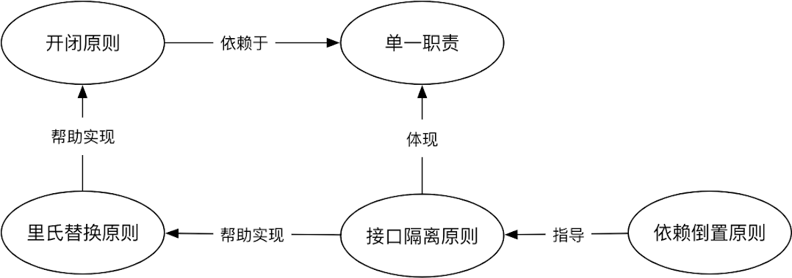
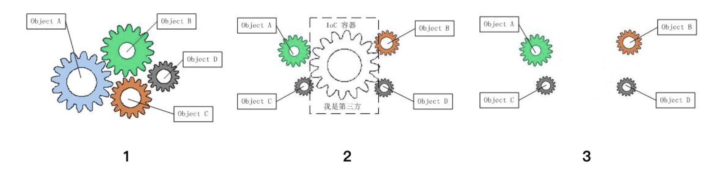

# SOLID
- 单一职责原则（Single Responsibility Principle, SRP）：一个类只允许有一个职责，即只有一个导致该类变更的原因。

- 开放封闭原则（Open Closed Principle, OCP）：一个软件实体如类、模块和函数应该对扩展开放，对修改关闭。

- 里式替换原则（Liskov Substitution Principle, LSP）：所有引用基类的地方必须能透明地使用其子类的对象，也就是说子类对象可以替换其父类对象，而程序执行效果不变。

- 最少知识原则(Least Knowledge Principle, LKP)：又称迪米特法则（Law of Demeter），一个对象应该对尽可能少的对象有接触，也就是只接触那些真正需要接触的对象。

- 接口分离原则（Interface Segregation Principle，ISP）：多个特定的客户端接口要好于一个通用性的总接口。

- 依赖倒置原则（Dependency Inversion Principle, DIP）：依赖抽象，而不是依赖实现；抽象不应该依赖细节；细节应该依赖抽象；高层模块不能依赖低层模块，二者都应该依赖抽象。

将以上六大原则的英文首字母拼在一起就是 SOLID(稳定的)，所以也称之为 SOLID 原则。


单一职责是所有设计原则的基础，开闭原则是设计的终极目标。里氏替换原则强调的是子类替换父类后程序运行时的正确性，它用来帮助实现开闭原则。而接口隔离原则用来帮助实现里氏替换原则，同时它也体现了单一职责。依赖倒置原则是过程式编程与 OO 编程的分水岭，同时它也被用来指导接口隔离原则。

REFERENCE: [A Solid Guide to SOLID Principles](https://www.baeldung.com/solid-principles)

# 依赖倒置

> High level modules should not depends upon low level modules. Both should depend upon abstractions. Abstractions should not depend upon details. Details should depend upon abstractions.

高层模块不应该依赖于低层模块，它们应该依赖于抽象。抽象不应该依赖于细节，细节应该依赖于抽象。应该面向接口编程，不应该面向实现类编程。面向实现类编程，相当于就是论事，那是正向依赖(正常人思维)；面向接口编程，相当于通过事物表象来看本质，那是反向依赖，即依赖倒置(程序员思维)。并不是说，所有的类都要有一个对应的接口，而是说，如果有接口，那就尽量使用接口来编程吧。

# 依赖注入与控制反转
Martin Fowler 在 2004 年发表的 [Inversion of Control Containers and the Dependency Injection pattern](https://martinfowler.com/articles/injection.html) 一文中阐述了 IoC 的概念与实践模式。

在传统的层次化模式(Layers Pattern)中，高层次的组件(Higher Level)调用低层次(Lower Level)的组件来逐步构建复杂的系统；不过这种方式会导致组件之间存在较强的耦合，对于低层次组件的强依赖往往也会限制了高层次组件的可扩展性与重用性。

通常我们在没有依赖注入的时候如果 A 依赖于 B，那么在 A 初始化或者执行中的某个过程需要先创建 B，这时我们就认为 A 对 B 的依赖是正向的。但是这样解决依赖的办法会得得 A 与 B 的逻辑耦合在一起，依赖越来越多代码就会变的越来越糟糕。如下图所示，齿轮之间是相互依赖的，一损俱损。控制反转（IOC）模式就是要解决这个问题，它会多引入一个容器（Container）的概念，让一个 IOC 容器去管理 A、B 的依赖并初始化。当我们去掉容器时，剩下的齿轮成了一个个独立的功能模块。

- 1、耦合
- 2、解耦
- 3、理想对象

# DI
DI - Dependency Injection，即"依赖注入"：组件之间的依赖关系由容器在运行期决定，形象的说，即由容器动态的将某个依赖关系注入到组件之中。依赖注入的目的并非为软件系统带来更多功能，而是为了提升组件重用的频率，并为系统搭建一个灵活、可扩展的平台。通过依赖注入机制，我们只需要通过简单的配置，而无需任何代码就可指定目标需要的资源，完成自身的业务逻辑，而不需要关心具体的资源来自何处，由谁实现。

理解 DI 的关键是："谁依赖了谁，为什么需要依赖，谁注入了谁，注入了什么"，那我们来深入分析一下：
- 谁依赖了谁：当然是应用程序依赖 IoC 容器
- 为什么需要依赖：应用程序需要 IoC 容器来提供对象需要的外部资源
- 谁注入谁：很明显是往 IoC 容器注入应用程序依赖的对象
- 注入了什么：注入某个对象所需的外部资源（包括对象、资源、常量数据）

IoC 和 DI 其实它们是同一个概念的不同角度描述，由于控制反转的概念比较含糊，所以 2004 年 Martin Fowler 又给出了一个新的名字："依赖注入"，相对 IoC 而言，"依赖注入" 明确描述了被注入对象依赖 IoC 容器配置依赖对象。

总的来说，控制反转（Inversion of Control）是说创建对象的控制权发生转移，以前创建对象的主动权和创建时机由应用程序把控，而现在这种权利转交给 IoC 容器，它就是一个专门用来创建对象的工厂，你需要什么对象，它就给你什么对象。有了 IoC 容器，依赖关系就改变了，原先的依赖关系就没了，它们都依赖 IoC 容器了，通过 IoC 容器来建立它们之间的关系。

# 单一职责原则
There should never be more than one reason for a class to change.

单一职责原则的定义是就一个类而言，应该仅有一个引起他变化的原因。也就是说一个类应该只负责一件事情。如果一个类负责了方法 M1,方法 M2 两个不同的事情，当 M1 方法发生变化的时候，我们需要修改这个类的 M1 方法，但是这个时候就有可能导致 M2 方法不能工作。这个不是我们期待的，但是由于这种设计却很有可能发生。所以这个时候，我们需要把 M1 方法，M2 方法单独分离成两个类，让每个类只专心处理自己的方法。

要真正理解并正确运用单一职责原则，并没有那么容易。单一职责就跟“盐少许”一样，不好把握。单一职责原则某种程度上说是在分离关注点。分离不同角色的关注点，分离不同时间的关注点。

- 利益相关者角色是一个重要的变化原因，不同的角色会有不同的需求，从而产生不同的变化原因。作为居民，家用的电线是普通的 220V 电线，而对电网建设者，使用的是高压电线。用一个 Wire 类同时服务于两类角色，通常意味着坏味道。

- 变更频率是另一个值得考虑的变化原因。即使对同一类角色，需求变更的频率也会存在差异。最典型的例子是业务处理的需求比较稳定，而业务展示的需求更容易发生变更，毕竟人总是喜新厌旧的。因此这两类需求通常要在不同的类中实现。

单一职责原则可以降低类的复杂度，一个类只负责一项职责，这样逻辑也简单很多。提高类的可读性，和系统的维护性，因为不会有其他奇怪的方法来干扰我们理解这个类的含义 当发生变化的时候，能将变化的影响降到最小，因为只会在这个类中做出修改。

# 开放封闭原则
Software entities like classes, modules and functions should be open for extension but closed for modifications.

软件实体，如：类、模块与函数，对于扩展应该是开放的，但对于修改应该是封闭的。简言之，对扩展开放，对修改封闭。当需求发生改变的时候，我们需要对代码进行修改，这个时候我们应该尽量去扩展原来的代码，而不是去修改原来的代码，因为这样可能会引起更多的问题。

但是如果能够确保对整体架构不会产生任何影响，那么也没必要搞得那么复杂了；直接改这个类吧，有时候过度拘泥模式而导致代码膨胀反而得不偿失。假设你是一名成功的开源类库作者，很多开发者使用你的类库。如果某天你要扩展功能，只能通过修改某些代码完成，结果导致类库的使用者都需要修改代码。更可怕的是，他们被迫修改了代码后，又可能造成别的依赖者也被迫修改代码。这种场景绝对是一场灾难。如果你的设计是满足开闭原则的，那就完全是另一种场景。你可以通过扩展，而不是修改来改变软件的行为，将对依赖方的影响降到最低。

实现开闭原则的关键是抽象。在 Bertrand Meyer 提出开闭原则的年代（上世纪 80 年代），在类库中增加属性或方法，都不可避免地要修改依赖此类库的代码。这显然导致软件很难维护，因此他强调的是要允许通过继承来扩展类。随着技术发展，我们有了更多的方法来实现开闭原则，包括接口、抽象类、策略模式等。

# 里氏替换原则
Functions that use pointers or references to base classes must be able to use objects of derived classes without knowing it.

该原则由麻省理工学院的 Barbara Liskov 女士提出，即使用基类的指针或引用的函数，必须是在不知情的情况下，能够使用派生类的对象。
父类能够被替换成子类，但子类不一定能被替换为父类。也就是说，在代码中可以将父类全部替换为子类，程序不会报错，也不会在运行时出现任何异常，但反过来却不一定成立。
学过 OO 的同学都知道，子类本来就可以替换父类，为什么还要里氏替换原则呢？这里强调的不是编译错误，而是程序运行时的正确性。

程序运行的正确性通常可以分为两类：
- 一类是不能出现运行时异常，最典型的是 UnsupportedOperationException，也就是子类不支持父类的方法。
- 第二类是业务的正确性，这取决于业务上下文。

下例中，由于 java.sql.Date 不支持父类的 toInstance 方法，当父类被它替换时，程序无法正常运行，破坏了父类与调用方的契约，因此违反了里氏替换原则。
```java
package java.sql;

public class Date extends java.util.Date {

  @Override
  public Instant toInstant() {
    throw new java.lang.UnsupportedOperationException();
  }
}
```
该原则包含以下几层要求：

- 子类可以实现父类的抽象方法，但是不能覆盖父类的非抽象方法，子类可以增加自己独有的方法。
- 当子类的方法重载父类的方法时候，方法的形参要比父类的方法的输入参数更加宽松。
- 当子类的方法实现父类的抽象方法时，方法的返回值要比父类更严格。

里氏替换原则之所以这样要求是因为继承有很多缺点，他虽然是复用代码的一种方法，但同时继承在一定程度上违反了封装。父类的属性和方法对子类都是透明的，子类可以随意修改父类的成员。这也导致了，如果需求变更，子类对父类的方法进行一些复写的时候，其他的子类无法正常工作。

如果你的设计满足里氏替换原则，那么子类（或接口的实现类）就可以保证正确性的前提下替换父类（或接口），改变系统的行为，从而实现扩展。BranchByAbstraction 和绞杀者模式 都是基于里氏替换原则，实现系统扩展和演进。这也就是对修改封闭，对扩展开放，因此里氏替换原则是实现开闭原则的一种解决方案。

# 接口隔离原则
The dependency of one class to another one should depend on the smallest possible interface.

接口隔离原则说的是客户端不应该被迫依赖于它不使用的方法。简单来说就是更小和更具体的瘦接口比庞大臃肿的胖接口好。不要对外暴露没有实际意义的接口。换一种说法就是类间的依赖关系应该建立在最小的接口上。这样说好像更难懂。胖接口的职责过多，很容易违反单一职责原则，也会导致实现类不得不抛出 UnsupportedOperationException 这样的异常，违反里氏替换原则。因此，应该将接口设计得更瘦。

我们通过一个例子来说明。我们知道在 Java 中一个具体类实现了一个接口，那必然就要实现接口中的所有方法。如果我们有一个类 A 和类 B 通过接口 I 来依赖，类 B 是对类 A 依赖的实现，这个接口 I 有 5 个方法。但是类 A 与类 B 只通过方法 1,2,3 依赖，然后类 C 与类 D 通过接口 I 来依赖，类 D 是对类 C 依赖的实现但是他们却是通过方法 1,4,5 依赖。那么是必在实现接口的时候，类 B 就要有实现他不需要的方法 4 和方法 5 而类 D 就要实现他不需要的方法 2 和方法 3，这简直就是一个灾难的设计。所以我们需要对接口进行拆分，就是把接口分成满足依赖关系的最小接口，类 B 与类 D 不需要去实现与他们无关接口方法。比如在这个例子中，我们可以把接口拆成 3 个，第一个是仅仅由方法 1 的接口，第二个接口是包含 2,3 方法的，第三个接口是包含 4,5 方法的。这样，我们的设计就满足了接口隔离原则。

接口之所以存在，是为了解耦。开发者常常有一个错误的认知，以为是实现类需要接口。其实是消费者需要接口，实现类只是提供服务，因此应该由消费者（客户端）来定义接口。理解了这一点，才能正确地站在消费者的角度定义 Role interface，而不是从实现类中提取 Header Interface。

# 案例-砖头
砖头(Brick)可以被建筑工人用来盖房子，也可以被用来正当防卫
```java
public class Brick {
  private int length;
  private int width;
  private int height;
  private int weight;

  public void build() {
    //...包工队盖房
  }

  public void defense() {
    //...正当防卫
  }
}
```
如果直接提取以下接口，这就是 Header Interface：
```java
public interface BrickInterface {
  void buildHouse();
  void defense();
}
```
普通大众需要的是可以防卫的武器，并不需要用砖盖房子。
当普通大众(Person)被迫依赖了自己不需要的接口方法时，就违反接口隔离原则。
正确的做法是站在消费者的角度，抽象出 Role interface:
```java
public interface BuildHouse {
    void build();
}

public interface StrickCompetence {
    void defense();
}

public class Brick implement BuildHouse, StrickCompetence {
}
```

有了 Role interface，作为消费者的普通大众和建筑工人就可以分别消费自己的接口：
```java
// Worker.java
brick.build();

// Person.java
brick.strike();
```
# 最少知识原则
Only talk to you immediate friends.

只与你最直接的朋友交流。尽量减少对象之间的交互，从而减小类之间的耦合。简言之，一定要做到：低耦合，高内聚。
在做系统设计时，不要让一个类依赖于太多的其他类，需尽量减小依赖关系，否则，您死都不知道自己怎么死的。
该原则也称为“迪米特法则(Law of Demeter)”，由 Ian Holland 提出。
这个人不太愿意和陌生人说话，只和他走得最近的朋友们交流。


# [设计模式](../design-p.md)


