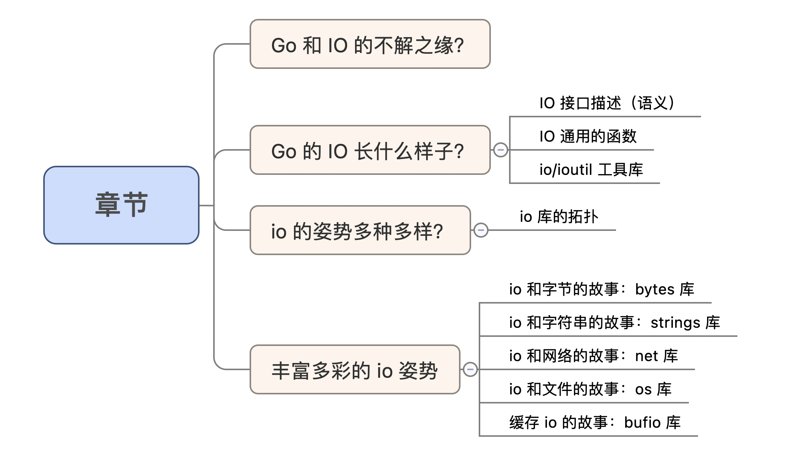
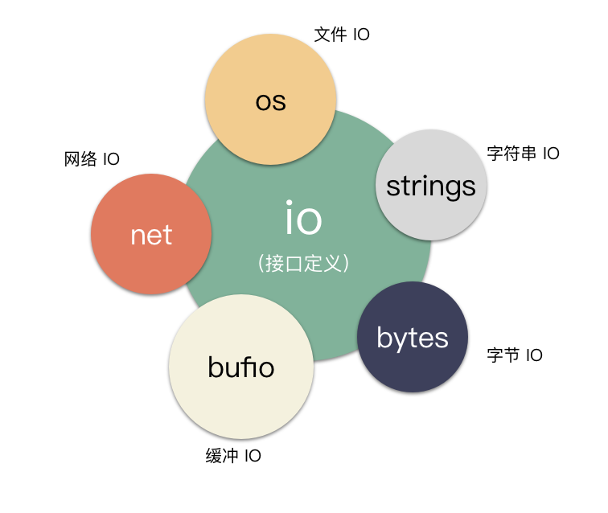
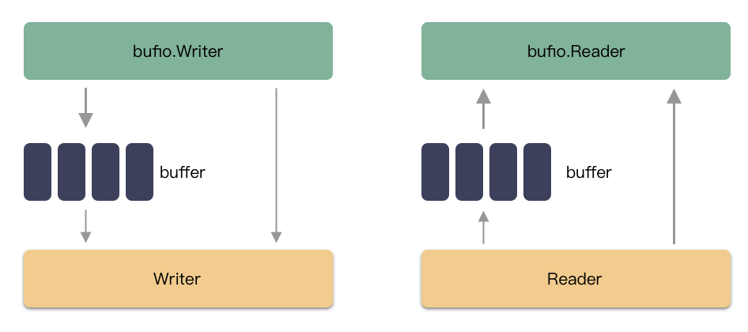

#### 并行和并发的区别？

并行看的是时刻，并发看的是时间段。 2021/1/1 12:00:00 这个时刻有两个请求在同时被执行，这说的是并行； 2021/1/1 12:00:00 - 2021/1/1 12:00:01 这 1 秒的时间，完成了 1000
个请求，qps 为 1000，这种说的是并发；

#### Go 除了 Goroutine 足够轻量之外，支持如此高并发的这其中的秘诀在哪里？

执行体调度得当。CPU 不停的在不同的执行体（ Goroutine ）之间反复横跳！ CPU 一直在装填和运行不同执行体的指令，G1（Goroutine 1 的缩写） 不行就搞 G2 ，一刻不能停， 这样才能使得大量的执行体（
Goroutine ）齐头并进，系统才能完成如此高并发的吞吐（注意关键字：并发哦）。

#### 程序可分为 CPU 密集型的程序和 IO 密集型的程序两种，Go 适合哪种？

IO 密集型。 这里的理由其实很有意思，先说为什么不合适 CPU 密集型呢？ 理由其实很简单，CPU 密集型就意味着每个执行体都是急需 CPU 的， G1 吃 CPU 都不够，还切到 G2 去干嘛？ 所以 CPU
密集型的程序最好的情况就是不调度！ 绑核都来不及呢。 想要提高这种程序的性能，就是加钱，买核，买 CPU，买 GPU，把 CPU 核并行起来。

#### 为什么 IO 密集型就好了？

划重点：IO 设备和 CPU 可以是不同的独立设备呀。 这两者之间的处理可是**并行**运行的。 Go 程序的协程调度则可以很好的利用这个关系，让 CPU 执行程序指令，只负责发送 IO ， 一旦 IO 被 IO
设备接收，不等待完成，就可以处理其他人的指令，IO 的完成以异步事件的形式触发。 这样 IO 设备的处理过程就和 CPU 的执行并行了起来。

#### 任何 IO 都适配 Go 吗？

不是的。IO 也分为网络 IO 和文件 IO 。 其实适合 Go 的程序类型准确的来讲是：网络 IO 密集型的程序。

其中差异就在于：

- 网络 fd 可以用 epoll 池来管理事件，实现异步 IO；
- 文件 fd 不能用 epoll 池来管理事件，只能同步 IO；

题外话：文件要实现异步 IO 当前在 Linux 下有两种方式：

- Linux 系统提供的 AIO ：但 Go 没封装实现，因为这个有不少坑；
- Linux 系统提供的 io_uring ：但内核版本要求高，线上没普及； 一句话，Go 语言级别把网络 IO 做了异步化，但是文件 IO 还是同步的调用。 异步 IO 咱们就不展开了，以后单独讲。笔者铺开了这么多，
  只想说明一个事情：Go 和 IO 天然就存在不解之缘，IO 操作是 Go 的最核心之一。



## IO 接口描述（语义）

IO 无非就是读写。Go 的语义接口用 interface 来表述，定义在 io 这个 package 中， 代码位置：io/io.go 。

### **io 是 Go 里面最最核心的 IO 相关的库。**为什么怎么说呢？

因为 IO 的 interface 定义在这个地方。 该库不涉及具体的 IO 实现，定义的是最本源的 IO 接口语义。 什么是 Reader、Writer、ReaderAt、WriterAt ，在这个库里说的明明白白。
划重点：这个库不涉及具体的 io 实现，描述的是最核心的 IO 接口语义。 io 库的内容，如果按照接口的定义维度大致可以分为 3 大类：

#### 基础类型：

比如：Reader、Writer、Closer、ReaderAt、WriterAt、Seeker、ByteReader、ByteWrieter、RuneReader、StringWriter 等； 这些接口是最基本的接口，描述了最原始的
Go 的 IO 的样子，这个非常非常非常重要。重要的说三遍。 如果你写 Go 代码的时候，要实现这些接口，千万要注意在标准库里的注释。
如果大意疏忽了这些接口的语义，可能会造成不可挽回损失。笔者在 [Go Reader，ReaderAt](https://mp.weixin.qq.com/s/IrAp7Qgfu8GfNSh89SRrSQ) 的区别 一文中分享过一个经验案例。

#### 组合类型：

第二大类就是组合类型，往往是把最基本的接口组合起来，使用的语法糖则是 Go 的匿名字段的用法， 比如：ReaderCloser、WriteCloser、WriteSeeker 等；

#### 进阶类型：

这个类型比较有意思，一般是基于基础接口之上，加了一些有趣的实现，比如： TeeReader、LimitReader、SectionReader、MultiReader、MultiWriter、PipeReader、PipeWriter 等；
比如： TeeReader 这是一个分流器的实现，如果把数据比作一个水流，那么通过 TeeReader 之后，将会分叉出一个新的数据流。 LimitReader 则是给 Reader 加了一个边界期限。 MultiReader
则是把多个数据流合成一股。
> 这个和 Linux 的 tee 命令异曲同工，细品。

## IO 通用的函数

io 库还有一些基于这些接口的函数，比如：

- Copy ：把一个 Reader 读出来，写到 Writer 里去，直到其中一方出错为止（ 比如最常见的，读端出现 EOF ）；
- CopyN ：这个和 Copy 一样，读 Reader，写 Writer，直到出错为止。 但是 CopyN 比 Copy 多了一个结束条件：数据的拷贝绝对不会超过 N 个；
- CopyBuffer：这个也是个拷贝实现，和 Copy，CopyN 本质无差异。 这个能让用户指定使用多大的 Buffer 内存，这个可以让用户能根据实际情况优化性能， 比如大文件拷贝的话，可以考虑使用大一点的 buffer，
  提高效率（ 1G 的文件拷贝，它也是分了无数次的读写完成的，比如用 1M 的内存 buffer， 不停的搬运，搬运 1024 次，才算完）。

## io/ioutil 工具库

这个库位于 src/io 目录之下，目录路径为 src/io/ioutil。顾名思义，这是一个工具类型的库，util 嘛，你们都懂的，啥都有，是一些方便的函数实现。他的核心是：怎么方便怎么来。

- ReadFile：给一个路径，把文件一把读到内存（不需要 open，close，read，write 啥的，统统封装起来）方便不？
- WriterFile：给一个路径，把内存一把写入文件，方便不？
- ReadDir：给一个目录路径，把这个路径下的文件列表一把读上来，方便不？
- ReadAll：给一个 Reader 流，一把读完，全部读到内存，方便不？

这就是个工具库，就是应付一些简单的场景的 IO 方便而已。注意了，场景一定要简单，举个栗子：
> 使用 ReadAll 这个函数，是把 Reader 流全部读到内存，所以这里内存要装得下才行，如果你这个 Reader 是从一个 2 T 的文件来的，那就 (⊙o⊙)… 尴尬了。

## io 姿势

io 库定义了 io 的该有的样子。现在可以想象具体的问题了，Reader，Writer 可能是哪些？

- 字节数组可以是 Reader / Writer ？
- 内存结构体可以是 Reader 吗？
- 文件可以是 Reader / Writer 吗？
- 字符串可以是 Reader ？
- IO 能聚合来提高效率吗？

都可以！Go 帮你做好了这一切。


### io 和字节的故事：bytes 库

Reader/Writer 可以是内存字节数组。 处理字节数组的库，bytes.Reader 可以把 []byte 转换成 Reader，bytes.Buffer 可以把 []byte 转化成 Reader、Writer
，换句话讲，内存块可以作为读写的数据流了。 举个栗子： [demo](./io1/io1.go)

```go
buffer := make([]byte, 1024)
readerFromBytes := bytes.NewReader(buffer)
n, err := io.Copy(ioutil.Discard, readerFromBytes)
// n == 1024, err == nil
fmt.Printf("n=%v,err=%v\n",n, err)
```

### io 和字符串的故事：strings 库

字符串可以是 Reader。 strings.Reader 能够把字符串转换成 Reader ，这个也挺有意思的，直接能把字符串作为读源。
[demo](./io1/io1.go)

```go
data := "hello world"
readerFromBytes := strings.NewReader(data)
n, err := io.Copy(ioutil.Discard, readerFromBytes)
fmt.Printf("n=%v,err=%v\n", n, err)
```

### io 和网络的故事：net 库

网络可以作为读写源，抽象成了 Reader、Writer 的形式。 这个是以 net.Conn 封装出来的。 举个栗子：演示一个 C/S 通信。

#### [服务端：](io2/s/server.go)

```go
package main

import (
	"log"
	"net"
)

func handleConn(conn net.Conn) {
	defer conn.Close()
	buf := make([]byte, 4096)
	conn.Read(buf)
	conn.Write([]byte("pong: "))
	conn.Write(buf)
}

func main() {
	server, err := net.Listen("tcp", ":9999")
	if err != nil {
		log.Fatalf("err:%v", err)
	}
	for {
		c, err := server.Accept()
		if err != nil {
			log.Fatalf("err:%v", err)
		}
		go handleConn(c)
	}
}
```

#### 关键点：

- net.Listen 创建一个监听套接字，在 Go 里封装成了 net.Listener 类型；
- Accept 函数返回一个 net.Conn ，代表一条网络连接，net.Conn  
  既是 Reader，又是 Writer ，拿到之后各自处理即可；

#### [客户端：](io2/c/client.go)

通过 net.Dail 一个 net.Conn 出来。

```go
package main

import (
	"io"
	"net"
	"os"
)

func main() {
	conn, err := net.Dial("tcp", ":9999")
	if err != nil {
		panic(err)
	}
	conn.Write([]byte("hello world\n"))
	io.Copy(os.Stdout, conn)
}
```

#### 关键点：

- net.Dail 传入服务端地址和网络协议类型，即可返回一条和服务端通信的网络连接，返回的结构为 net.Conn；
- net.Conn 即可作为读端（ Reader ），也是写端（ Writer ）； 以上无论是 net.Listener ，还是 net.Conn 都是基于系统调用 socket 之上的一层封装。底下使用的是类似的系统调用：

```shell
syscall.Socket
syscall.Connect
syscall.Listen
syscall.GetsockoptInt
```

#### Go 针对网络 fd 会做哪些封装呢？

创建还是用 socket 的调用创建的 fd，创建出来就会立马设置 nonblock 模式（因为 Go 的网络 fd 天然要使用 IO 多路复用的方式来走 IO ），还有其他配置； 把 socket fd 丢到 epoll 池里 （ 通过
poll.runtime_pollOpen 把 socket 套接字加到 epoll 池里，底层调用的还是 epollctl ），监听事件； 封装好读写事件到来的函数回调；

### io 和文件的故事：os 库

文件 IO，这个就是我们最常见的文件 IO 啦，文件可以作为读端，也可以作为写端。 File io 的读写端可以是文件。这个太容易理解了，也是我们最常见的读写端，毕竟文件就是存储数据的一种形态。 在 Go 里面，我们用
os.OpenFile 这个调用，就可以获取到 Go 帮你封装的文件操作句柄 File ， File 这个结构体对外实现了 Read，Write，ReadAt，WriteAt 等接口，所以自然就可以作为 Reader 和 Writer
来使用。。

```go
    // 如下，把 test.data 的数据读出来丢到垃圾桶
fd, err := os.OpenFile("test.data", os.O_RDWR, 0)
if err != nil {
panic(err)
}
io.Copy(ioutil.Discard, fd)
```

这里返回了一个 File 类型，不难想象这个是基于文件 fd 的一层封装。这个里面大概做了什么？

- 调用系统调用 syscall.Open 拿到文件 fd ，顺便设置了下垃圾回收时候的析构函数，其他的好像没了。远比网络 fd 要简单；

#### Stdin、Stdout、Stderr

Go 这个把标准输入、标准输出、标准错误输出 抽象成了读写源，对应了 os.Stdin，os.Stdout，os.Stderr 这三个变量。 这三个变量其实就是 File 类型的变量，定义在 Go 的源码库 src/os/file.go
里：

```go
var (
Stdin = NewFile(uintptr(syscall.Stdin), "/dev/stdin")
Stdout = NewFile(uintptr(syscall.Stdout), "/dev/stdout")
Stderr = NewFile(uintptr(syscall.Stderr), "/dev/stderr")
)
```

**划重点：这个就是我们常用的 0，1，2 句柄哦。**
标准输入就可以和方便的作为读端（ Reader ），标准输出可以作为写端（ Writer ）啦。 举个栗子：用一行代码实现一个最简单的 echo 回显的程序。

```go
package main

import (
	"io"
	"os"
)

func main() {
	// 一行代码实现回显
	io.Copy(os.Stdout, os.Stdin)
}
```
把标准输入作为读端，标准输出作为写端.

### 缓存 io 的故事：bufio 库
Reader/Writer 可以是缓冲 IO 的数据流。
在 c 语言，有人肯定用过 fopen  打开的文件（所谓的标准IO）：
```
FILE * fopen ( const char * filename, const char * mode );
```
**这个函数 open 出的是一个 FILE 结构体，而非之前常说的整数 fd 句柄。**
通过这个文件句柄的 IO 就是标准库帮你实现的缓冲 IO。

c 语言的缓冲 IO 有三种模式：
- 全缓冲：数据填满 buffer，才会真正的调用底层 IO；
- 行缓冲：不用等填满 buffer，遇到换行符，就会把 IO 下发下去；
- 不缓冲：bypass 的模式，每次都是直通底层 IO；

**Go 的缓冲 IO 则是由 bufio 这个库提供。先讨论下缓冲 IO 究竟是什么吧.
缓冲 IO 是在底层 IO 之上实现的一层 buffer ，什么意思？**
> 假设有个用户，每次写数据都只写 1 个字节，顺序的，写 512 次。
之前我们在 [磁盘 IO 为啥要对齐](https://mp.weixin.qq.com/s/rqq-GgZMMs5gj6p_VJqEVA) 中提过，非对齐的 IO 性能损失很大。
以普通的机械硬盘来说，写 1 个字节，其实要先读一个扇区出来，然后再写下去。
所以这里 IO 实际的 IO 次数为 1024 次，实际的 IO 数据量为：
读 512*512 Byte，写了 512*512  Byte。

**能怎么优化呢？**
> 搞一个内存 512 字节的 buffer ，用户写 1 个字节我就先暂存在 buffer 里面，
直到写满 512 字节，buffer 满了，然后一次性把 512 字节的 buffer 数据写到底层。
你会发现，这里实际的 IO 只有一次，实际的数据量只有 512 字节。
这就是 buffer io ，能极大的减少底层真实的 IO 次数。

**所以缓冲的优势是什么？**
> 一目了然，写的时候能聚合 IO，极大减少 IO 次数。
读的时候还能实现预读的效果，同样也减少 IO 次数。

**缺点是啥？**
> 这个也很容易理解，buffer io 相当于缓存数据了，一份数据多份存储了，
这里给数据的一致性管理带来了复杂性，预读还有可能读到脏数据等等混乱情况。

bufio 这个库我们先理解名字，buffer io 的缩写。那顾名思义，核心是实现了缓存 IO 的库。

对一个 Reader/Writer 携带一个内存 buffer 做了一层封装，达到聚合 io 的目的。

bufio 的使用接口：
```go
// 创建一个带 buffer 的 writer，使用默认 buffer size 4096
bufio.NewWriter

// 创建一个带 buffer 的 writer 可以手动指定 buffer size
bufio.NewWriterSize
```

## 总结

- CPU 和 IO 设备是不同的设备，能并行运行。合理调度程序，充分利用硬件，就能跑出很好的性能；
- Go 的 IO 最最核心的是 io 库，如果要实现其中的 interface  ，千万要仔细阅读语义；
- io 库除了定义 interface ，还实现了通用的函数，比如 Copy 之类的；
- io/ioutil 里面实现的挺杂的，但真香；
- 内存字节数组可以作为 Reader ，Writer ，实现在 bytes 库中，bytes.NewReader，bytes.NewBuffer （换句话说，内存结构体和可以作为 Reader，因为结构体可以强转成字节数组）；
- 字符串可以作为 Reader，实现在 strings 库中，strings.NewReader  ；
- 网络句柄可以作为 Reader，Writer，实现在 net 库中，net.Conn；
- 文件句柄可以作为 Reader，Writer，实现在 os 库中，os.File ；


