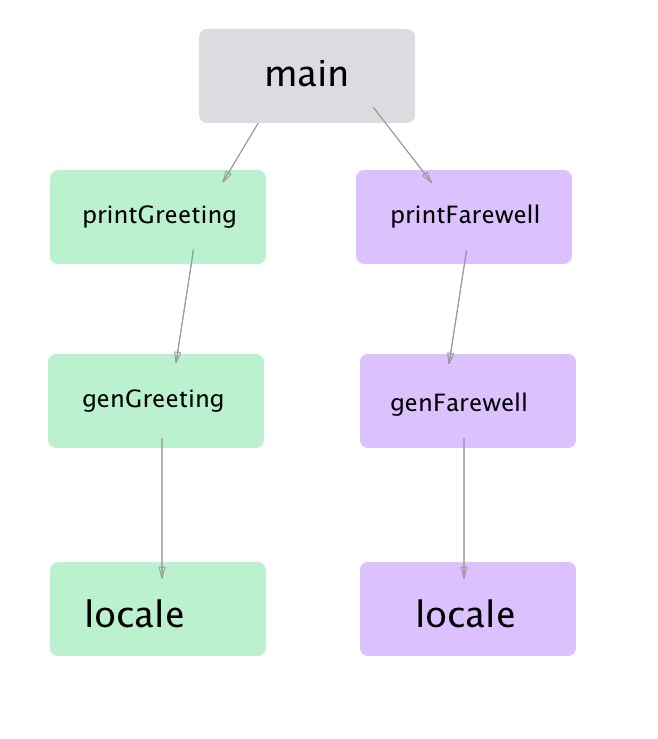
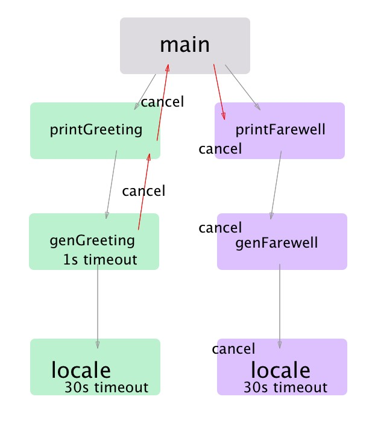

# context 
正如我们所看到的，在并发程序中，由于超时，取消或系统其他部分的故障往往需要抢占操作。
我们已经看过了创建done channel 的习惯做法，该channel 在你的程序中流动并取消所有阻塞
的并发操作。这很好，但它也是有限的。

如果我们可以在简单的通知上附加传递额外的信息以取消：为什么会取消，或者我们的函数有一个
他必须要完成的最后期限，这将非常有用。
事实证明，对于任何规模的系统来说，使用这些信息来包装已完成的channel是非常常见的，因此
Go语言的作者们决定为此创建一个标准模式。
它起源于一个在标准库之外的实验功能，但是在Go1.7 中，context 包被引入标准库中，
这使它成为考虑并发问题时的一个标准的风格。

context 包：
```go
var Canceled = errors.New("context canceled")
var DeadlineExceeded error = deadlineExceededError{}

type CancelFunc func()
unc Background() Context
func TODO() Context
func WithCancel(parent Context) (ctx Context, cancel CancelFunc)
func WithDeadline(parent Context, d time.Time) (Context, CancelFunc)
func WithTimeout(parent Context, timeout time.Duration) (Context, CancelFunc)
func WithValue(parent Context, key, val interface{}) Context
```
稍后讨论这些类型和函数，现在关注context 类型。
这个类型就像是 done channel 一样，在你的整个系统中进行传递。如果使用上下文包，
那么位于顶级并发调用下游的每个函数都会将context 作为其第一个参数。
类型如下：
```go
type Context interface {
	// Deadline returns the time when work done on behalf of this context
	// should be canceled. Deadline returns ok==false when no deadline is
	// set. Successive calls to Deadline return the same results.
	Deadline() (deadline time.Time, ok bool)

	// Done returns a channel that's closed when work done on behalf of this
	// context should be canceled. Done may return nil if this context can
	// never be canceled. Successive calls to Done return the same value.
	// The close of the Done channel may happen asynchronously,
	// after the cancel function returns.
	//
	// WithCancel arranges for Done to be closed when cancel is called;
	// WithDeadline arranges for Done to be closed when the deadline
	// expires; WithTimeout arranges for Done to be closed when the timeout
	// elapses.
	//
	// Done is provided for use in select statements:
	//
	//  // Stream generates values with DoSomething and sends them to out
	//  // until DoSomething returns an error or ctx.Done is closed.
	//  func Stream(ctx context.Context, out chan<- Value) error {
	//  	for {
	//  		v, err := DoSomething(ctx)
	//  		if err != nil {
	//  			return err
	//  		}
	//  		select {
	//  		case <-ctx.Done():
	//  			return ctx.Err()
	//  		case out <- v:
	//  		}
	//  	}
	//  }
	//
	// See https://blog.golang.org/pipelines for more examples of how to use
	// a Done channel for cancellation.
	Done() <-chan struct{}

	// If Done is not yet closed, Err returns nil.
	// If Done is closed, Err returns a non-nil error explaining why:
	// Canceled if the context was canceled
	// or DeadlineExceeded if the context's deadline passed.
	// After Err returns a non-nil error, successive calls to Err return the same error.
	Err() error

	// Value returns the value associated with this context for key, or nil
	// if no value is associated with key. Successive calls to Value with
	// the same key returns the same result.
	//
	// Use context values only for request-scoped data that transits
	// processes and API boundaries, not for passing optional parameters to
	// functions.
	//
	// A key identifies a specific value in a Context. Functions that wish
	// to store values in Context typically allocate a key in a global
	// variable then use that key as the argument to context.WithValue and
	// Context.Value. A key can be any type that supports equality;
	// packages should define keys as an unexported type to avoid
	// collisions.
	//
	// Packages that define a Context key should provide type-safe accessors
	// for the values stored using that key:
	//
	// 	// Package user defines a User type that's stored in Contexts.
	// 	package user
	//
	// 	import "context"
	//
	// 	// User is the type of value stored in the Contexts.
	// 	type User struct {...}
	//
	// 	// key is an unexported type for keys defined in this package.
	// 	// This prevents collisions with keys defined in other packages.
	// 	type key int
	//
	// 	// userKey is the key for user.User values in Contexts. It is
	// 	// unexported; clients use user.NewContext and user.FromContext
	// 	// instead of using this key directly.
	// 	var userKey key
	//
	// 	// NewContext returns a new Context that carries value u.
	// 	func NewContext(ctx context.Context, u *User) context.Context {
	// 		return context.WithValue(ctx, userKey, u)
	// 	}
	//
	// 	// FromContext returns the User value stored in ctx, if any.
	// 	func FromContext(ctx context.Context) (*User, bool) {
	// 		u, ok := ctx.Value(userKey).(*User)
	// 		return u, ok
	// 	}
	Value(key interface{}) interface{}
}
```
这看起来也简单，有一个Done 方法返回当我们的函数被强占时关闭的channel。
还有一些新的但易于理解的方法：一个Deadline 函数，用于指示在一定时间之后 goroutine 是否会被取消，
以及一个Err方法，如果goroutine被取消，将返回非零。但Value方法看起来似乎有点儿不合适。
这是为什么呢?

Go语言作者们注意到，goroutine 的主要用途之一是为请求提供服务的程序。
通常在这些程序中，除了强占信息之外，还需要传递特定于请求的信息。
这是Value函数的目的。我们稍后会进一步讨论这个问题，但现在我们只需要知道 context 包
有两个主要目的：
- 提供一个可以取消你的调用图中分支的API。
- 提供用于通过呼叫传输请求范围数据的数据包。

让我们先关注：取消。
正如我们在 "防止 goroutine 泄露" 中所学到的，函数中取消有三个方面：
- goroutine 的 父goroutine 可能想要取消它。
- 一个goroutine 可能想要取消它的子 goroutine。
- 【goroutine 中的任何阻塞操作都必须是可抢占的，以便它可以被取消。】

context包帮助管理所有这三个东西。

正如我们所提到的，context 类型将是你的函数的第一个参数。如果你看看 context 
接口上的方法，你会发现没有任何东西可以改变底层结构的状态。
此外，接收 context的函数并不能取消它。这保护了调用堆栈上的函数被子函数取消context的情况。
结合 done channel 提供的完成函数，这允许context 类型安全地管理其前件（没懂）的取消。

这就产生一个问题：如果 context 是不可变的，那么我们如何影响调用堆栈中当前函数下面的函数
中的取消行为？

下面的函数就是让 context 包变得如此重要的原因所在了。让我们从中再挑选出几个函数来刷新我们
的认知：
```go
func WithCancel(parent Context) (ctx Context, cancel CancelFunc)
func WithDeadline(parent Context, d time.Time) (Context, CancelFunc)
func WithTimeout(parent Context, timeout time.Duration) (Context, CancelFunc)
```
请注意，所有这些函数都接收一个Context 参数, 并且返回一个 Context。
其中一些还有其他的参数，如截止时间和超时参数。这些函数都使用与这些函数相关的
选项来生成Context的新实例。

WithCancel 返回一个新的Context，它在调用返回的cancel 函数时关闭其 done channel。
WithDeadline 返回一个新的Context，当机器的时钟超过给定的最后期限时，它关闭完成的channel。
WithTimeout 返回一个新的Context，它在给定的超时时间后关闭其完成的channel。

如果你的函数需要以某种方式在调用图中取消它后面的函数，它将调用其中一个函数并传递给它的上下文，
然后将返回的上下文传递给它的子元素。如果你的函数不需要修改取消行为，那么函数只传递给定的上下文。（这里没读懂翻译）

通过这种方式，调用图的连续图层可以创建符合其需求的上下文，而不会影响其父母节点。
这为如何管理调用图的分支提供了一个非常可组合的优雅解决方案。

context 包就是本着这种精神来串联起你程序的调用图的。在前面的对象的范例中，通常将对经常使用
的数据的引用存储为成员变量，但重要的是不要使用context.Context 的实例来执行此操作。context.Context 的实例
可能与外部看起来相同，但在内部它们可能会在每个栈帧更改。
出于这个原因，总是将context 的实例传递给你的函数是很重要的。通过这种方式，函数具有用于它的上下文，
而不是用于堆栈N 的context。

在异步调用图的顶部，你的代码可能不会传递context。要启动这个调用链，context包提供了两个函数来创建上下文的空实例。
```go
func Backgroud() Context
func TODO() Context
```
`Backgroud()`只是返回一个空的上下文。`TODO()` 不是用于生产，而是返回一个空的 context。`TODO()` 的预期目的
是作为一个占位符，当你不知道使用哪个 context，或者你希望你的代码被提供一个context，但上游代码还没有提供。

所以让我们把所有这些用于使用。我们来看一个使用完成channel模式的例子，并且看看我们切换到使用 context 包获得什么好处。
这是一个同时打印问候和告别的程序"
```go
package main

import (
	"fmt"
	"sync"
	"time"
)

func main() {
	var wg sync.WaitGroup
	done := make(chan interface{})
	defer close(done)

	wg.Add(1)
	go func() {
		defer wg.Done()
		if err := printGreeting(done); err != nil {
			fmt.Printf("%v", err)
			return
		}
	}()

	wg.Add(1)
	go func() {
		defer wg.Done()
		if err := printFarewell(done); err != nil {
			fmt.Printf("%v", err)
			return
		}
	}()

	wg.Wait()
}

func printGreeting(done <-chan interface{}) error {
	greeting, err := genGreeting(done)
	if err != nil {
		return err
	}
	fmt.Printf("%s world!\n", greeting)
	return nil
}

func printFarewell(done <-chan interface{}) error {
	farewell, err := genFarewell(done)
	if err != nil {
		return err
	}
	fmt.Printf("%s world!\n", farewell)
	return nil
}

func genGreeting(done <-chan interface{}) (string, error) {
	switch locale, err := locale(done); {
	case err != nil:
		return "", err
	case locale == "EN/US":
		return "hello", nil
	}
	return "", fmt.Errorf("unsupported locale")
}

func genFarewell(done <-chan interface{}) (string, error) {
	switch locale, err := locale(done); {
	case err != nil:
		return "", err
	case locale == "EN/US":
		return "goodbye", nil
	}
	return "", fmt.Errorf("unsupported locale")
}

func locale(done <-chan interface{}) (string, error) {
	select {
	case <-done:
		return "", fmt.Errorf("canceled")
	case <-time.After(3 * time.Second):
	}
	return "EN/US", nil
}
```
[【demo】](context_demo1/cd1_done.go)

输出：
```shell
goodbye world!
hello world!
```
忽略竞争条件（顺序不定）, 我们可以看到我们的程序有两个分支同时运行。
我们通过创建完成通道并将其传递给我们的调用图来设置标准抢占方法。
如果我们在main 的任何一点关闭done channel，那么两个分支都将被取消。

通过引入goroutine, 我们已经开辟了以几种不同且有趣的方式来控制该程序的可能性。
我们可能希望genGreeting 在耗时过长的时候发生超时。也许我们不希望genFarewell
调用locale，如果我们知道其父函数将很快被取消。
在每个堆栈框架中，一个函数可以影响其下的整个调用堆栈。

使用 done channel 模式的话，我们可以通过将输入的 done channel 都包装到统一的
done channel中，并在任意done channel 被关闭的时候关闭所有done channel，
【但是这样做的话我们没办法获得Context 所能给我们提供的关于错误以及超时的额外信息】。

为了比较 done channel 和 context 包，我们用树来表示这个程序，树中每个节点代表一个
函数的调用


让我们修改我们的程序，使用 context 包而不是 done channel。因为我们现在
具有 context.Context 的灵活性，所以我们可以引入一个有趣的场景。

假设 genGreeting 只想在放弃调用 locale 之前 等待 1s，超时时间就应该为1s。
我们也想要在 main 函数中建立一些智能逻辑。如果 printGreeting 不成功，
我们也想取消我们对printFarewell 的调用。毕竟，如果我们不打声招呼，说再见就没有意义了。

使用context 包实现这一点很简单：
```go
package main

import (
	"context"
	"fmt"
	"sync"
	"time"
)

func main() {
	var wg sync.WaitGroup
	// 1、这里 main 用 context.Background() 创建一个 Context 并用 context.WithCancel 包装它以允许取消。
	ctx, cancel := context.WithCancel(context.Background())
	defer cancel()
	wg.Add(1)
	go func() {
		defer wg.Done()
		if err := printGreeting(ctx); err != nil {
			fmt.Printf("cannot print greeting: %v\n", err)
			// 2、这一行上，如果从打印语问候语返回错误，main将取消这个context。
			cancel()
		}
	}()

	wg.Add(1)
	go func() {
		defer wg.Done()
		if err := printFarewell(ctx); err != nil {
			fmt.Printf("cannot print farewell: %v\n", err)
		}
	}()
	wg.Wait()
}

func printGreeting(ctx context.Context) error {
	greeting, err := genGreeting(ctx)
	if err != nil {
		return err
	}
	fmt.Printf("%s world!\n", greeting)
	return nil
}

func printFarewell(ctx context.Context) error {
	farewell, err := genFarewell(ctx)
	if err != nil {return err}
	fmt.Printf("%s world!\n", farewell)
	return nil
}

func genGreeting(ctx context.Context) (string, error) {
	// 3、这里genGreeting 用context.WithTimeout 包装它的Context。这将
	// 在1s 后自动取消返回的 context，从而取消它传递该 context 的任何子函数，即语言环境。
	ctx, cancel := context.WithTimeout(ctx, 1 * time.Second)
	defer cancel()
	switch locale, err := locale(ctx); {
	case err != nil:
		return "", err
	case locale == "EN/US":
		return "hello", nil
	}
	return "", fmt.Errorf("unsupported locale")
}

func genFarewell(ctx context.Context) (string, error) {
	switch locale, err := locale(ctx); {
	case err != nil:
		return "", err
	case locale == "EN/US":
		return "goodbye", nil
	}
	return "", fmt.Errorf("unsupported locale")
}

func locale(ctx context.Context) (string, error) {
	select {
	case <-ctx.Done():
		// 这一行返回为什么Context 被取消对的原因。该错误将会一直弹出到main， 这会导致取消。
		return "", ctx.Err()
	case <-time.After(30 * time.Second):
	}
	return "EN/US", nil
}
```
[【demo】](context_demo2/cd2_ctx.go)

输出：
```shell
cannot print greeting: context deadline exceeded
cannot print farewell: context canceled
```
让我们看使用调用图了解发生了什么。这里数字对应前面例子中的代码标注


我们可以从我们的输出中看到该系统运行的很完美。
由于我们确保local 至 少需要一分钟来运行，因此我们在genGreeting 中的调用将
始终超时，这意味着main 会始终取消 printFarewell 下面的调用图。

请注意，genGreeting 是如何构建自定义的Context.Context 以满足其需求，
而不必影响父级的context。如果 genGreeting 成功返回，并且 printGreeting 
需要再次调用，则可以在不泄露有关genGreeting 如何操作的信息的情况下进行。
这种可组合性使你能够编写大型系统，而无需在整个调用图中混淆问题。

我们可以对这个程序进行另一个改进：因为我们知道locale 需要大约一分钟的时间来运行，
在locale的内部，我们可以检查是否已经设置了超时时间，如果已经设置了超时时间的话，
我们是否已经超时。下面例子展示了如何使用context.Context 的 Deadline 方法：
```go
package main

import (
	"context"
	"fmt"
	"sync"
	"time"
)

func main() {
	var wg sync.WaitGroup
	ctx, cancel := context.WithCancel(context.Background())
	defer cancel()

	wg.Add(1)
	go func() {
		defer wg.Done()

		if err := printGreeting(ctx); err != nil {
			fmt.Printf("cannot print greeting: %v\n", err)
			cancel()
		}
	}()

	wg.Add(1)
	go func() {
		defer wg.Done()
		if err := printFarewell(ctx); err != nil {
			fmt.Printf("cannot print farewell: %v\n", err)
		}
	}()

	wg.Wait()
}

func printGreeting(ctx context.Context) error {
	greeting, err := genGreeting(ctx)
	if err != nil {
		return err
	}
	fmt.Printf("%s world!\n", greeting)
	return nil
}

func printFarewell(ctx context.Context) error {
	farewell, err := genFarewell(ctx)
	if err != nil {return err}
	fmt.Printf("%s world!\n", farewell)
	return nil
}

func genGreeting(ctx context.Context) (string, error) {
	ctx, cancel := context.WithTimeout(ctx, 2 * time.Second)
	defer cancel()
	switch locale, err := locale(ctx); {
	case err != nil:
		return "", err
	case locale == "EV/US":
		return "hello", nil
	}
	return "", fmt.Errorf("unsupported locale")
}

func genFarewell(ctx context.Context) (string, error) {
	switch locale, err := locale(ctx); {
	case err != nil:
		return "", err
	case locale == "EN/US":
		return "goodbye", nil
	}
	return "", fmt.Errorf("unsupported locale")
}


func locale(ctx context.Context) (string, error) {
	// 这里我们检查我们的context 是否提供了超时时间。如果确实如此，并且我们的系统时钟已经超过截止时间，
	// 那么我们只会返回context 包中定义的特定错误，即 DeadlineExceeded 
	if deadline, ok := ctx.Deadline(); ok {
		if deadline.Sub(time.Now().Add(1 * time.Minute)) <= 0 {
			return "", context.DeadlineExceeded
		}
	}
	select {
	case <- ctx.Done():
		return "", ctx.Err()
	case <-time.After(1 * time.Minute):
	}
	return "EN/US", nil
}
```
输出
```shell
cannot print greeting: context deadline exceeded
cannot print farewell: context canceled
```
虽然在迭代程序之间的差异很小，但它允许locale 函数很快就会失败。
在调用下一个函数的成本很高的程序中，这可能会节省大量的时间，但
至少它也允许该函数立即失效，而不必等待实际的超时发生。
唯一的问题是，你必须知道你的下级调用图需要多长时间，这个实践起来可能非常困难。

这将我们带到了 context 包提供的另一半功能: 用于存储和检索请求范围数据
的 Context 的数据包。请记住，当一个函数创建一个 goroutine 和 Context 时，
它通常会启动一个将为请求提供服务的 goroutine，并且进一步向下的函数可能需要
有关请求的信息。以下是如何下上下文中存储数据以及如何检索数据的示例：
```go
package main

import (
	"context"
	"fmt"
)

func main() {
	ProcessRequest("jane", "abc123")
}

func ProcessRequest(userID, authToken string) {
	ctx := context.WithValue(context.Background(), "userID", userID)
	ctx = context.WithValue(ctx, "authToken", authToken)
	//fmt.Printf("-->: %v\n", ctx)
	HandleResponse(ctx)
}

func HandleResponse(ctx context.Context) {
	fmt.Printf(
		"handling response for userID: %v (authToken: %v)",
		ctx.Value("userID"),
		ctx.Value("authToken"),
	)
}
```
[【demo】](context_demo4/cd4_req.go)

输出：
```shell
handling response for userID: jane (authToken: abc123)
```
很简单的东西，唯一的限制条件是：
- 你使用的键值必须满足Go语言的可比性概念（这里可以点进去看到源码）,也就是运算符
 == 和 != 在使用时需要返回正确的结果。
- 返回值必须安全，才能从多个 goroutine 访问。

由于 Context 的键值都被定义为 interface{}，所以当试图检索值时，
我们会失去Go语言的类型安全性。key 可以是不同的类型，或者与我们提供的key略有所不同。
值可能与我们预期的不同。出于这些原因，Go语言作者建议你在从Context 中存储和检索值时
遵循一些规则。

首先，它们建议你在软件包中定义一个自定义键类型。只要其他软件包执行相同的操作，则可以
防止上下文中的冲突。作为一个提醒我们为什么要这么做的例子，我们来看看如下这个尝试将
相同的内部值存储在不同key 类型的简短程序：
```go
package main

import "fmt"

type foo int
type bar int

func main() {
	m := make(map[interface{}]int)
	m[foo(1)] = 1
	m[bar(1)] = 2
	fmt.Printf("%v\n", m)
}
```
[【demo】](context_demo5/cd5_samev_notsk.go)

输出
```shell
map[1:2 1:1]
```
可以看到，虽然基础值是相同的，但不同的类型信息在map 中区分它们。
由于你为软件包 key 定义的类型未导出，因此其他软件包不能与你在软件包中生成的key 冲突。

由于我们不导出用于存储数据的key，因此我们必须导出为我们检索数据的函数。
这能很好地工作，因为它允许这些数据的使用者使用静态的、类型安全的函数。

当你把所有这些放在一起时，你会得到类似下面的这个例子：
```go
package main

import (
	"context"
	"fmt"
)

type ctxKey int

const (
	ctxUserID ctxKey = iota
	ctxAuthToken
)

func UserID(c context.Context) string {
	return c.Value(ctxUserID).(string)
}

func AuthToken(c context.Context) string {
	return c.Value(ctxAuthToken).(string)
}

func ProcessRequest(userID, authToken string) {
	ctx := context.WithValue(context.Background(), ctxUserID, userID)
	ctx = context.WithValue(ctx, ctxAuthToken, authToken)
	HandleResponse(ctx)
}

func HandleResponse(ctx context.Context) {
	fmt.Printf(
		"handle response for userID: %v (authToken: %v)",
		UserID(ctx),
		AuthToken(ctx),
	)
}

func main() {
	ProcessRequest("jane", "abc12")
}
```
[【demo】](context_demo6/cd6_use_key.go)

输出：
```shell
handle response for userID: jane (authToken: abc12)
```
我们现在有一种类型安全的函数来从context 获取值，如果消费者在不同的包中，
它们不会知道或关心用于存储信息的key。但是，这种技术确实会造成问题。

在前面的例子中，我们假设 HandleResponse 确实存在于另一个名为response 的包中，
我们假设 ProcessRequest 位于名为 process 的包中。
process 包必须导入响应包才能调用 HandleResponse，但 HandleResponse 无法访问
process 包中定义的访问器函数，因为导入过程会形成循环依赖关系。
由于用于在 Context 中存储key 的类型对于 process 包来说是私有的，所以 response
包无法检索这些数据！

这就迫使了创建以某种数据类型为中心的包被不同的地方导入的架构。这样做当然不是一件坏事，
但确实是一个值得三思之后的决定。

context 包非常整洁，但尚未被整个Go语言社区所赞美。在Go语言社区中，
context包一直存在争议。建议取消 context 包的提议已经相当受欢迎，而且在context 中
存储任意数据的能力以及存储数据的类型不安全的方式造成了一些分歧。
虽然已经减少了部分访问函数缺乏类型安全性，但是仍然可以通过存储不正确的类型来引入错误。
然而，更大的问题肯定是开发人员应该在 context 的实例中存储什么的问题。

关于什么是适当的、最普遍的指导，下面是context包中的下面有点函数的注释：
> // Package context defines the Context type, which carries deadlines,
// cancellation signals, and other request-scoped values across API boundaries
// and between processes.

这个翻译可能比较早
> 仅将上下文值用于传输进程和请求的请求范围数据，API边界，而不是将可选参数传递给函数。

你应该很清楚什么是可选参数（你不应该使用context 来满足你对Go语言支持可选参数的奇怪需求），
但什么是"请求范围数据"？据说它"转换进程 和 API 边界"，但它也可以描述很多东西。
我发现定义它的最哈方法是与团队一起提出一些启发式方法， 并在代码评审中评估它们。
这是我的启发式的建议：（有的没看懂）
1. ***数据应该通过进程或API边界***
   > 如果你在进程的内存中生成数据，那么除非你通过API边界传递数据，否则可能不是一个很好的选择。
2. ***数据应该是不可变的***
   > 如果不是，那么根据定义，你存储的内容不是来自请求的内容。
3. ***数据应该趋向简单类型***
   > 如果请求范围数据是为了传递进进程和API边界，那么如果另一方不需要导入一个复杂的包的图，
   那么将这些数据拉出就容易的多。
4. ***数据应该是数据，而不是类型和方法***
   > 操作是逻辑的，属于消耗这些数据的东西。
5. ***数据应该用于修饰操作，而不是驱动操作***
   > 如果你的算法根据 context 中包含或不包含的内容而有所不同，你可能会跨越可选参数的范围。（目前我理解这是不应该的，逻辑不应该放在这里吧）

以上皆非硬性规定，只是用来启发你编程时候思维的建议。但是，
如果你发现存储在上下文中的数据违反了上述所有五条准则，你可能需要仔细观察下你正在做什么。

需要考虑的另一个方面是该数据在使用之前可能需要经过多少层。如果在接收数据的地方和使用的点之间
有几个框架和几十个函数，你是否想要倾向于冗长的自解释的参数名，并将数据作为参数添加？
或者你更愿意将它放在 context 中，从而创建一个不可见的依赖关系？
每种方法都有优点，最终这是你和你的团队必须做出的决定。

即使采用这些启发式方法，值是否是请求范围数据仍然是一个难以回答的问题。看看下面的表格。
它列出了我对每种数据是否满足我列出的五种启发式的看法。

| 数据 | 1 | 2 | 3 | 4 | 5 |
| :---: | :---: | :---: | :---: | :---: | :---: |
| RequestID | ✔️ | ✔️ | ✔️ | ✔️| ✔️ |  
| UserID | ✔️ | ✔️ | ✔️ | ✔️| |  
| URL | ✔️ | ✔️ | ️ | ️| ️ |  
| API Server Connection |  | ️ |️ | ️|️ |
| Authorization Token | ✔️ | ✔️ | ✔️ | ✔️| |
| Request Token | ✔️ | ✔️ | ✔️ | |  |  

有时很明显，某些内容不应该存储在上下文中，因为它与API 服务器连接有关，但
有时不太清楚。什么是授权令牌？它是不可变的，它可能是一部分字节，但是这些
数据的接收者不会使用它来确定是否要求字段？这些数据是否属于上下文？
为了让情况更加难以预测：很可能在一个团队可以被接受的编程方式，在另一个团队中
是不可被接受的。

总而言之，这个问题并没有一个一概而就的答案。该软件包已被纳入标准库，
因此你必须对其使用形成一些意见，但该意见可能（也可能应该）根据你所触及
的项目而改变。我留给你的最后意见是，context 提供的取消功能非常有用，
你对数据包的感受不应该阻止你使用它。


