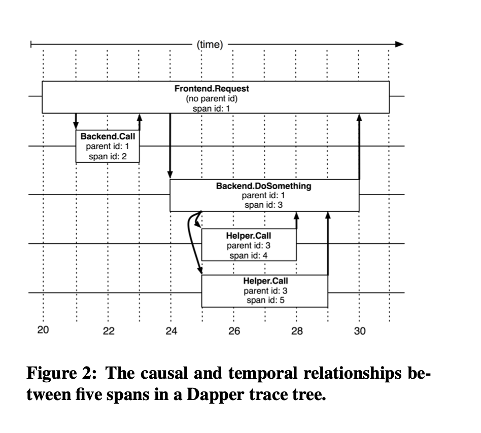
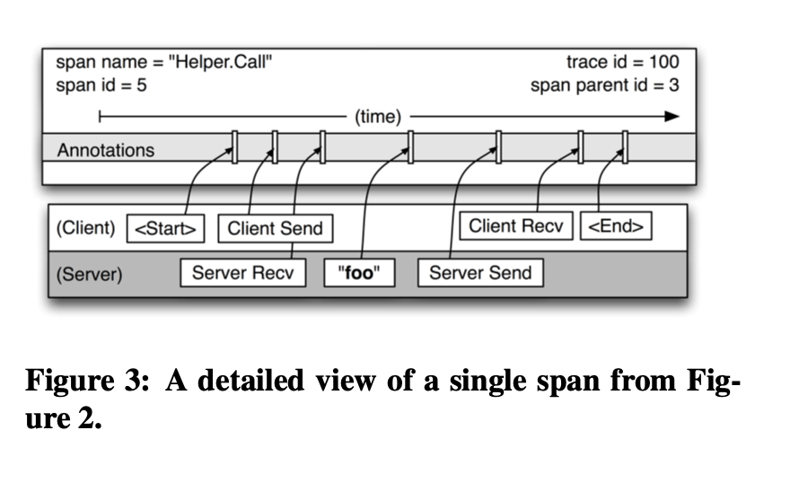
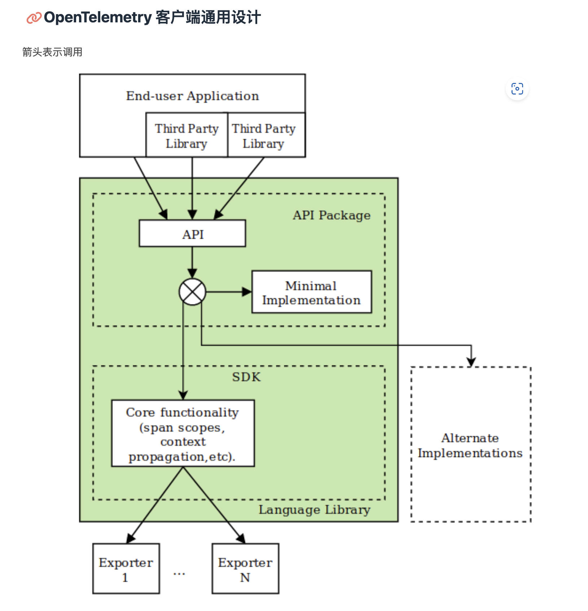

<!--
 * @Author: 27
 * @LastEditors: 27
 * @Date: 2023-03-06 00:18:22
 * @LastEditTime: 2023-03-06 16:02:41
 * @FilePath: /let-sGo/c/trace_learn/doc.md
 * @description: type some description
-->
# 链路追踪

## 历史
概括：单体到微服务架构的产物。

Google Dapper 论文

一个Web查询的例子将会说明trace系统需要去解决的一些问题。

一个前端服务可能会产生一个Web请求到上百个查询服务器，其中在每一个服务器上的查询都在它自己的索引内进行搜索。
请求也有可能被发送到多个处理广告、检查拼写、或者寻找包含图像、音频、新闻等特殊结果的服务。
来自这些服务的结果被有选择性地组合起来用于产生最终的页面（我们称这个模型为“universal search”）。

总共可能需要上千台服务器和很多不同的服务去处理“universal search”请求。还有，用户对于延迟是敏感的，子系统的低效都可能导致总体性能较低。
**工程师仅仅看一眼总体的延迟就可能知道出现故障了，但是不可能猜出哪个服务出了故障，也不能解释这种行为表现**。

- 首先，工程师可能不会准确地意识到正在使用哪一个服务；新服务每周都会出现，旧服务每周都会被改动，这些情况都会添加一些用户可见的特性或提升性能、安全方面的东西。
- 第二，工程师不会精通每一个服务的内部原理；每一个服务由不同的团队开发和维护。
- 第三，服务可能同时被很多种不同的客户端使用，所以服务的性能可能取决于其他客户端的行为。举个例子，一个前端服务可能要应付各种各样的请求类型，而一个使用效率很高的存储系统，比如Bigtable，有可能正被反复读写着，因为上面跑着各种各样的应用。

上面所讨论的案例为Dapper引出了两个基本条件：无处不在的部署和持续监控。无处不在的部署是很重要的条件，因为如果系统的一小部分没有被监控，trace基础设施的可用性可以被严重的影响。
另外，监控应该总被开启，因为通常情况下异常的或其他值得注意的系统行为很难重现甚至不可重现。
从这两个条件中推导出了三个具体的设计目标：
- **低开销**：trace系统对运行的服务的性能影响应该忽略不计。在某些高度优化的服务中，甚至一点小的监控开销都很容易察觉到，这样可能会迫使开发团队把trace系统关闭掉。
- **应用级透明**：开发人员不应需要意识到trace系统的存在。依赖于开发人员积极协作以实现运作的trace基础设施是非常脆弱的，由于trace库的漏洞或疏忽它经常坏掉，因此违反了无处不在的要求。
像我们这样，对于快节奏的开发环境尤为重要。
- **可扩展性**：它至少需要在未来几年处理Google服务和群集的规模。


随着这篇论文的诞生，分布式追踪（Distributed Tracing)被越来越多人接受，技术概念逐渐兴起。

## OpenTelemetry
In the past, the way in which code was instrumented would vary, as each Observability back-end would have its own instrumentation libraries and agents for emitting data to the tools.

This meant that there was no standardized data format for sending data to an Observability back-end. Furthermore, if a company chose to switch Observability back-ends, it meant that they would have to re-instrument their code and configure new agents just to be able to emit telemetry data to the new tool of choice.

Recognizing the need for standardization, the cloud community came together, and two open source projects were born: OpenTracing (a Cloud Native Computing Foundation (CNCF) project) and OpenCensus (a Google Open Source community project).

OpenTracing provided a vendor-neutral API for sending telemetry data over to an Observability back-end; however, it relied on developers to implement their own libraries to meet the specification.

OpenCensus provided a set of language-specific libraries that developers could use to instrument their code and send to any one of their supported back-ends.

In the interest of having one single standard, OpenCensus and OpenTracing were merged to form OpenTelemetry (OTel for short) in May 2019. As a CNCF incubating project, OpenTelemetry takes the best of both worlds, and then some.

OTel’s goal is to provide a set of standardized vendor-agnostic SDKs, APIs, and tools for ingesting, transforming, and sending data to an Observability back-end (i.e. open source or commercial vendor).


## Dapper 定义链路信息




## 基本概念
**Tracer Provider:**
A Tracer Provider (sometimes called TracerProvider) is a factory for Tracers. In most applications, a Tracer Provider is initialized once and its lifecycle matches the application's lifecycle. Tracer Provider initialization also includes *Resource* and *Exporter* initialization

**Resources** are a special type of attribute that apply to all spans generated by a process. 
These should be used to represent underlying metadata about a process that's non-ephemeral — for example, the hostname of a process, or its instance ID.

Resources should be assigned to a tracer provider at its initialization, and are created much like attributes:
```go
resources := resource.NewWithAttributes(
    semconv.SchemaURL,
    semconv.ServiceNameKey.String("myService"),
    semconv.ServiceVersionKey.String("1.0.0"),
    semconv.ServiceInstanceIDKey.String("abcdef12345"),
)

provider := sdktrace.NewTracerProvider(
    ...
    sdktrace.WithResource(resources),
)
```
```
// os.Getenv("HOSTNAME")
```

Tracer
A Tracer creates spans containing more information about what is happening for a given operation, such as a request in a service. Tracers are created from Tracer Providers.

Trace Exporters
Trace Exporters send traces to a consumer. This consumer can be standard output for debugging and development-time, the OpenTelemetry Collector, or any open source or vendor backend of your choice.

Context Propagation
Context Propagation is the core concept that enables Distributed Tracing. With Context Propagation, Spans can be correlated with each other and assembled into a trace, regardless of where Spans are generated. We define Context Propagation by two sub-concepts: Context and Propagation.

A **Context** is an object that contains the information for the sending and receiving service to correlate one span with another and associate it with the trace overall. For example, if Service A calls Service B, then a span from Service A whose ID is in context will be used as the parent span for the next span created in Service B.

**Propagation** is the mechanism that moves Context between services and processes. By doing so, it assembles a Distributed Trace. It serializes or deserializes Span Context and provides the relevant Trace information to be propagated from one service to another. We now have what we call: Trace Context.

Why does OTel Baggage exist?
Baggage provides a uniform way to store and propagate information across a trace and other signals. For example, you may want to attach information from your application to a span and retrieve that information much later and use it later on with another span. However, spans in opentelemetry are immutable once created, and can be exported before you need information on them later on. Baggage allows you to work around this problem by providing a place to store and retrieve information.


What should OTel Baggage be used for?
OTel Baggage should be used for non-sensitive data that you’re okay with potentially exposing to third parties. This is because it’s stored in HTTP headers alongside the current context.

Baggage is not the same as Span attributes
One important thing to note about Baggage is that it is not a subset of the Span Attributes. When you add something as Baggage, it does not automatically end up on the Attributes of the child system’s spans. You must explicitly take something out of Baggage and append it as Attributes.

For example, in .NET you might do this:
```.net
var accountId = Baggage.GetBaggage("AccountId");
Activity.Current?.SetTag("AccountId", accountId);
```

OpenTelemetry 支持的数据类型
• Metrics
Metric 是关于一个服务的度量，在运行时捕获。从逻辑上讲，捕获其中一个量度的时刻称为 Metric event，它不仅包含量度本身，还包括获取它的时间和相关元数据。应用和请求指标是可用性和性能的重要指标。自定义指标可以深入了解可用性如何影响用户体验和业务。自定义 Metrics 可以深入理解可用性 Metrics 是如何影响用户体验或业务的。OpenTelemetry 目前定义了三个 Metric 工具：
• counter: 一个随时间求和的值，可以理解成汽车的里程表，它只会上升。
• measure: 随时间聚合的值。它表示某个定义范围内的值。
• observer: 捕捉特定时间点的一组当前值，如车辆中的燃油表。

• Logs
日志是带有时间戳的文本记录，可以是带有元数据结构化的，也可以是非结构化的。虽然每个日志都是独立数据源，但可以附加到 Trace 的 Span 中。日常使用调用时，在进行节点分析时出伴随着也可看到日志。
在 OpenTelemetry 中，任何不属于分布式 Trace 或 Metrics 的数据都是日志。日志通常用于确定问题根因，通常包含有关谁更改了内容以及更改结果的信息。

• Traces
Trace 指单个请求的追踪，请求可以由应用程序发起，也可以由用户发起。分布式 Tracing 是跨网络，跨应用的追踪形式。每个工作单元在 Trace 中被称为 Span，一个 Trace 由一个树形的 Span 组成。Span 表示经过应用程序所设计的服务或组件所做工作的对象，Span 还提供了可用于调试可用性和性能问题的请求、错误和持续时间的 Metrics。Span 包含了一个 Span 上下文，它是一组全局唯一标识符，表示每个 Span 所属的唯一请求。通常我们称之为 TraceID。

• Baggage
除了 Trace 的传播，OpenTelemetry 还提供了 Baggage 来传播键值对。Baggage 用于索引一个服务中的可观察事件，该服务包含同一事务中先前的服务提供的属性，有助于在事件之间建立因果关系。虽然 Baggage 可以用作其他横切关注点的原型，但这种机制主要是为了传递 OpenTelemetry 可观测性系统的值。这些值可以从 Baggage 中消费，并作为度量的附加维度，或日志和跟踪的附加上下文使用。

## otel 设计原则
- OpenTelemetry API 必须良好定义，并与实现清晰地分离。这允许最终用户使用 API 而不用实现。
- 在代码中添加第三方库和框架将只依赖于 OpenTelemetry 客户端的 API 。第三方库和框架的开发人员不关心（也不知道）最终应用程序中使用了 OpenTelemetry 的什么具体实现。
- 最终应用程序的开发者通常决定如何配置 OpenTelemetry SDK 和使用什么扩展。他们也可以选择不使用任何 OpenTelemetry 的实现，及时应用程序和/或它的库已经被插装过了。其基本原理是，使用 OpenTelemetry 的第三方库和框架必须在不使用 OpenTelemetry 的应用程序中仍然完全可用（因此这就消除了开发人员对其框架的插装和无插装版本的需要）。
- SDK 必须清晰地划分为独立于线路协议（wire protocol-independent）部分，它们实现公共逻辑（例如，批处理、通过进程信息添加标记等）和依赖于协议的遥测数据导出器。遥测数据导出器必须包含最低限度的功能，从而使供应商能够轻松地添加对其特定协议的支持。
- SDK 实现必须包括以下导出器
    - OTLP
    - Jaeger
    - Zipkin
    - Primetheus
    - 用于调试和测试的标准输出（或日志），以及作为各种日志代理工具的输入
    - 内存（模拟）导出器，在本地内存中积累遥测数据，并允许检查，对单元测试很有用



### API 和最小实现
API 包是自依赖的，在这个意义上，如果最终用户的应用程序或第三方库只依赖 API 包，没有安装完整的 SDK ，那么应用程序的构建和运行仍然不会失败，尽管没有遥测数据被传递给后端。

这种自依赖是通过以下途径实现的。

API 依赖包含 API 的最小实现。当应用程序中没有明确包含其他实现时，就不会收集遥测数据。

从 API 的最小实现返回的值是有效的，不需要调用者执行额外的检查（例如，createSpan 方法不应该失败，应该返回一个有效的非空 Span 对象）。


