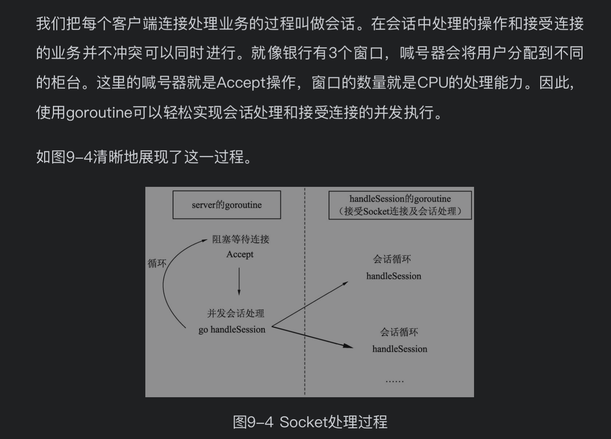
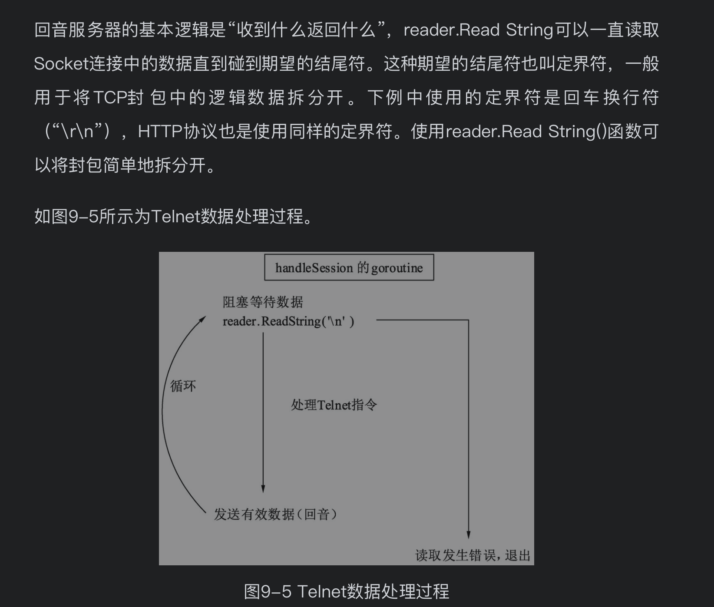
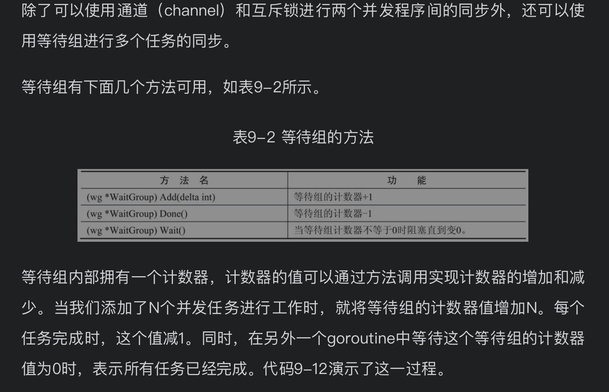

# 通道传输

## 示例：Telnet回音服务器——TCP服务器的基本结构

Telnet协议是TCP/IP协议族中的一种。
它允许用户(Telnet客户端)通过一个协商过程与一个远程设备进行通信。

本例将使用一部分Telnet协议与服务器进行通信。

服务器的网络库为了完整展示自己的代码实现了完整的收发过程，一般比较倾向于使用发送任意包返回原数据的逻辑。
这个过程类似于对着大山高喊，大山把你的声音原样返回的过程。也就是回音（Echo）。

本节使用Go语言中的Socket、goroutine和通道编写一个简单的Telnet协议的回音服务器。

回音服务器的代码分为4个部分，分别是:
1. 接受连接 
2. 会话处理
3. Telnet命令处理
4. 程序入口

#### 1．接受连接
回音服务器能同时服务于多个连接。要接受连接就需要先创建侦听器，侦听器需要一个侦听地址和协议类型。
- 主机IP：一般为一个IP地址或者域名，127.0.0.1表示本机地址。
- 端口号：16位无符号整型值，一共有65536个有效端口号。 
> 通过地址和协议名创建侦听器后，可以使用侦听器响应客户端连接。
响应连接是一个不断循环的过程，就像到银行办理业务时，一般是排队处理，前一个人办理完后，轮到下一个人办理。

> **Go语言中可以根据实际会话数量创建多个goroutine，并自动的调度它们的处理。**

telnet 服务器处理:
1．接受连接
```
func server(address string, exitChan chan int){
	// 根据给定地址进行侦听
	l, err := net.Listen("tcp", address)

	// 如果侦听发生错误，打印错误并退出
	if err != nil {
		fmt.Println(err.Error())
		exitChan <- 1
	}

	// 打印侦听地址，表示侦听成功
	fmt.Println("listen: ", address)

	// 延迟关闭侦听器
	defer l.Close()

	// 侦听循环
	for {
		// 新链接没有来的时候 Accept是阻塞的
		conn, err := l.Accept()

		// 发生任何的侦听错误，打印错误并退出服务器
		if err != nil {
			fmt.Println(err.Error())
			continue
		}

		// 根据链接开启会话，这个过程需要并行执行
		go handleSession(conn, exitChan)
	}
}
``` 
2．会话处理
> 每个连接的会话就是一个接收数据的循环。当没有数据时，调用reader.ReadString会发生阻塞，
等待数据的到来。 一旦数据到来，就可以进行各种逻辑处理。


回音服务器需要将收到的有效数据通过Socket发送回去。
```
func handleSession(conn net.Conn, exitChan chan int) {
	fmt.Println("session start")

	// 创建一个网络连接数据的读取器
	reader := bufio.NewReader(conn)

	// 接收数据的循环
	for {
		// 读取字符串，碰到回车返回
		str, err := reader.ReadString('\n')

		// 数据读取正确
		if err == nil {
			// 去掉字符串尾部的回车
			str = strings.TrimSpace(str)

			// 处理Telnet 指令
			if !processTelnetCommend(str, exitChan){
				conn.Close()
				break
			}

			// Echo 逻辑 发送什么数据，原样返回
			conn.Write([]byte(str + "\r\n"))
		} else {
			// 发生错误
			fmt.Println("session closed")
			conn.Close()
			break
		}
	}
}
```
3．Telnet命令处理
Telnet是一种协议。在操作系统中可以在命令行使用Telnet命令发起TCP连接。
我们一般用Telnet来连接TCP服务器，键盘输入一行字符回车后，即被发送到服务器上。
在下例中，定义了以下两个特殊控制指令，用以实现一些功能：
- 输入“@close”退出当前连接会话。
- 输入“@shutdown”终止服务器运行。
```
func processTelnetCommend(str string, exitChan chan int) bool {
	// @close 指令表示终止本次会话
	if strings.HasPrefix(str, "@close") {
		fmt.Println("session closed")
		// 告诉外部需要断开连接
		return false

		// @shutdown指令表示终止服务进程
	} else if strings.HasPrefix(str, "@shutdown") {
		fmt.Println("server shutdown")

		// 往通道中写入0， 阻塞等待接收方处理
		exitChan <- 0

		// 告诉外部需要断开连接
		return false
	}

	// 打印输入的字符串
	fmt.Println("inner handle", str)
	return true
}

```
4．程序入口
Telnet 回音处理主流程
```
exitChan := make(chan int)

	// 将服务器并发运行
	go server("127.0.0.1:7001", exitChan)

	// 通道阻塞，等待接收返回值
	code := <- exitChan

	// 标记程序返回值并退出
	os.Exit(code)
```
todo: 事实上运行不动
命令不起作用

## 同步——保证并发环境下数据访问的正确性
### 竞态检测——检测代码在并发环境下可能出现的问题
当多线程并发运行的程序竞争访问和修改同一块资源时，会发生竞态问题。
下面的代码中有一个ID生成器，每次调用生成器将会生成一个不会重复的顺序序号，使用10个并发生成序号，观察10个并发后的结果。
```
var (
	// 序列号
	seq int64
)

// 序列号生成器, 有误
func GenID() int64 {
	// 尝试原子的增加序列号
	atomic.AddInt64(&seq, 1)
	return seq
}

func GenIDRight() int64 {
	// 尝试原子的增加序列号
	return atomic.AddInt64(&seq, 1)
}


// go run -race xxx.go 来检测竞态条件
func main(){
	// 生成10个并发序列号
	for i := 0; i < 10 ; i ++ {
		go GenIDRight()
	}

	fmt.Println(GenIDRight())
}

```
本例中只是对变量进行增减操作，虽然可以使用互斥锁（sync.Mutex）解决竞态问题，但是对性能消耗较大。
在这种情况下，推荐使用原子操作（atomic）进行变量操作。

###  互斥锁synx.Mutex 办证同时只有一个goroutine可以访问共享资源

互斥锁是一种常用的控制共享资源访问的方法, 在go程序中使用非常简单，参见下面的代码：

```
package main

import (
	"fmt"
	"sync"
)

var (
	// 逻辑中使用的某个变量
	count int

	// 与变量对应的使用互斥锁
	countGuard sync.Mutex
)

func GetCount() int {
	// 锁定
	countGuard.Lock()

	// 在函数退出时解除锁定
	defer countGuard.Unlock()

	return count
}

func setCount(c int) {
	countGuard.Lock()
	count = c
	countGuard.Unlock()
}


func main(){
	// 可以进行并发安全性设置
	setCount(1)
	// 可以进行并发安全的获取
	fmt.Println(GetCount())


}
```

### 读写互斥锁 synx.RWMutex 在读多写少的环境下比互斥锁更高效
把上面代码稍作修改即可
```
package main

import (
	"fmt"
	"sync"
)

var (
	// 逻辑中使用的某个变量
	count int

	// 与变量对应的使用互斥锁
	countGuard sync.RWMutex

)

func GetCount() int {
	// 锁定
	countGuard.RLock()

	// 在函数退出时解锁
	defer countGuard.RUnlock()

	return count
}

func setCount(c int) {
	countGuard.Lock()
	count = c
	countGuard.Unlock()
}


func main(){
	// 可以进行并发安全性设置
	setCount(29292)
	// 可以进行并发安全的获取
	fmt.Println(GetCount())

}
```
### 等待组（sync.WaitGroup） 保证在并发环境中完成指定数量的任务

```
package main

import (
	"fmt"
	"net/http"
	"sync"
)

func main() {
	// 声明一个等待组
	var wg sync.WaitGroup

	// 准备一系列的网站地址
	var urls = []string{
		"http://www.baidu.com",
		"http://www.zhihu.com",
	}

	// 遍历这些网址
	for _, url := range urls {
		// 每一个任务开始时，等待组增加一
		wg.Add(1)
		// 开启一个并发
		go func(url string) {
			// 使用defer 表示函数完成时将等待组值减一
			defer  wg.Done()

			// 使用http 访问提供地址
			_, err := http.Get(url)

			// 访问完成后，打印地址和可能发生的错误
			fmt.Println(url, err)

			// 通过参数传递url 地址

		}(url)
	}

	// 等待所有的任务完成
	wg.Wait()

	fmt.Println("over")
}
```


