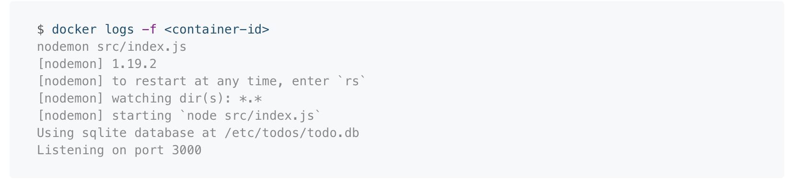
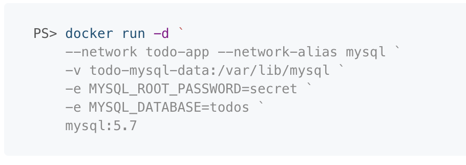
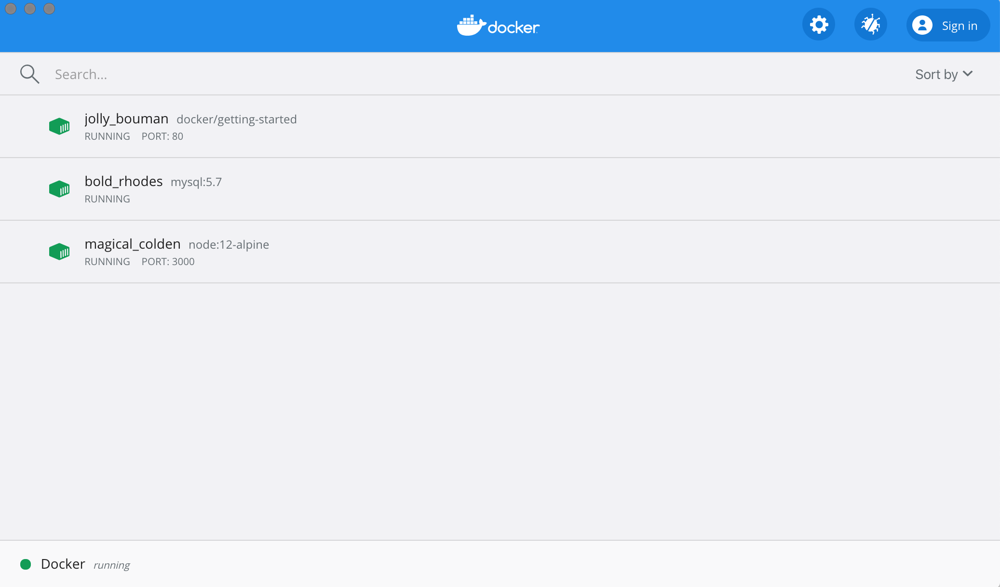

## Sample application

```dockerfile
# syntax=docker/dockerfile:1
FROM node:12-alpine
RUN apk add --no-cache python g++ make
WORKDIR /app
COPY .. .
RUN yarn install --production
CMD ["node", "src/index.js"]
```
### build
eg:
```shell
docker build -t getting-started .
```
the -t flag tags our image. Think of this simply as a human-readable name for the final image. 
Since we named the image getting-started, we can refer to that image when we run a container.

The `CMD` directive specifies the default command to run when starting a container from this image.

`.` at the end of the docker build command tells that Docker should look for the Dockerfile in the current directory.
### run
```shell
 docker run -dp 3000:3000 getting-started
```
Remember the -d and -p flags? 
We’re running the new container in “detached”(-d) mode (in the background) and creating a mapping between 
the **host’s port 3000** to the **container’s port 3000**. (-p)
Without the port mapping, we wouldn’t be able to access the application.

## Update the application
先 remove 原来的 docker 再 

remove 的方式
1. `docker stop <the-container-id>` 然后 `docker rm <the-container-id>`
2. `docker rm -f <the-container-id>`

> You can stop and remove a container in a single command by adding the “force” flag to the docker rm command.

然后再运行更新的 docker ， `docker run -dp 3000:3000 getting-started`

## Share the application
#### Create a repo

#### Push the image
1. In the command line, try running the push command you see on Docker Hub. Note that your command will be using your namespace, not “docker”.
2. Login to the Docker Hub using the command `docker login -u YOUR-USER-NAME`.
3. Use the docker tag command to give the getting-started image a new name. Be sure to swap out YOUR-USER-NAME with your Docker ID.
```shell
$ docker tag getting-started YOUR-USER-NAME/getting-started
```
4. Now try your push command again. If you’re copying the value from Docker Hub, you can drop the tagname portion, 
   as we didn’t add a tag to the image name. If you don’t specify a tag, Docker will use a tag called `latest`.
```shell
$ docker push YOUR-USER-NAME/getting-started
```

#### Run the image on a new instance
login

```shell
$ docker run -dp 3000:3000 YOUR-USER-NAME/getting-started
```
You should see the image get pulled down and eventually start up!

## Persist the DB
#### The container’s filesystem

When a container runs, it uses the various layers from an image for its filesystem. 
Each container also gets its own “scratch space” to create/update/remove files. 
Any changes won’t be seen in another container, even if they are using the same image.


#### Container volumes
With the previous experiment, we saw that each container starts from the image definition each time it starts. While containers can create, update, and delete files, those changes are lost when the container is removed and all changes are isolated to that container. With volumes, we can change all of this.

Volumes provide the ability to connect specific filesystem paths of the container back to the host machine. If a directory in the container is mounted, changes in that directory are also seen on the host machine. If we mount that same directory across container restarts, we’d see the same files.

There are two main types of volumes. We will eventually use both, but we will start with named volumes.

#### Persist the todo data

With the database being a single file, if we can persist that file on the host and make it available to the next container, it should be able to pick up where the last one left off. By creating a volume and attaching (often called “mounting”) it to the directory the data is stored in, we can persist the data. As our container writes to the todo.db file, it will be persisted to the host in the volume.

As mentioned, we are going to use a named volume. Think of a named volume as simply a bucket of data. Docker maintains the physical location on the disk and you only need to remember the name of the volume. Every time you use the volume, Docker will make sure the correct data is provided.

#### Dive into the volume
A lot of people frequently ask “Where is Docker actually storing my data when I use a named volume?” If you want to know, you can use the docker volume inspect command.
```shell
$ docker volume inspect todo-db
```

## Use bind mounts
#### Quick volume type comparisons
Bind mounts and named volumes are the two main types of volumes that come with the Docker engine. However, additional volume drivers are available to support other uses cases (SFTP, Ceph, NetApp, S3, and more).

| - | **Named Volumes** | **Bind Mounts** |
| :---: | :---: | :---: |
| Host Location | Docker chooses | You control |
| Mount Example (using -v) | my-volume:/usr/local/data | /path/to/data:/usr/local/data |
| Populates new volume with container contents | yes | no |
| Supports Volume Drivers | yes | no |


#### Start a dev-mode container
To run our container to support a development workflow, we will do the following:
- Mount our source code into the container
- Install all dependencies, including the “dev” dependencies
- Start nodemon to watch for filesystem changes
  
So, let’s do it!
1. Make sure you don’t have any previous getting-started containers running.
2. Run the following command. We’ll explain what’s going on afterwards:
   ```shell
    docker run -dp 3000:3000 \
     -w /app -v "$(pwd):/app" \
     node:12-alpine \
     sh -c "yarn install && yarn run dev"
   ```
   If you are using PowerShell then use this command:
   ```shell
   docker run -dp 3000:3000 `
     -w /app -v "$(pwd):/app" `
     node:12-alpine `
     sh -c "yarn install && yarn run dev"
   ```
   - `-dp 3000:3000` - same as before. Run in detached (background) mode and create a port mapping
   - `-w /app` - sets the “working directory” or the current directory that the command will run from
   - `-v "$(pwd):/app"` - bind mount the current directory from the host in the container into the `/app` directory
   - `node:12-alpine` - the image to use. Note that this is the base image for our app from the Dockerfile
   - `sh -c "yarn install && yarn run dev"` - the command. 
     We’re starting a shell using `sh` (alpine doesn’t have `bash`) and running `yarn install` to install all dependencies 
     and then running `yarn run dev`. If we look in the `package.json`, we’ll see that the `dev` script is starting `nodemon.`
3. You can watch the logs using docker logs -f <container-id>. You’ll know you’re ready to go when you see this:
   
   When you’re done watching the logs, exit out by hitting `Ctrl+C`.
4. Now, let’s make a change to the app. In the `src/static/js/app.js` file, 
   let’s change the “Add Item” button to simply say “Add”. This change will be on line 109:
   ```shell
   -                         {submitting ? 'Adding...' : 'Add Item'}
   +                         {submitting ? 'Adding...' : 'Add'}
   ```
5. Simply refresh the page (or open it) and you should see the change reflected in the browser almost immediately. 
   It might take a few seconds for the Node server to restart, so if you get an error, just try refreshing after a few seconds.
6. Feel free to make any other changes you’d like to make. When you’re done, stop the container and build your 
   new image using `docker build -t getting-started .` .

Using bind mounts is very common for local development setups. The advantage is that the dev machine doesn’t need to have all of the build tools and environments installed. With a single docker run command, the dev environment is pulled and ready to go. We’ll talk about Docker Compose in a future step, as this will help simplify our commands (we’re already getting a lot of flags).

## Multi container apps
“Where will MySQL run? Install it in the same container or run it separately?” In general, 
each container should do one thing and do it well. A few reasons:
- There’s a good chance you’d have to scale APIs and front-ends differently than databases
- Separate containers let you version and update versions in isolation 
- While you may use a container for the database locally, you may want to use a managed service for the database in production. You don’t want to ship your database engine with your app then.
- Running multiple processes will require a process manager (the container only starts one process), which adds complexity to container startup/shutdown 

And there are more reasons. So, we will update our application to work like this:


#### Container networking
Remember that containers, by default, run in isolation and don’t know anything about other processes or containers on the same machine. So, how do we allow one container to talk to another? The answer is networking. Now, you don’t have to be a network engineer (hooray!). Simply remember this rule...
> If two containers are on the same network, they can talk to each other. If they aren’t, they can’t.

#### Start MySQL
There are two ways to put a container on a network: 
- 1) Assign it at start or 
- 2) connect an existing container 

For now, we will create the network first and attach the MySQL container at startup.
1. Create the network.
   ```shell
   docker network create todo-app
   ```
2. Start a MySQL container and attach it to the network. We’re also going to define a few environment variables 
   that the database will use to initialize the database (see the “Environment Variables” section in the [MySQL Docker Hub listing](https://hub.docker.com/_/mysql/)).
   ```shell
   docker run -d \
     --network todo-app --network-alias mysql \
     -v todo-mysql-data:/var/lib/mysql \
     -e MYSQL_ROOT_PASSWORD=secret \
     -e MYSQL_DATABASE=todos \
     mysql:5.7
   ```
   If you are using PowerShell then use this command.
   
   You’ll also see we specified the `--network-alias` flag. We’ll come back to that in just a moment.
   > You’ll notice we’re using a volume named `todo-mysql-data` here and mounting it at `/var/lib/mysql`, 
   which is where MySQL stores its data. However, we never ran a `docker volume create` command. 
   Docker recognizes we want to use a named volume and creates one automatically for us.
3. To confirm we have the database up and running, connect to the database and verify it connects.
```shell
docker exec -it <mysql-container-id> mysql -u root -p
```
When the password prompt comes up, type in secret. In the MySQL shell, list the databases and verify you see the todos database.
```mysql
mysql> SHOW DATABASES;
```
You should see output that looks like this:
```mysql
 +--------------------+
 | Database           |
 +--------------------+
 | information_schema |
 | mysql              |
 | performance_schema |
 | sys                |
 | todos              |
 +--------------------+
 5 rows in set (0.00 sec)
```
Hooray! We have our todos database and it’s ready for us to use!
#### Connect to MySQL
Now that we know MySQL is up and running, let’s use it! But, the question is... how? 
If we run another container on the same network, how do we find the container (remember each container has its own IP address)?

To figure it out, we’re going to make use of the nicolaka/netshoot container, which ships with a lot of tools that are useful for troubleshooting or debugging networking issues.
1. Start a new container using the nicolaka/netshoot image. Make sure to connect it to the same network.
```shell
$ docker run -it --network todo-app nicolaka/netshoot
```
2. Inside the container, we’re going to use the `dig` command, which is a useful DNS tool. 
   We’re going to **look up the IP address for the hostname mysql**.
```shell
$ dig mysql
```
And you’ll get an output like this...
```shell
;; global options: +cmd
 ;; Got answer:
 ;; ->>HEADER<<- opcode: QUERY, status: NOERROR, id: 32162
 ;; flags: qr rd ra; QUERY: 1, ANSWER: 1, AUTHORITY: 0, ADDITIONAL: 0

 ;; QUESTION SECTION:
 ;mysql.				IN	A

 ;; ANSWER SECTION:
 mysql.			600	IN	A	172.23.0.2

 ;; Query time: 0 msec
 ;; SERVER: 127.0.0.11#53(127.0.0.11)
 ;; WHEN: Tue Oct 01 23:47:24 UTC 2019
 ;; MSG SIZE  rcvd: 44
```
In the “ANSWER SECTION”, you will see an `A` record for `mysql` that resolves to `172.23.0.2`(your IP address will most likely have a different value). 
While `mysql` isn’t normally a valid hostname, Docker was able to resolve it to the IP address of the container 
that had that network alias (remember the `--network-alias` flag we used earlier?).

What this means is... our app only simply needs to connect to a host named mysql and it’ll talk to the database! It doesn’t get much simpler than that!

#### Run your app with MySQL
The todo app supports the setting of a few environment variables to specify MySQL connection settings. They are:
- `MYSQL_HOST` - the hostname for the running MySQL server
- `MYSQL_USER` - the username to use for the connection
- `MYSQL_PASSWORD` - the password to use for the connection
- `MYSQL_DB` - the database to use once connected

> Setting Connection Settings via Env Vars
While using env vars to set connection settings is generally ok for development, it is **HIGHLY DISCOURAGED** when 
running applications in production. Diogo Monica, the former lead of security at Docker, 
[wrote a fantastic blog](https://diogomonica.com/2017/03/27/why-you-shouldnt-use-env-variables-for-secret-data/) post explaining why.
A more secure mechanism is to use the secret support provided by your container orchestration framework. 
> In most cases, these secrets are mounted as files in the running container. 
> You’ll see many apps (including the MySQL image and the todo app) also support env vars 
with a `_FILE` suffix to point to a file containing the variable.
As an example, setting the `MYSQL_PASSWORD_FILE` var will cause the app to use the contents of the referenced file 
as the connection password. Docker doesn’t do anything to support these env vars. 
Your app will need to know to look for the variable and get the file contents.

With all of that explained, let’s start our dev-ready container!
1. We’ll specify each of the environment variables above, as well as connect the container to our app network.
```shell
$  docker run -dp 3000:3000 \
   -w /app -v "$(pwd):/app" \
   --network todo-app \
   -e MYSQL_HOST=mysql \
   -e MYSQL_USER=root \
   -e MYSQL_PASSWORD=secret \
   -e MYSQL_DB=todos \
   node:12-alpine \
   sh -c "yarn install && yarn run dev"
```
2. If we look at the logs for the container (docker logs <container-id>), we should see a message indicating it’s using the mysql database.
```shell
$ nodemon src/index.js
```
3. Open the app in your browser and add a few items to your todo list.
4. Connect to the mysql database and prove that the items are being written to the database. Remember, the password is secret.
```shell
$ docker exec -it <mysql-container-id> mysql -p todos
```   
And in the mysql shell, run the following:
```mysql
mysql> select * from todo_items;
```
Obviously, your table will look different because it has your items. But, you should see them stored there!

If you take a quick look at the Docker Dashboard, you’ll see that we have two app containers running. 
But, there’s no real indication that they are grouped together in a single app. We’ll see how to make that better shortly!


## Use Docker Compose


