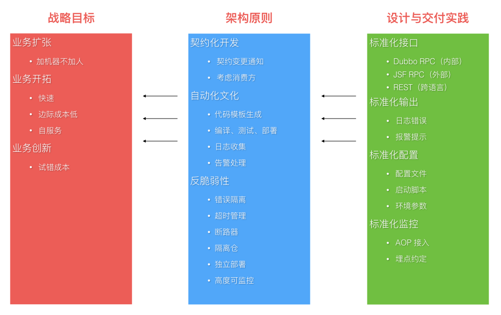
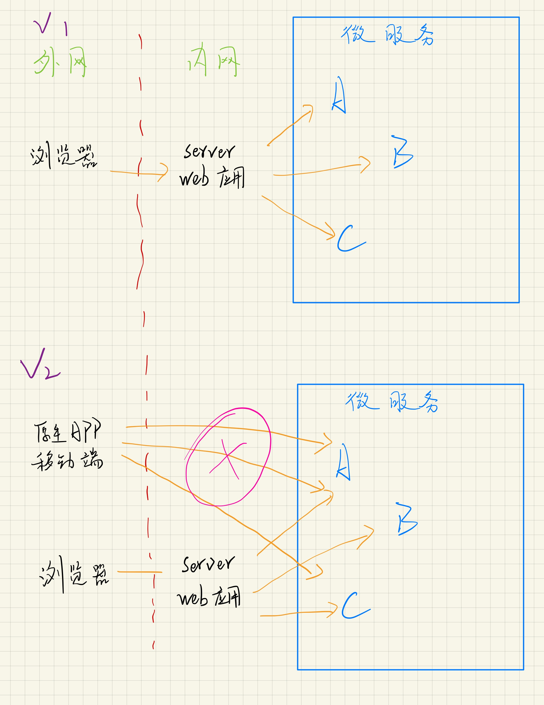
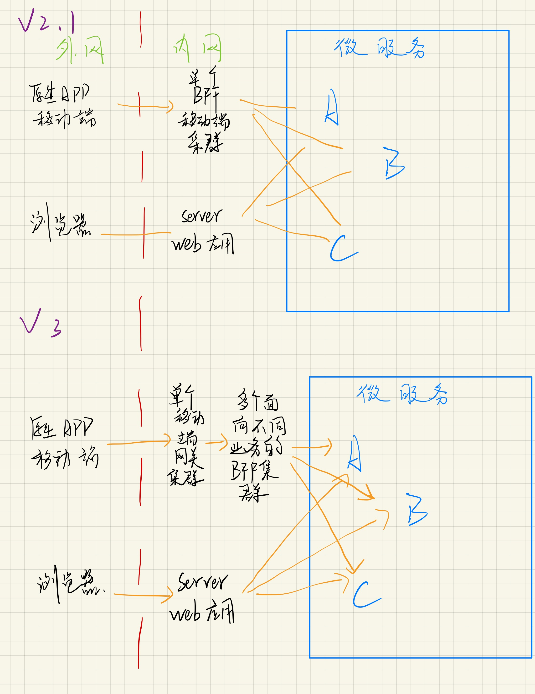
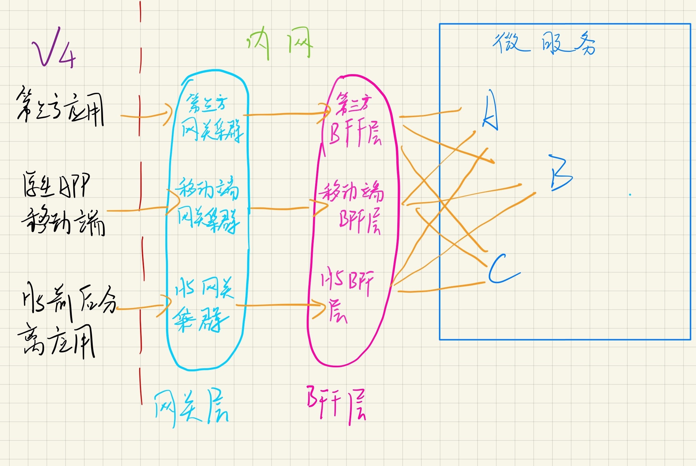

## 待看文献list
- [ ] [What are microservices?](https://microservices.io/index.html)
  > 收获不多，应该是太菜了，还有里面目录还没有一一点进去看
  - 巨石架构，单体应用
  - 微服务架构
- [x] [Microservice 微服务的理论模型和现实路径](https://blog.csdn.net/mindfloating/article/details/51221780)
  > 感觉到作者应该是多年经验的浓缩，我吸收起来还是有些吃力，先写印象深或者感觉自己可能懂了的地方
  - 微服务一些定义
    - 采用以小组服务来构建
    - 每个服务独立运行，不同服务通过一些轻量级交互机制来通信，如RPC, HTTP等
    - 围绕业务能力来构建，并依赖自动部署机制来独立部署。
  - 起源
    - Small is beautiful.
    - Make each program do one thing.
    - Build a prototype as soon as possible.
    - Choose portability over efficiency. 可移植性比效率更重要
  - 按照微服务架构理念构建的系统应该具备什么样的特征？
    - 组件服务化。传统应用局部变化整个应用重新部署。当通过服务实现组件之后，单一服务变化只需要重新部署对应的服务进程
    - 按照业务能力组织服务，服务提供的能力和业务对应。传统开发中，往往是根据技术分类划分层次。
    - 服务即产品。亚马逊提出一个观点: `You build it, you run it.` 开发团队对软件在声场环境的运行负全部责任。
    - 智能终端(服务本身)。哑管道(通信机制)，可以是同步的rpc，也可以是异步的MQ，只作为消息通道，不附加额外逻辑。
    - 去中心化
      - 技术栈的去中心化，不一定是语言依赖的
      - 数据的去中心化，各个服务独享数据存储
    - 基础设施自动化。包括测试和部署，无自动化不微服务。
      - 开发、测试、调试、监控、和部署的复杂度都会提升
      - 但是如果使用微服务架构，自动化基础设施是必要的，否则开发运维成本激增。
    - 容错设计，微服务架构采用**粗粒度**的进程间通信，引入了额外的复杂性和其他不能忽略的新问题，如：
      - 网络延迟
      - 消息格式
      - 负载均衡
    - 兼容设计，服务的变更可能引发服务的消费者的兼容性破坏，一条普适的健壮原则：`Be conservative in what you send, be liberal in what you accept.`
  - 如何实施，何时选择微服务架构？
    - 根据项目复杂度的提高的某个拐点，如图：
    - 作者的经验是两个前提:
      - 普通程序员的舒适维护区范围，两万行代码左右。
      - 自动化部署的基础设施，否则部署难度是乘数级增长。比如一个应用拆50个微服务进程，则需要部署50，若是引用规模变大，需要部署到100台机器，这时候部署复杂度变成了50 * 100
  - 实施微服务的维度有哪些?
    - 围绕业务能力建模，[京东咚咚架构演进](https://mp.weixin.qq.com/s?__biz=MzAxMTEyOTQ5OQ==&mid=401186254&idx=1&sn=1b3c81386973c99cad99079fcd6be6e3) 里面的服务矩阵图
    - 协作
      - 工作中其实发现沟通成本是很高的，所以里面提到的服务的契约文档还是非常的有用和提高沟通效率，以及后续其他人接手也好，新员工了解也好，后来查阅也好都很方便。
        - 契约文档基本信息包括以下几点但不限于：
            1. API，具体接口的API接入技术说明。
            2. 能力，服务能力的描述
            3. 契约，提供这些能力所约定的一些限制条件说明。
            4. 版本，支持的最新和历史的版本说明。
      - 多个服务间协同工作可能带来的问题，就是当一个业务需要的服务调用链路过长时，可能造成系统阻塞，甚至雪崩。这时候我们用服务之间调用的异步化来规避和这个风险。
    - **测试，没太看明白，留有疑问**
    - 部署：一机多服务或者一机一服务
    - 监控基础设施建设。微服务的架构带来的问题就是在这样大量微服务来协作完成业务的复杂生产环境中，出现异常和错误是很难迅速定位的。这就需要一套成体系的监控基础设施。使用分层思想，顶层是用户视角，底层是系统视角：
      - 用户视角
      - 业务监控
        - 长周期趋势
        - 多维度
      - 服务监控
        - 响应时间
        - 流量TPS
        - 全链路
        - 染色
      - 基础监控
        - IDC （有疑问？互联网数据中心？）
        - 网络
        - 主机
        - OS
        - VM
  - 实施的原则，**里面很多点是不了解的** 
  - 微服务的团队角色问题，对团队人员的要求更高，能增强自驱力，自学能力，提高可能更快。
- [x] [微服务架构~BFF和网关是如何演化出来的](https://www.cnblogs.com/dadadechengzi/p/9373069.html)
  - 渐进过程：
    - 
    - 
    - 
  - V2的问题：
    - 移动端和内网微服务强耦合，牵一发而动全身
    - 移动端需要知道内部服务的各种细节
    - 移动端要做大量的适配和聚合、裁剪工作
      - 聚合：一个页面的数据需要两个api
      - 裁剪：为了适配不同设备，裁剪某些数据
      - 适配：不同数据格式的兼容，比如有些后台服务只支持老的XML格式，不支持新的JSON格式，则移动端要适配处理
    - 随着移动端设备种类增多，会做大量的重复工作
  - V2.1，引入BFF，由前端团队开发的一种适配服务。向移动端设备暴露友好和统一的API，方便无线设备接入访问后端服务。它的优势：
    - 解决移动端和内网微服务的强耦合问题
      - 后端变化，通过BFF屏蔽，前端设备不影响。
      - 前端变化，通过BFF屏蔽，后端服务暂时可以不变化。
      - 当移动端有新需求，通过BFF屏蔽，可以减少前后端团队的沟通协调开销，很多由前端团队在BFF层可以搞定
    - 解决移动端需要知道内网细节的问题，它只需要知道BFF地址即可，并且服务接口对外是统一的。
    - 聚合裁剪在BFF解决，移动端可以瘦身
  - V2.1 也有一些问题：
    - 单点BFF集群成为沟通和系统的瓶颈。
      - 无线团队增多，业务线增多，单块BFF和多团队之间就出现不匹配的问题，沟通协调成本增高，交付率下降
      - BFF集群是个失败单点，流量洪峰或者代码缺陷可能引发集群宕机，导致所有应用都不可用了。
    - 随着项目增大，BFF里面不仅有各个业务线的聚合裁剪适配和业务逻辑，也引入了很多跨横切面逻辑，比如安全认证，日志监控，**限流熔断（不太明白）*等等等等，越复杂，效率越低，缺陷数量会增多。
  - V3，引入网关集群，作用及优点：
    - BFF按照业务拆分为多个BFF微服务，每个业务线可以并行开发和交付各自的BFF微服务，解决了单点BFF集群瓶颈的问题
    - 网关（一般由独立管集团对负责运维）专注跨横切面（Cross-Cutting Concerns）的功能，包括：
      - 路由：无线设备请求路由到具体BFF集群
      - 认证：对api访问做鉴权
      - 监控：api做性能监控
      - 限流熔断：出现流量洪峰，或者后端BFF/微服务出现延迟或者故障，网关能主动限流，保护后端服务，并保持前端用户体验可以接受。
      - 安全防爬：通过手机访问日志，通过后台分析出恶意行为，阻断恶意访问。
    - 网关在无线设备和BFF中间又引入了一层。使两边可以独立变化，**当后代BFF升级和迁移时， 可以做到用户端不收影响**（这个怎么做到的？分机器升级或者迁移？？）也同时解决了跨横切面的问题。
    - 网关是解耦拆分和后续升级迁移的利器，解耦拆分让各个业务线团队提高了研发效率。
    - 跨横切面逻辑剥离到网关则BFF可以更加关注业务逻辑交付，实现了架构上的**关注分离（Separation of Concerns）**
  - V4是一个比较完整的现代微服务架构，从外到内依次分为：端用户体验层->网关层->BFF层->微服务层。整个架构层次清晰，职责分明，是一种灵活的演化式架构。
    - 支持第三方，前后分离单页应用的相应的配套网关和BFF
- [X] [微服务中的设计模式](https://www.cnblogs.com/viaiu/archive/2018/11/24/10011376.html)
  - 浏览一遍，懵懵懂懂
- [ ] [微服务架构的故障隔离及容错处理](https://www.cnblogs.com/lfs2640666960/p/9543096.html)
  - 
  - 
  - 
  - 
  - 
- [ ] [为什么Uber微服务架构使用多租户？](https://mp.weixin.qq.com/s/L6OKJK1ev1FyVDu03CQ0OA)
- [ ] [面向资源的设计](https://www.bookstack.cn/read/API-design-guide/API-design-guide-02-面向资源的设计.md)
- [ ] [How To Design Great APIs With API-First Design](https://www.programmableweb.com/news/how-to-design-great-apis-api-first-design-and-raml/how-to/2015/07/10)
- [ ] [微服务实战（一）：微服务架构的优势与不足](http://www.dockone.io/article/394)
- [ ] [微服务实战（二）：构建微服务：使用API Gateway](https://www.jianshu.com/p/3c7a0e81451a)
- [ ] [微服务实战（三）：深入微服务架构的进程间通信](https://www.jianshu.com/p/6e539caf662d)
- [ ] [微服务实战（四）：服务发现的可行方案以及实践案例](https://my.oschina.net/CraneHe/blog/703173)
- [ ] [微服务实践（五）：微服务的事件驱动数据管理](https://my.oschina.net/CraneHe/blog/703169)
- [ ] [微服务实战（六）：选择微服务部署策略](https://my.oschina.net/CraneHe/blog/703163)
- [ ] [微服务实践（七）：从单体式架构迁移到微服务架构](https://my.oschina.net/CraneHe/blog/703160)

## 其他文章
- [康威定律（略读）](https://segmentfault.com/a/1190000011118897)

## 其他书籍
- [ ]  <<微服务设计>>，纽曼，人名邮电出版社
- [ ]  <<微服务架构设计模式>>，克里斯.理查森，机械工业出版社

## todo list
- 看完之后总结
  - [ ] 流程各个节点
  - [ ] 注意事项
  - [ ] 优缺点
  - [ ] 发散思考
