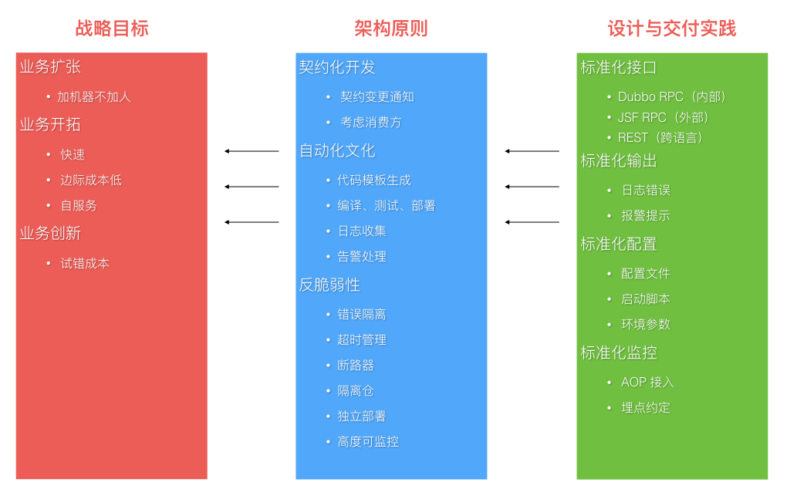
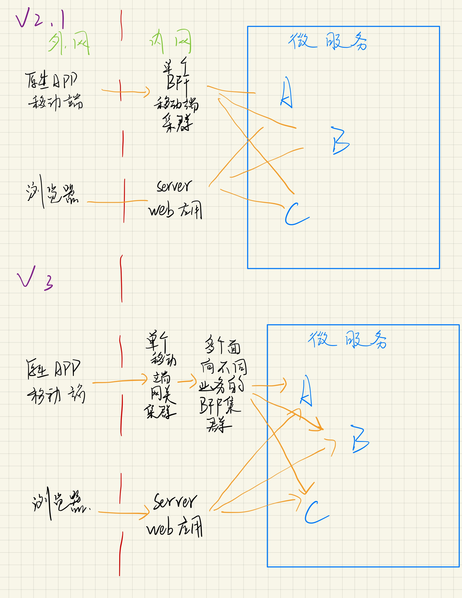
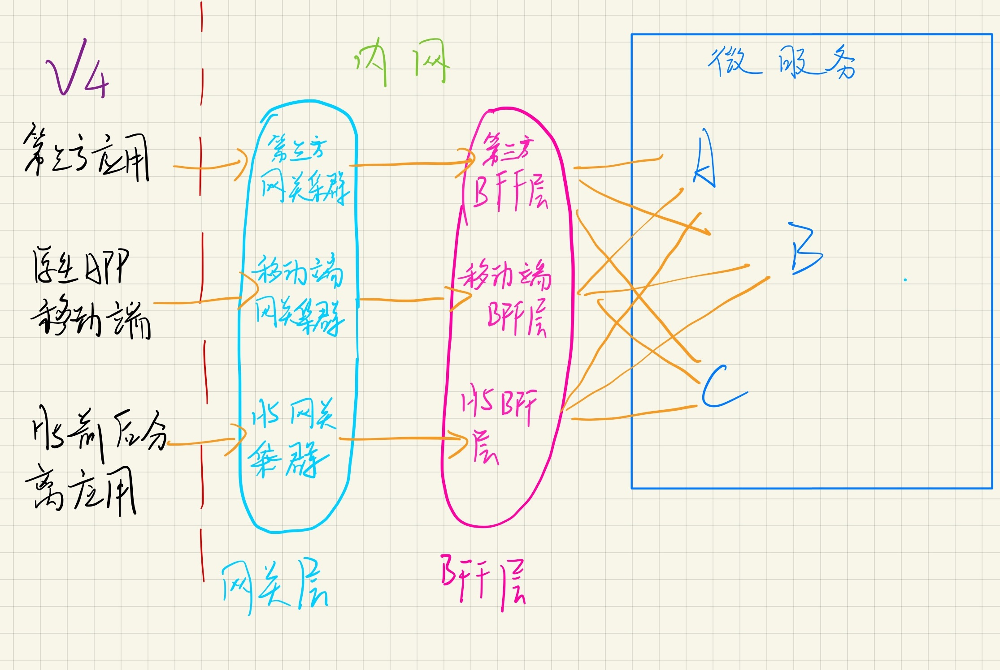

## 待看文献list
- [ ] [What are microservices?](https://microservices.io/index.html)
  > 收获不多，应该是太菜了，还有里面目录还没有一一点进去看
  - 巨石架构，单体应用
  - 微服务架构
- [x] [Microservice 微服务的理论模型和现实路径](https://blog.csdn.net/mindfloating/article/details/51221780)
  > 感觉到作者应该是多年经验的浓缩，我吸收起来还是有些吃力，先写印象深或者感觉自己可能懂了的地方
  - 微服务一些定义
    - 采用以小组服务来构建
    - 每个服务独立运行，不同服务通过一些轻量级交互机制来通信，如RPC, HTTP等
    - 围绕业务能力来构建，并依赖自动部署机制来独立部署。
  - 起源
    - Small is beautiful.
    - Make each program do one thing.
    - Build a prototype as soon as possible.
    - Choose portability over efficiency. 可移植性比效率更重要
  - 按照微服务架构理念构建的系统应该具备什么样的特征？
    - 组件服务化。传统应用局部变化整个应用重新部署。当通过服务实现组件之后，单一服务变化只需要重新部署对应的服务进程
    - 按照业务能力组织服务，服务提供的能力和业务对应。传统开发中，往往是根据技术分类划分层次。
    - 服务即产品。亚马逊提出一个观点: `You build it, you run it.` 开发团队对软件在声场环境的运行负全部责任。
    - 智能终端(服务本身)。哑管道(通信机制)，可以是同步的rpc，也可以是异步的MQ，只作为消息通道，不附加额外逻辑。
    - 去中心化
      - 技术栈的去中心化，不一定是语言依赖的
      - 数据的去中心化，各个服务独享数据存储
    - 基础设施自动化。包括测试和部署，无自动化不微服务。
      - 开发、测试、调试、监控、和部署的复杂度都会提升
      - 但是如果使用微服务架构，自动化基础设施是必要的，否则开发运维成本激增。
    - 容错设计，微服务架构采用**粗粒度**的进程间通信，引入了额外的复杂性和其他不能忽略的新问题，如：
      - 网络延迟
      - 消息格式
      - 负载均衡
    - 兼容设计，服务的变更可能引发服务的消费者的兼容性破坏，一条普适的健壮原则：`Be conservative in what you send, be liberal in what you accept.`
  - 如何实施，何时选择微服务架构？
    - 根据项目复杂度的提高的某个拐点，如图：
    - 作者的经验是两个前提:
      - 普通程序员的舒适维护区范围，两万行代码左右。
      - 自动化部署的基础设施，否则部署难度是乘数级增长。比如一个应用拆50个微服务进程，则需要部署50，若是引用规模变大，需要部署到100台机器，这时候部署复杂度变成了50 * 100
  - 实施微服务的维度有哪些?
    - 围绕业务能力建模，[京东咚咚架构演进](https://mp.weixin.qq.com/s?__biz=MzAxMTEyOTQ5OQ==&mid=401186254&idx=1&sn=1b3c81386973c99cad99079fcd6be6e3) 里面的服务矩阵图
    - 协作
      - 工作中其实发现沟通成本是很高的，所以里面提到的服务的契约文档还是非常的有用和提高沟通效率，以及后续其他人接手也好，新员工了解也好，后来查阅也好都很方便。
        - 契约文档基本信息包括以下几点但不限于：
            1. API，具体接口的API接入技术说明。
            2. 能力，服务能力的描述
            3. 契约，提供这些能力所约定的一些限制条件说明。
            4. 版本，支持的最新和历史的版本说明。
      - 多个服务间协同工作可能带来的问题，就是当一个业务需要的服务调用链路过长时，可能造成系统阻塞，甚至雪崩。这时候我们用服务之间调用的异步化来规避和这个风险。
    - **测试，没太看明白，留有疑问**
    - 部署：一机多服务或者一机一服务
    - 监控基础设施建设。微服务的架构带来的问题就是在这样大量微服务来协作完成业务的复杂生产环境中，出现异常和错误是很难迅速定位的。这就需要一套成体系的监控基础设施。使用分层思想，顶层是用户视角，底层是系统视角：
      - 用户视角
      - 业务监控
        - 长周期趋势
        - 多维度
      - 服务监控
        - 响应时间
        - 流量TPS
        - 全链路
        - 染色
      - 基础监控
        - IDC （有疑问？互联网数据中心？）
        - 网络
        - 主机
        - OS
        - VM
  - 实施的原则，**里面很多点是不了解的** 
  - 微服务的团队角色问题，对团队人员的要求更高，能增强自驱力，自学能力，提高可能更快。
- [x] [微服务架构~BFF和网关是如何演化出来的](https://www.cnblogs.com/dadadechengzi/p/9373069.html)
  - 渐进过程：
    - 
    - 
    - 
  - V2的问题：
    - 移动端和内网微服务强耦合，牵一发而动全身
    - 移动端需要知道内部服务的各种细节
    - 移动端要做大量的适配和聚合、裁剪工作
      - 聚合：一个页面的数据需要两个api
      - 裁剪：为了适配不同设备，裁剪某些数据
      - 适配：不同数据格式的兼容，比如有些后台服务只支持老的XML格式，不支持新的JSON格式，则移动端要适配处理
    - 随着移动端设备种类增多，会做大量的重复工作
  - V2.1，引入BFF，由前端团队开发的一种适配服务。向移动端设备暴露友好和统一的API，方便无线设备接入访问后端服务。它的优势：
    - 解决移动端和内网微服务的强耦合问题
      - 后端变化，通过BFF屏蔽，前端设备不影响。
      - 前端变化，通过BFF屏蔽，后端服务暂时可以不变化。
      - 当移动端有新需求，通过BFF屏蔽，可以减少前后端团队的沟通协调开销，很多由前端团队在BFF层可以搞定
    - 解决移动端需要知道内网细节的问题，它只需要知道BFF地址即可，并且服务接口对外是统一的。
    - 聚合裁剪在BFF解决，移动端可以瘦身
  - V2.1 也有一些问题：
    - 单点BFF集群成为沟通和系统的瓶颈。
      - 无线团队增多，业务线增多，单块BFF和多团队之间就出现不匹配的问题，沟通协调成本增高，交付率下降
      - BFF集群是个失败单点，流量洪峰或者代码缺陷可能引发集群宕机，导致所有应用都不可用了。
    - 随着项目增大，BFF里面不仅有各个业务线的聚合裁剪适配和业务逻辑，也引入了很多跨横切面逻辑，比如安全认证，日志监控，**限流熔断（不太明白）*等等等等，越复杂，效率越低，缺陷数量会增多。
  - V3，引入网关集群，作用及优点：
    - BFF按照业务拆分为多个BFF微服务，每个业务线可以并行开发和交付各自的BFF微服务，解决了单点BFF集群瓶颈的问题
    - 网关（一般由独立管集团对负责运维）专注跨横切面（Cross-Cutting Concerns）的功能，包括：
      - 路由：无线设备请求路由到具体BFF集群
      - 认证：对api访问做鉴权
      - 监控：api做性能监控
      - 限流熔断：出现流量洪峰，或者后端BFF/微服务出现延迟或者故障，网关能主动限流，保护后端服务，并保持前端用户体验可以接受。
      - 安全防爬：通过手机访问日志，通过后台分析出恶意行为，阻断恶意访问。
    - 网关在无线设备和BFF中间又引入了一层。使两边可以独立变化，**当后代BFF升级和迁移时， 可以做到用户端不收影响**（这个怎么做到的？分机器升级或者迁移？？）也同时解决了跨横切面的问题。
    - 网关是解耦拆分和后续升级迁移的利器，解耦拆分让各个业务线团队提高了研发效率。
    - 跨横切面逻辑剥离到网关则BFF可以更加关注业务逻辑交付，实现了架构上的**关注分离（Separation of Concerns）**
  - V4是一个比较完整的现代微服务架构，从外到内依次分为：端用户体验层->网关层->BFF层->微服务层。整个架构层次清晰，职责分明，是一种灵活的演化式架构。
    - 支持第三方，前后分离单页应用的相应的配套网关和BFF
- [X] [微服务中的设计模式](https://www.cnblogs.com/viaiu/archive/2018/11/24/10011376.html)
  - 浏览一遍，懵懵懂懂
- [X] [微服务架构的故障隔离及容错处理](https://www.cnblogs.com/lfs2640666960/p/9543096.html)
  - 微服务架构的风险与挑战
    - 网络问题
    - 服务间交互
    - 分布式
    - 发布
    - 配置
  - 能否实现服务降级？
  - 版本变更，google可靠性团队发现70%的故障源于变更。所以这时有两种模式：
    1. 分布部署，监控关键指标，出现问题自动回滚。
    2. 蓝绿发布或者叫红黑发布，不行也是要回滚
  - 健康检查，负载均衡（指向剩下的健康的实例）
  - 自我修复，重启，但是需要注意有时某些服务的实例不需要立即重启，并且需要让外部系统知道。（这里有个疑问，还有哪些情况无需重启）
  - 故障转移缓存，Failover Caching。因为有些故障是暂时的（源于自我修复和负载均衡），某些情况下，需要让服务在出现故障的情况下也能工作。这时Failover Caching可以帮助我们的应用提供必要的数据。
    - **具体做法没太看明白**
  - 重试逻辑，Retry Logic。_添加重试需要小心，有可能变得更糟。_
    > 在分布式系统中，微服务的某个服务重试可能会触发多个其他请求或重试，并导致级联效应。
    应减少重试数量，并使用指数退避算法（exponential backoff algorithm)来持增加重试之间的延迟时间，直到达到最大限制。
    要为应用程序提供幂等处理能力。例如当你重试购买时，不应该向客户收两次钱。
    给每个事务使用唯一的幂等键（idempotency-key）是解决问题的方法。
  - 限流器和负载开关（Rate Limiters and Load Shedders）
    - 限流是指在一段时间内，定义某个客户或应用可以接收或者处理多少请求的技术。
      > 例如，通过限流，你可以过滤掉产生流量峰值的客户和微服务，或者可以确保你的 应用程序在自动扩展（Auto Scaling）失效前都不会出现过载的情况。
      还可以阻止较低优先级的流量，以便为管件事务提供足够的资源。
      
      > 并发限流器（concurrent request limiter）,当你有一些昂贵和重要的端点（endpoint），
      希望它不应该被调用超过指定的次数，但是仍然想要提供流量服务时，这个限流器就十分有用了。
    - 负载开关可以确保对于关键的事务总能提供足够的资源保障。
      > 它为高优先级的请求保留一些资源，并且不允许低优先级的事务去占用这些资源。
      负载开关会根据系统的整体状态做出决定，而不是基于单个用户的请求桶（request bucket）大小.
      负载设备有助于你的系统恢复，因为它们在持续发生故障事件时，依然能保持核心功能正常工作。
  - 快速且单独失效（Fail Fast and Independently）
    > 服务失效要尽快，没人愿意等待到超时，没有用户喜欢无响应的页面。
    第一个办法是对服务定义超时的级别，但微服务系统处于高度动态的环境中，很难针对每种情况都设置一个恰当的超时值。
    使用timeout 来实现快速失败是一种反模式，应该避免。
    
    > 可以使用基于操作成功/失败统计次数的熔断模式，而不是超时
  - 舱壁模式，隔板模式（Bulkheads）在工业领域，尝试用舱壁将船体划分为几个部分，以便在有某部分船体发生破裂时，其他部分依然能密封安然无恙。这个概念可以在软件开发领域用于隔离资源。
    > 可以保护有限资源不被用尽。比如，如果我们有两类操作，它们和同一个数据库实例进行通信，
    并且数据库限制连接数，这时我们可以使用两个连接池而不是使用一个共享连接池。
    由于这种客户端和资源分离，超时或过度使用不会令其他操作失效。
  - 断路器（Circuit Breakers）微服务
    > 断路器在分布式系统中非常有用，因为重复的故障可能会导致雪球效应，并使整个系统崩溃。
    我们可以使用断路器来处理错误，而不是使用小型和特定基于事务的静态超时机制。所以它在更高层次。
    
    > 作用：断路器以现实世界的电子元件命名，因为它们的行为是都是相同的，一可以保护资源，二可以协助它们进行恢复。
    
    > 当在短时间内多次发生指定类型的错误，断路器会开启。
    开启的断路器可以拒绝接下来更多的请求，就像防止真实的电子流动一样。
    
    > 但要注意的是： 并不是所有的错误都应该触发断路器。
    例如，你可能希望忽略客户端问题，比如4xx响应代码的请求，但要包括5xx服务器端故障。
    
    > 一些断路器还可以有半开关状态。在这种状态下，服务发送第一个请求以检查系统的可用性，同时让其他请求失败。
    如果这个第一个请求成功，则将断路器恢复到关闭状态并继续接受流量。否则，保持打开状态。
    
  - 故障测试(Testing for Failures)
    - 持续测试系统的常见问题，确保服务可以在各类故障环境下运行。应该经常测试故障，以让你的团队对可能发生的事情有所准备。
    - 可以随机终止一个实例，来测单点故障。或者关闭整个服务来模拟云提供商层面的故障中断。

- [ ] [面向资源的设计](https://www.bookstack.cn/read/API-design-guide/API-design-guide-02-面向资源的设计.md)
  - 浏览，感觉还是需要实战中提升api的定义能力
- [X] [How To Design Great APIs With API-First Design](https://www.programmableweb.com/news/how-to-design-great-apis-api-first-design-and-raml/how-to/2015/07/10)
  - SOAP(Simple Object Access Protocol), RAML(RESTful API Markup Language)

- [ ] [为什么Uber微服务架构使用多租户？](https://mp.weixin.qq.com/s/L6OKJK1ev1FyVDu03CQ0OA)
- [ ] [微服务实战（一）：微服务架构的优势与不足](http://www.dockone.io/article/394)
- [ ] [微服务实战（二）：构建微服务：使用API Gateway](https://www.jianshu.com/p/3c7a0e81451a)
- [ ] [微服务实战（三）：深入微服务架构的进程间通信](https://www.jianshu.com/p/6e539caf662d)
- [ ] [微服务实战（四）：服务发现的可行方案以及实践案例](https://my.oschina.net/CraneHe/blog/703173)
- [ ] [微服务实践（五）：微服务的事件驱动数据管理](https://my.oschina.net/CraneHe/blog/703169)
- [ ] [微服务实战（六）：选择微服务部署策略](https://my.oschina.net/CraneHe/blog/703163)
- [ ] [微服务实践（七）：从单体式架构迁移到微服务架构](https://my.oschina.net/CraneHe/blog/703160)

- [X] [DDD 理论](https://www.jianshu.com/p/5732b69bd1a1)
  - 如何设计或拆分才能避免拆分出来的微服务不是小单体？这才是所有微服务架构团队需要关注和解决的问题，这也是DDD的价值所在。
  - 评判微服务设计合理的一个简单标准就是：微服务在随着业务发展而不断拆分或者重新组合过程中不会过度增加软件维护成本，并且这个过程是非常轻松且简单的。
  - 很多东西感觉在平常撸业务代码时候会有一些思考，比如当你思考你的某个文件该放什么位置的时候其实你已经在思考设计了。
- [X] [DDD 实战](https://www.jianshu.com/p/b5abfb3cc0ce)
  - 微服务视图
    
  - 微服务代码结构模型
    - 微服务代码总目录
      >  
    - 用户接口层代码模型
      > 
    - 应用层代码模型
      > 
    - 领域层代码模型
      > 
    - 
      > 
    -  微服务总目录结构
      > 
    -
  - 原则
    - 第一条：“要领域驱动设计，而不是数据驱动设计，也不是界面驱动设计”。
    - 第二条：“要边界清晰的微服务，而不是泥球小单体”。
    - 第三条：“要职能清晰的分层，而不是什么都放的大箩筐”。
    - 第四条：“要做自己能hold住的微服务，而不是过度拆分的微服务”。
  - 基于DDD的微服务设计和开发实例
    - 基本信息
    - 设计和实施步骤
      1. 事件风暴
          - 场景分析
          - 领域建模了，领域建模是一个收敛的过程。这个收敛过程分三步：
            > 第一步根据场景分析中的操作集合定义领域实体；第二步根据领域实体业务关联性，定义聚合；第三步根据业务及语义边界等因素，定义限界上下文。
          - 微服务设计和拆分
      2. 领域对象及服务矩阵，这个步骤最关键的工作是确定实体、方法、服务等领域对象在微服务分层架构中的位置以及各对象之间的依赖关系，形成服务矩阵（类似下面）。
         > 
         确定完各领域对象的属性后，按照代码模型设计各个领域对象在代码模型中的代码对象 
         （包括代码对象所在的：包名、类名和方法名），建立领域对象与代码对象的一一映射关系。
         根据这种映射关系，相关人员可快速定位到业务逻辑所在的代码位置。
      3. 领域模型及服务架构
         > 
      4. 代码模型设计
         > 依照之前的代码模板应用样例场景的代码设计
      5. 详细设计
         > 主要工作包括：系统界面、数据库表以及字段、服务参数规约及功能等。
      6. 代码开发
      7. 测试和发布
  
### 名词记录
#### DDD名词和术语
Event Storming（事件风暴）：事件风暴是一项团队活动，旨在通过领域事件识别出聚合根，进而划分微服务的限界上下文。
在活动中，团队先通过头脑风暴的形式罗列出领域中所有的领域事件，整合之后形成最终的领域事件集合，
然后对于每一个事件，标注出导致该事件的命令（Command），再然后为每个事件标注出命令发起方的角色，
命令可以是用户发起，也可以是第三方系统调用或者是定时器触发等。最后对事件进行分类整理出聚合根以及限界上下文。

Entity（实体）：每个实体是唯一的，并且可以相当长的一段时间内持续地变化。
我们可以对实体做多次修改，故一个实体对象可能和它先前的状态大不相同。
但是，由于它们拥有相同的身份标识，他们依然是同一个实体。
例如一件商品在电商商品上下文中是一个实体，通过商品中台唯一的商品id来标示这个实体。

ValueObject（值对象）：值对象用于度量和描述事物，当你只关心某个对象的属性时，该对象便可作为一个值对象。
实体与值对象的区别在于唯一的身份标识和可变性。当一个对象用于描述一个事物，但是又没有唯一标示，那么它就是一个值对象。
例如商品中的商品类别，类别就没有一个唯一标识，通过图书、服装等这些值就能明确表示这个商品类别。

Aggregate（聚合）：聚合是实体的升级，是由一组与生俱来就密切相关实体和值对象组合而成的，
整个组合的最上层实体就是聚合。

Bounded Context（限界上下文）：用来封装通用语言和领域对象，为领域提供上下文语境，
保证在领域之内的一些术语、业务相关对象等（通用语言）有一个确切的含义，没有二义性。
使团队所有成员能够明确地知道什么必须保持一致，什么必须独立开发。

