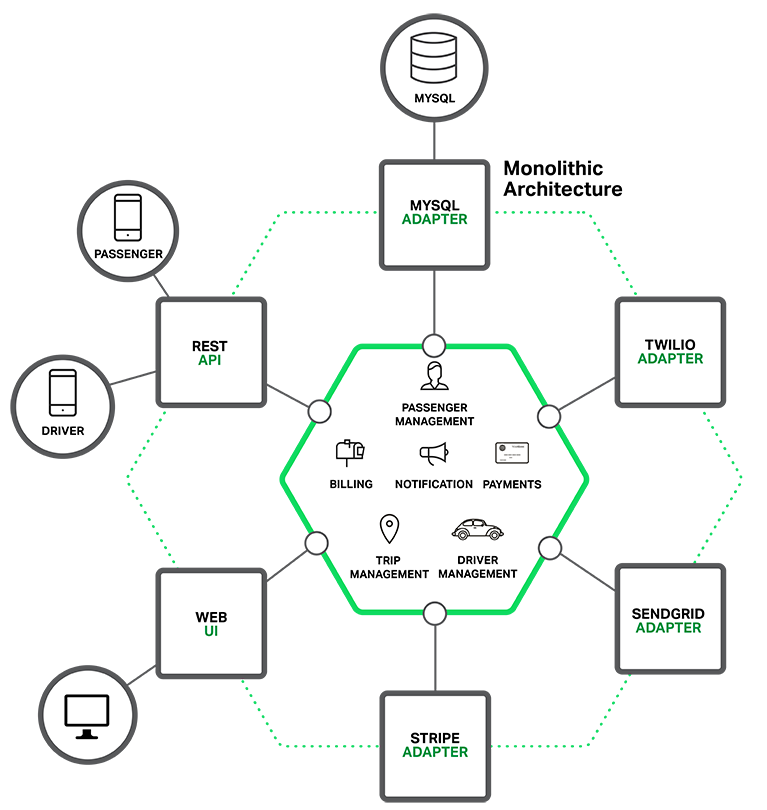
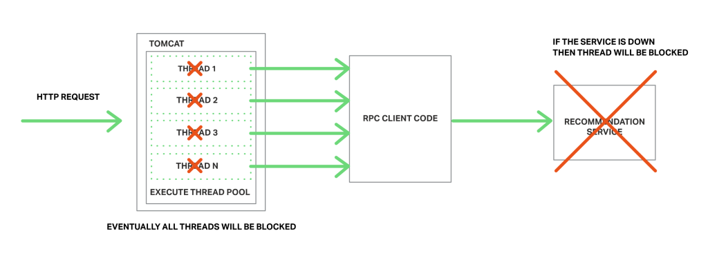

## 待看文献list
- [X] [What are microservices?](https://microservices.io/index.html)
  > 浏览
  - 巨石架构，单体应用
  - 微服务架构
  - **各种理论概念描述及分析**，可作为速查来使用
- [x] [Microservice 微服务的理论模型和现实路径](https://blog.csdn.net/mindfloating/article/details/51221780)
  > 感觉到作者应该是多年经验的浓缩，我吸收起来还是有些吃力，先写印象深或者感觉自己可能懂了的地方
  - 微服务一些定义
    - 采用以小组服务来构建
    - 每个服务独立运行，不同服务通过一些轻量级交互机制来通信，如RPC, HTTP等
    - 围绕业务能力来构建，并依赖自动部署机制来独立部署。
  - 起源
    - Small is beautiful.
    - Make each program do one thing.
    - Build a prototype as soon as possible.
    - Choose portability over efficiency. 可移植性比效率更重要
  - 按照微服务架构理念构建的系统应该具备什么样的特征？
    - 组件服务化。传统应用局部变化整个应用重新部署。当通过服务实现组件之后，单一服务变化只需要重新部署对应的服务进程
    - 按照业务能力组织服务，服务提供的能力和业务对应。传统开发中，往往是根据技术分类划分层次。
    - 服务即产品。亚马逊提出一个观点: `You build it, you run it.` 开发团队对软件在声场环境的运行负全部责任。
    - 智能终端(服务本身)。哑管道(通信机制)，可以是同步的rpc，也可以是异步的MQ，只作为消息通道，不附加额外逻辑。
    - 去中心化
      - 技术栈的去中心化，不一定是语言依赖的
      - 数据的去中心化，各个服务独享数据存储
    - 基础设施自动化。包括测试和部署，无自动化不微服务。
      - 开发、测试、调试、监控、和部署的复杂度都会提升
      - 但是如果使用微服务架构，自动化基础设施是必要的，否则开发运维成本激增。
    - 容错设计，微服务架构采用**粗粒度**的进程间通信，引入了额外的复杂性和其他不能忽略的新问题，如：
      - 网络延迟
      - 消息格式
      - 负载均衡
    - 兼容设计，服务的变更可能引发服务的消费者的兼容性破坏，一条普适的健壮原则：`Be conservative in what you send, be liberal in what you accept.`
  - 如何实施，何时选择微服务架构？
    - 根据项目复杂度的提高的某个拐点，如图：
    - 作者的经验是两个前提:
      - 普通程序员的舒适维护区范围，两万行代码左右。
      - 自动化部署的基础设施，否则部署难度是乘数级增长。比如一个应用拆50个微服务进程，则需要部署50，若是引用规模变大，需要部署到100台机器，这时候部署复杂度变成了50 * 100
  - 实施微服务的维度有哪些?
    - 围绕业务能力建模，[京东咚咚架构演进](https://mp.weixin.qq.com/s?__biz=MzAxMTEyOTQ5OQ==&mid=401186254&idx=1&sn=1b3c81386973c99cad99079fcd6be6e3) 里面的服务矩阵图
    - 协作
      - 工作中其实发现沟通成本是很高的，所以里面提到的服务的契约文档还是非常的有用和提高沟通效率，以及后续其他人接手也好，新员工了解也好，后来查阅也好都很方便。
        - 契约文档基本信息包括以下几点但不限于：
            1. API，具体接口的API接入技术说明。
            2. 能力，服务能力的描述
            3. 契约，提供这些能力所约定的一些限制条件说明。
            4. 版本，支持的最新和历史的版本说明。
      - 多个服务间协同工作可能带来的问题，就是当一个业务需要的服务调用链路过长时，可能造成系统阻塞，甚至雪崩。这时候我们用服务之间调用的异步化来规避和这个风险。
    - **测试，没太看明白，留有疑问**
    - 部署：一机多服务或者一机一服务
    - 监控基础设施建设。微服务的架构带来的问题就是在这样大量微服务来协作完成业务的复杂生产环境中，出现异常和错误是很难迅速定位的。这就需要一套成体系的监控基础设施。使用分层思想，顶层是用户视角，底层是系统视角：
      - 用户视角
      - 业务监控
        - 长周期趋势
        - 多维度
      - 服务监控
        - 响应时间
        - 流量TPS
        - 全链路
        - 染色
      - 基础监控
        - IDC （有疑问？互联网数据中心？）
        - 网络
        - 主机
        - OS
        - VM
  - 实施的原则，**里面很多点是不了解的** 
  - 微服务的团队角色问题，对团队人员的要求更高，能增强自驱力，自学能力，提高可能更快。
- [x] [微服务架构~BFF和网关是如何演化出来的](https://www.cnblogs.com/dadadechengzi/p/9373069.html)
  - 渐进过程：
    - 
    - 
    - 
  - V2的问题：
    - 移动端和内网微服务强耦合，牵一发而动全身
    - 移动端需要知道内部服务的各种细节
    - 移动端要做大量的适配和聚合、裁剪工作
      - 聚合：一个页面的数据需要两个api
      - 裁剪：为了适配不同设备，裁剪某些数据
      - 适配：不同数据格式的兼容，比如有些后台服务只支持老的XML格式，不支持新的JSON格式，则移动端要适配处理
    - 随着移动端设备种类增多，会做大量的重复工作
  - V2.1，引入BFF，由前端团队开发的一种适配服务。向移动端设备暴露友好和统一的API，方便无线设备接入访问后端服务。它的优势：
    - 解决移动端和内网微服务的强耦合问题
      - 后端变化，通过BFF屏蔽，前端设备不影响。
      - 前端变化，通过BFF屏蔽，后端服务暂时可以不变化。
      - 当移动端有新需求，通过BFF屏蔽，可以减少前后端团队的沟通协调开销，很多由前端团队在BFF层可以搞定
    - 解决移动端需要知道内网细节的问题，它只需要知道BFF地址即可，并且服务接口对外是统一的。
    - 聚合裁剪在BFF解决，移动端可以瘦身
  - V2.1 也有一些问题：
    - 单点BFF集群成为沟通和系统的瓶颈。
      - 无线团队增多，业务线增多，单块BFF和多团队之间就出现不匹配的问题，沟通协调成本增高，交付率下降
      - BFF集群是个失败单点，流量洪峰或者代码缺陷可能引发集群宕机，导致所有应用都不可用了。
    - 随着项目增大，BFF里面不仅有各个业务线的聚合裁剪适配和业务逻辑，也引入了很多跨横切面逻辑，比如安全认证，日志监控，**限流熔断（不太明白）*等等等等，越复杂，效率越低，缺陷数量会增多。
  - V3，引入网关集群，作用及优点：
    - BFF按照业务拆分为多个BFF微服务，每个业务线可以并行开发和交付各自的BFF微服务，解决了单点BFF集群瓶颈的问题
    - 网关（一般由独立管集团对负责运维）专注跨横切面（Cross-Cutting Concerns）的功能，包括：
      - 路由：无线设备请求路由到具体BFF集群
      - 认证：对api访问做鉴权
      - 监控：api做性能监控
      - 限流熔断：出现流量洪峰，或者后端BFF/微服务出现延迟或者故障，网关能主动限流，保护后端服务，并保持前端用户体验可以接受。
      - 安全防爬：通过手机访问日志，通过后台分析出恶意行为，阻断恶意访问。
    - 网关在无线设备和BFF中间又引入了一层。使两边可以独立变化，**当后代BFF升级和迁移时， 可以做到用户端不收影响**（这个怎么做到的？分机器升级或者迁移？？）也同时解决了跨横切面的问题。
    - 网关是解耦拆分和后续升级迁移的利器，解耦拆分让各个业务线团队提高了研发效率。
    - 跨横切面逻辑剥离到网关则BFF可以更加关注业务逻辑交付，实现了架构上的**关注分离（Separation of Concerns）**
  - V4是一个比较完整的现代微服务架构，从外到内依次分为：端用户体验层->网关层->BFF层->微服务层。整个架构层次清晰，职责分明，是一种灵活的演化式架构。
    - 支持第三方，前后分离单页应用的相应的配套网关和BFF
- [X] [微服务中的设计模式](https://www.cnblogs.com/viaiu/archive/2018/11/24/10011376.html)
  - 浏览一遍，懵懵懂懂
- [X] [微服务架构的故障隔离及容错处理](https://www.cnblogs.com/lfs2640666960/p/9543096.html)
  - 微服务架构的风险与挑战
    - 网络问题
    - 服务间交互
    - 分布式
    - 发布
    - 配置
  - 能否实现服务降级？
  - 版本变更，google可靠性团队发现70%的故障源于变更。所以这时有两种模式：
    1. 分布部署，监控关键指标，出现问题自动回滚。
    2. 蓝绿发布或者叫红黑发布，不行也是要回滚
  - 健康检查，负载均衡（指向剩下的健康的实例）
  - 自我修复，重启，但是需要注意有时某些服务的实例不需要立即重启，并且需要让外部系统知道。（这里有个疑问，还有哪些情况无需重启）
  - 故障转移缓存，Failover Caching。因为有些故障是暂时的（源于自我修复和负载均衡），某些情况下，需要让服务在出现故障的情况下也能工作。这时Failover Caching可以帮助我们的应用提供必要的数据。
    - **具体做法没太看明白**
  - 重试逻辑，Retry Logic。_添加重试需要小心，有可能变得更糟。_
    > 在分布式系统中，微服务的某个服务重试可能会触发多个其他请求或重试，并导致级联效应。
    应减少重试数量，并使用指数退避算法（exponential backoff algorithm)来持增加重试之间的延迟时间，直到达到最大限制。
    要为应用程序提供幂等处理能力。例如当你重试购买时，不应该向客户收两次钱。
    给每个事务使用唯一的幂等键（idempotency-key）是解决问题的方法。
  - 限流器和负载开关（Rate Limiters and Load Shedders）
    - 限流是指在一段时间内，定义某个客户或应用可以接收或者处理多少请求的技术。
      > 例如，通过限流，你可以过滤掉产生流量峰值的客户和微服务，或者可以确保你的 应用程序在自动扩展（Auto Scaling）失效前都不会出现过载的情况。
      还可以阻止较低优先级的流量，以便为管件事务提供足够的资源。
      
      > 并发限流器（concurrent request limiter）,当你有一些昂贵和重要的端点（endpoint），
      希望它不应该被调用超过指定的次数，但是仍然想要提供流量服务时，这个限流器就十分有用了。
    - 负载开关可以确保对于关键的事务总能提供足够的资源保障。
      > 它为高优先级的请求保留一些资源，并且不允许低优先级的事务去占用这些资源。
      负载开关会根据系统的整体状态做出决定，而不是基于单个用户的请求桶（request bucket）大小.
      负载设备有助于你的系统恢复，因为它们在持续发生故障事件时，依然能保持核心功能正常工作。
  - 快速且单独失效（Fail Fast and Independently）
    > 服务失效要尽快，没人愿意等待到超时，没有用户喜欢无响应的页面。
    第一个办法是对服务定义超时的级别，但微服务系统处于高度动态的环境中，很难针对每种情况都设置一个恰当的超时值。
    使用timeout 来实现快速失败是一种反模式，应该避免。
    
    > 可以使用基于操作成功/失败统计次数的熔断模式，而不是超时
  - 舱壁模式，隔板模式（Bulkheads）在工业领域，尝试用舱壁将船体划分为几个部分，以便在有某部分船体发生破裂时，其他部分依然能密封安然无恙。这个概念可以在软件开发领域用于隔离资源。
    > 可以保护有限资源不被用尽。比如，如果我们有两类操作，它们和同一个数据库实例进行通信，
    并且数据库限制连接数，这时我们可以使用两个连接池而不是使用一个共享连接池。
    由于这种客户端和资源分离，超时或过度使用不会令其他操作失效。
  - 断路器（Circuit Breakers）微服务
    > 断路器在分布式系统中非常有用，因为重复的故障可能会导致雪球效应，并使整个系统崩溃。
    我们可以使用断路器来处理错误，而不是使用小型和特定基于事务的静态超时机制。所以它在更高层次。
    
    > 作用：断路器以现实世界的电子元件命名，因为它们的行为是都是相同的，一可以保护资源，二可以协助它们进行恢复。
    
    > 当在短时间内多次发生指定类型的错误，断路器会开启。
    开启的断路器可以拒绝接下来更多的请求，就像防止真实的电子流动一样。
    
    > 但要注意的是： 并不是所有的错误都应该触发断路器。
    例如，你可能希望忽略客户端问题，比如4xx响应代码的请求，但要包括5xx服务器端故障。
    
    > 一些断路器还可以有半开关状态。在这种状态下，服务发送第一个请求以检查系统的可用性，同时让其他请求失败。
    如果这个第一个请求成功，则将断路器恢复到关闭状态并继续接受流量。否则，保持打开状态。
    
  - 故障测试(Testing for Failures)
    - 持续测试系统的常见问题，确保服务可以在各类故障环境下运行。应该经常测试故障，以让你的团队对可能发生的事情有所准备。
    - 可以随机终止一个实例，来测单点故障。或者关闭整个服务来模拟云提供商层面的故障中断。

- [X] [面向资源的设计](https://www.bookstack.cn/read/API-design-guide/API-design-guide-02-面向资源的设计.md)
  - 浏览，感觉还是需要实战中提升api的定义能力
- [X] [How To Design Great APIs With API-First Design](https://www.programmableweb.com/news/how-to-design-great-apis-api-first-design-and-raml/how-to/2015/07/10)
  - SOAP(Simple Object Access Protocol), RAML(RESTful API Markup Language)

- [X] [为什么Uber微服务架构使用多租户？](https://mp.weixin.qq.com/s/L6OKJK1ev1FyVDu03CQ0OA)
  - 并行测试的问题
      - 硬件成本
      - 两个环境的同步问题
      - 不可靠性测试
      - 不精确的负载容量（capacity）测试
  - 生产环境测试
  - 影子流量
  - 租户上下文
  - 路由
  - 数据隔离
  - 读后感：如何让多租户的落地，觉得还是很模糊，很多都提了一下，但是讲的没那么透彻。
  - [加上课程里多租户的讲解，这里有很多疑问，记录一下](../problem_record/多租户.md)

- [X] [微服务实战（一）：微服务架构的优势与不足](http://www.dockone.io/article/394)
  - 巨石架构
    > 
  - 微处理（微服务？）架构
    > 
    > 
    上图：行程管理服务如何部署在运行于AWS_EC2上的Docker上
    
    上图：应用数据库架构
  - 微服务架构好处
    - 单个服务很容易开发、理解和维护。
    - 每个服务都可以有专门开发团队来开发
    - 微服务架构模式是每个微服务独立的部署。
    - 微服务架构模式使得每个服务独立扩展。
  - 不足
    - 微服务应用是分布式系统，由此会带来固有的复杂性。
    - 挑战来自分区的数据库架构
    - 服务架构模式应用的改变将会波及多个服务
    - 部署一个微服务应用也很复杂，一个分布式应用只需要简单在复杂均衡器后面部署各自的服务器就好了。但是简单背后一般都隐藏着巨大的复杂。
      - 一种自动化方法是使用PaaS服务
- [X] [微服务实战（二）：构建微服务：使用API Gateway](https://www.jianshu.com/p/3c7a0e81451a)
  - 客户端和微服务直连
    > 
    - 其中一个问题是客户端的需求量与每个微服务暴露的细粒度API数量的不匹配，比如一个需求需要多个请求，这在公网效率很低
    - 另一个存在的问题是客户端直接请求微服务的协议可能并不是web友好型。一个服务可能是用Thrift的RPC协议，而另一个服务可能是用AMQP消息协议。它们都不是浏览或防火墙友好的，并且最好是内部使用。应用应该在防火墙外采用类似HTTP或者WEBSocket协议。
    - 另一个缺点是它很难重构微服务，随着时间的推移，我们可能需要改变系统微服务目前的切分方案。例如，我们可能需要将两个服务合并或者将一个服务拆分为多个。但是，如果客户端直接与微服务交互，那么这种重构就很难实施。
  - 解决这些问题的方法就是用一个APIGateway
    > 
    - 优点，既封装应用内部结构，也简化客户端代码。
    - 缺点：它是一个高可用的组件，必须要开发、部署和管理。所以他可能称为单点瓶颈。关于这个疑问的解决可以看research的另一篇文章：[微服务架构~BFF和网关是如何演化出来的](https://www.cnblogs.com/dadadechengzi/p/9373069.html)
  - 设计需要考虑的点：
    - 性能和可扩展性
    > 只有少数公司需要处理像Netflix那样的规模，每天需要处理数十亿的请求。
    但是，对于大多数应用，API Gateway的性能和可扩展性也是非常重要的。
    因此，创建一个支持同步、非阻塞I/O的API Gateway是有意义的。
    - 采用反应性编程模型（[这个模式不太懂，待查](../todo_list.md)）
    > 对于有些请求，API Gateway可以通过直接路由请求到对应的后端服务上的方式来处理。
    对于另外一些请求，它需要调用多个后端服务并合并结果来处理。
    对于一些请求，例如产品最终页面请求，发给后端服务的请求是相互独立的。
    为了最小化响应时间，API Gateway应该并发的处理相互独立的请求。
    利用传统回调会陷入回调噩梦，这种代码非常难以维护，一种优雅的方式是使用反应性编程实现。
    - 服务调用
      > 一个基于微服务的应用是一个分布式系统，并且必须采用线程间通信的机制。
      有两种线程间通信的方法。一种是采用同步机制，基于消息的方法。这类的实现方法有JMS和AMQP。另外的，例如Zeromq属于服务间直接通信。
      还有一种线程间通信采用异步机制，例如Thrift和HTTP。
      事实上一个系统会同时采用同步和异步两种机制。由于它的实现方式有很多种，因此API Gateway就需要支持多种通信方式。
    - 服务发现
      > API Gateway需要知道每一个微服务的IP和端口。
      在传统应用中，你可能会硬编码这些地址，在现在云基础的微服务应用中，这是个简单的问题。
      基础服务通常会采用静态地址，可以采用操作系统环境变量来指定。
      但应用服务通常动态分配地址和端口。同样的，由于扩展或者升级，服务的实例也会动态的改变。
      API Gateway需要采用系统的服务发现机制，要么采用服务端发现，要么是客户端发现。
      如果采用客户端发现服务，API Gateway必须要去查询服务注册处，也就是微服务实例地址的数据库。
    - 处理部分失败
    > 在实现API Gateway过程中，另外一个需要考虑的问题就是部分失败。这个问题发生在分布式系统中当一个服务调用另外一个服务超时或者不可用的情况。
    API Gateway不应该被阻断并处于无限期等待下游服务的状态。但是，如何处理这种失败**依赖于特定的场景和具体服务**。
    例如，如果是在产品详情页的推荐服务模块无响应，那么API Gateway应该返回剩下的其他信息给用户，因为这些信息也是有用的。
    推荐部分可以返回空，也可以返回固定的顶部10个给用户。
    但是，如果是产品信息服务无响应，那么API Gateway就应该给客户端返回一个错误。
    
    > 在缓存有效的时候，API Gateway应该能够返回缓存。
    这类数据可以由API Gateway自身来缓存，也可以由Redis或Memcached这类外部缓存实现。
    通过返回缓存数据或者默认数据，API Gateway来确保系统错误不影响到用户体验。
    
    > 解决服务出问题后快速失败的工具：Hystrix。 Hystrix对于实现远程服务调用代码来说是一个非常好用的库。
    Hystrix记录那些超过预设定的极限值的调用。
    它实现了circuit break(断路或者熔断)模式，使得可以将客户端从无响应服务的无尽等待中停止。
    如果一个服务的错误率超过预设值，Hystrix将中断服务，并且在一段时间内所有请求立刻失效。
    Hystrix可以为请求失败定义一个fallback操作，例如读取缓存或者返回默认值。
    如果你在用JVM，就应该考虑使用Hystrix。如果你采用的非JVM环境，那么应该考虑采用类似功能的库。
  - 总结：
    > 对于大多数微服务基础的应用，实现一个API Gateway都是有意义的，它就像是进入系统的一个服务提供点。
    API Gateway负责**请求转发、请求合成和协议转换**。它提供给应用客户端一个自定义的API。
    API Gateway可以通过**返回缓存或者默认值的方式来掩盖后端服务的错误**。
    (个人思考： 吃掉错误的同时要监控并向上反映出错误才行~)
- [X] [微服务实战（三）：深入微服务架构的进程间通信](https://www.jianshu.com/p/6e539caf662d)
  > 
  - 如图, 服务间交互必须通过进程间通信IPC(Inter-Process Communication)
  - 从设计出发，首先要考虑如何交互，即交互模式。有两个维度：
    - 第一个维度：
      - 一对一，每个客户端请求有一个服务实例来响应
      - 一对多，每个客户端请求有多个服务实例来响应
    - 第二个维度：
      - 同步模式：客户端请求需要服务端即时响应，甚至可能由于等待而阻塞。 
      - 异步模式：客户端请求不会阻塞进程，服务端的响应可以是非即时的。
    > 
    每个服务都是以上这些模式的组合，对某些服务，一个IPC机制就足够了；
    而对另外一些服务则需要多种IPC机制组合。
    下图展示了在一个打车服务请求中服务之间是如何通信的。
    
  - 定义API
    > API是服务端和客户端之间的契约。不管选择了什么样的IPC机制，重要的是使用某种交互式定义语言（IDL）来精确定义一个服务的API。
    有一些关于使用 [API first的方法（API-first approach）](https://www.programmableweb.com/news/how-to-design-great-apis-api-first-design-and-raml/how-to/2015/07/10) 来定义服务的很好的理由。
    在开发之前，你需要先定义服务的接口，并与客户端开发者详细讨论确认。这样的讨论和设计会大幅度提高API的可用度以及满意度。
    
    > API定义实质上依赖于选择哪种IPC。
    如果使用消息机制，API则由消息频道（channel）和消息类型构成；
    如果选择使用HTTP机制，API则由URL和请求、响应格式构成。 
  - API的演化 
    > 修改的问题，在微服务架构中需要知道如何在改变之后多版本同时运行。
    某些改变是微小的，并且可以和之前版本兼容。
    比如，你可能只是为某个请求和响应添加了一个属性。
    设计客户端和服务端时候应该遵循健壮性原理(be conservative in what you send, be liberal in what you accept)，这很重要。
    
    > 但有些时候API需要进行大规模的改动，并且可能与之前版本不兼容。
    因为你不可能强制让所有的客户端立即升级，所以支持老版本客户端的服务还需要再运行一段时间。
    如果你正在使用基于基于HTTP机制的IPC，例如REST，一种解决方案是把版本号嵌入到URL中。 
    每个服务都可能同时处理多个版本的API。
    或者，你可以部署多个实例，每个实例负责处理一个版本的请求。
  - 处理失败问题
    > 因为客户端和服务端是都是独立的进程，一个服务端有可能因为故障或者维护而停止服务，或者此服务因为过载停止或者反应很慢。
    假设推荐服务无法响应请求，那客户端就会由于等待响应而阻塞，这不仅会给客户带来很差的体验，而且在很多应用中还会占用很多资源，
    比如线程，以至于到最后由于等待响应被阻塞的客户端越来越多，线程资源被耗费完了。
    
    - [Netfilix](https://netflixtechblog.com/fault-tolerance-in-a-high-volume-distributed-system-91ab4faae74a?gi=d6a18ff94697) 提供了一个比较好的解决方案，具体的应对措施包括：
      - 网络超时：当等待响应时，不要无限期的阻塞，而是采用超时策略。使用超时策略可以确保资源不会无限期的占用。
      - 限制请求的次数：可以为客户端对某特定服务的请求设置一个访问上限。如果请求已达上限，就要立刻终止请求服务。
      - [断路器模式（Circuit Breaker Pattern）](https://martinfowler.com/bliki/CircuitBreaker.html) ：记录成功和失败请求的数量。如果失效率超过一个阈值，触发断路器使得后续的请求立刻失败。
        如果大量的请求失败，就可能是这个服务不可用，再发请求也无意义。在一个失效期后，客户端可以再试，如果成功，关闭此断路器。
        提供回滚：当一个请求失败后可以进行回滚逻辑。例如，返回缓存数据或者一个系统默认值。 [这里回滚逻辑没看明白，为啥称之为回滚？](../todo_list.md)
      - 之前提到过的断路框架[Hystrix](https://github.com/Netflix/Hystrix)
  - IPC技术，需要关心通信模式，消息格式。
    - 异步的，基于消息通信
      > 一个消息由头部（元数据例如发送方）和消息体构成。
      消息通过channel发送，任何数量的生产者都可以发送消息到channel，同样的，任何数量的消费者都可以从渠道中接受数据。
      有两类channel，点对点和发布/订阅。点对点channel会把消息准确的发送到某个从channel读取消息的消费者，服务端使用点对点来实现之前提到的一对一交互模式；
      而发布/订阅则把消息投送到所有从channel读取数据的消费者，服务端使用发布/订阅channel来实现上面提到的一对多交互模式。
      - 下图展示了打车软件如何使用发布/订阅：
        > 
        行程管理服务在发布-订阅channel(point-point)内创建一个行程消息，并通知调度服务有一个新的行程请求，
        调度服务发现一个可用的司机然后向发布-订阅channel写入司机建议消息（Driver Proposed message）来通知其他服务。 
        有很多消息系统可以选择，最好选择一种支持多编程语言的。一些消息系统支持标准协议，例如AMQP和STOMP。
        其他消息系统则使用独有的协议，有大量开源消息系统可选，比如RabbitMQ、Apache Kafka、Apache ActiveMQ和NSQ。
        它们都支持某种形式的消息和channel，并且都是可靠的、高性能和可扩展的；然而，它们的消息模型完全不同。
      - 消息机制优点:
        - 解耦客户端和服务端：客户端只需要将消息发送到正确的channel。客户端完全不需要了解具体的服务实例，更不需要一个发现机制来确定服务实例的位置。
        - Message Buffering：在一个同步请求/响应协议中，例如HTTP，所有的客户端和服务端必须在交互期间保持可用。而在消息模式中，消息broker将所有写入channel的消息按照队列方式管理，直到被消费者处理。也就是说，在线商店可以接受客户订单，即使下单系统很慢或者不可用，只要保持下单消息进入队列就好了。
        - 直接进程间通信：基于RPC机制，试图唤醒远程服务看起来跟唤醒本地服务一样。然而，因为物理定律和部分失败可能性，他们实际上非常不同。消息使得这些不同非常明确，开发者不会出现问题。（**没get到这个点的意思**）
      - 消息机制缺点：
        - 额外的操作复杂性：消息系统需要单独安装、配置和部署。消息broker（代理）必须高可用，否则系统可靠性将会受到影响。
        - 实现基于请求/响应交互模式的复杂性：请求/响应交互模式需要完成额外的工作。每个请求消息必须包含一个回复渠道ID和相关ID。服务端发送一个包含相关ID的响应消息到channel中，使用相关ID来将响应对应到发出请求的客户端。也许这个时候，使用一个直接支持请求/响应的IPC机制会更容易些。
    - 同步的，基于请求/响应的IPC
      > 当使用一个同步的，基于请求/响应的IPC机制，客户端向服务端发送一个请求，服务端处理请求，返回响应。
      这个模式中有很多可选的协议，但最常见的两个协议是REST和Thrift。首先我们来看下REST。
      - REST
        > REST是基于HTTP协议的。另外，一个需要理解的比较重要的概念是，REST是一个资源，一般代表一个业务对象，比如一个客户或者一个产品，或者一组商业对象。
        REST使用HTTP语法协议来修改资源，一般通过URL来实现。
        举个例子，GET请求返回一个资源的简单信息，响应格式通常是XML或者JSON对象格式。POST请求会创建一个新资源，PUT请求更新一个资源。
        
        > REST之父Roy Fielding说的： "当需要一个整体的、重视模块交互可扩展性、接口概括性、组件部署独立性和减小延迟、提供安全性和封装性的系统时，REST可以提供这样一组满足需求的架构。"
        - 下图展示了打车软件是如何使用REST的。
          > 
          乘客通过移动端向行程管理服务的/trips资源提交了一个POST请求。
          行程管理服务收到请求之后，会发送一个GET请求到乘客管理服务以获取乘客信息。
          当确认乘客信息之后，紧接着会创建一个行程，并向移动端返回201（译者注：状态码）响应
          
          - 很多开发者都表示他们基于HTTP的API是RESTful的。但是，如同[Fielding在他的博客](https://roy.gbiv.com/untangled/2008/rest-apis-must-be-hypertext-driven) 中所说，这些API可能并不都是RESTful的。Leonard Richardson为REST定义了一个[成熟度模型](https://martinfowler.com/articles/richardsonMaturityModel.html) ，具体包含以下4个层次
            - 第一个层次（Level 0）的 Web 服务只是使用 HTTP 作为传输方式，实际上只是远程方法调用（RPC）的一种具体形式。SOAP 和 XML-RPC 都属于此类。 
            - 第二个层次（Level 1）的 Web 服务引入了资源的概念。每个资源有对应的标识符和表达。
            - 第三个层次（Level 2）的 Web 服务使用不同的 HTTP 方法来进行不同的操作，并且使用 HTTP 状态码来表示不同的结果。如 HTTP GET 方法来获取资源，HTTP DELETE 方法来删除资源。
            - 第四个层次（Level 3）的 Web 服务使用 HATEOAS。在资源的表达中包含了链接信息。客户端可以根据链接来发现可以执行的动作。(感觉大家在日常开发中是止步于第三层，关于HATEOAS 的解释在文末)
          - 使用基于HTTP的协议有如下好处：
            - HTTP非常简单并且大家都很熟悉。
            - 可以使用浏览器扩展（比如Postman）或者curl之类的命令行来测试API。
            - 内置支持请求/响应模式的通信。
            - HTTP对防火墙友好的。
            - 不需要中间代理，简化了系统架构。
          - 不足之处包括：
            - 只支持请求/响应模式交互。可以使用HTTP通知，但是服务端必须一直发送HTTP响应才行。
            - 因为客户端和服务端直接通信（没有代理或者buffer机制），在交互期间必须都在线。
            - 客户端必须知道每个服务实例的URL。如之前那篇关于API Gateway的文章所述，这也是个烦人的问题。**客户端必须使用服务实例发现机制。**
            - 开发者社区最近重新发现了RESTful API接口定义语言的价值。于是就有了一些RESTful风格的服务框架，包括RAML和Swagger。一些IDL，例如Swagger允许定义请求和响应消息的格式。其它的，例如RAML，需要使用另外的标识，例如JSON Schema。对于描述API，IDL一般都有工具来定义客户端和服务端骨架接口。
      - Thrift
        - [Apache Thrift](https://thrift.apache.org)是一个很有趣的REST的替代品。它是Facebook实现的一种高效的、支持多种编程语言的远程服务调用的框架。Thrift提供了一个C风格的IDL定义API。使用Thrift编译器可以生成客户端和服务器端代码框架。编译器可以生成多种语言的代码，包括C++、Java、Python、PHP、Ruby, Erlang和Node.js。
        - Thrift接口包括一个或者多个服务。服务定义类似于一个JAVA接口，是一组方法。Thrift方法可以返回响应，也可以被定义为单向的。
        - Thrift支持多种消息格式：JSON、二进制和压缩二进制。二进制比JSON更高效，因为二进制解码更快。同样原因，压缩二进制格式可以提供更高级别的压缩效率。
        - Thrift也可以在裸TCP和HTTP中间选择，裸TCP看起来比HTTP更加有效。 但HTTP对防火墙，浏览器和人来说更加友好。
  - 消息格式方面的问题
    > 如果使用消息系统或者REST，就可以选择消息格式。
    其它的IPC机制，例如Thrift可能只支持部分消息格式，也许只有一种。
    但无论哪种方式，我们必须使用一个跨语言的消息格式，因为指不定哪天你会使用其它语言。
    - 有两类消息格式：文本和二进制。
      - 文本
        > 文本格式的例子包括JSON和XML。这种格式的优点在于不仅可读，而且是自描述的。在JSON中，一个对象就是一组键值对。类似的，在XML中，属性是由名字和值构成。
        XML文档结构是由XML schema定义的。随着时间发展，开发者社区意识到JSON也需要一个类似的机制。一个选择是使用JSON Schema，要么是独立的，要么是例如Swagger的IDL。
        - 问题：
          > 基于文本的消息格式最大的缺点是消息会变得冗长，特别是XML。因为消息是自描述的，所以每个消息都包含属性和值。另外一个缺点是解析文本的负担过大。所以，你可能需要考虑使用二进制格式。
      - 二进制
        > 二进制的格式也有很多。
        如果使用的是Thrift RPC，那可以使用二进制Thrift。
        如果选择消息格式，常用的还包括Protocol Buffers和Apache Avro。 它们都提供典型的IDL来定义消息架构。
        一个不同点在于Protocol Buffers使用的是加标记（tag）的字段，而Avro消费者需要知道模式（schema）来解析消息。 因此，使用前者，API更容易演进。
        这篇博客：[《Schema evolution in Avro, Protocol Buffers and Thrift》](https://martin.kleppmann.com/2012/12/05/schema-evolution-in-avro-protocol-buffers-thrift.html) 很好的比较了Thrift、Protocol Buffers、Avro三者的区别。
  - 总结
    - 微服务必须使用进程间通信机制来交互。当设计服务的通信模式时，你需要考虑几个问题：
      - 服务如何交互(请求/响应, 消息/订阅)
      - 每个服务如何标识API
      - 如何升级API，以及如何处理部分失败
      - 微服务架构有两类IPC机制可选，异步消息机制和同步请求/响应机制
- [X] [微服务实战（四）：服务发现的可行方案以及实践案例](https://my.oschina.net/CraneHe/blog/703173)
  - 为什么要使用服务发现?
    > 设想一下，我们正在写代码使用了提供REST API或者Thrift API的服务，为了完成一次服务请求，代码需要知道服务实例的网络位置（IP地址和端口）。
    传统应用都运行在物理硬件上，服务实例的网络位置都是相对固定的。例如，代码可以从一个经常变更的配置文件中读取网络位置。
    而对于一个基于云微服务的应用来说，这却是一个很麻烦的问题。其架构如图所示：
    
    服务实例的网络位置都是动态分配的，而且因为扩展、失效和升级等需求，服务实例会经常动态改变，因此，客户端代码需要使用一种更加复杂的服务发现机制。
  - 目前有两大类服务发现模式：[客户端发现](https://microservices.io/patterns/client-side-discovery.html) 和 [服务端发现](https://microservices.io/patterns/server-side-discovery.html) 。
  - 客户端发现，客户端负责决定相应服务实例的网络位置，并且对请求实现负载均衡。**客户端从一个服务注册服务中查询，其中是所有可用服务实例的库。** 客户端使用负载均衡算法从多个服务实例中选择出一个，然后发出请求。
    > 下图显示的是这种模式的架构图：
    服务实例的网络位置是在启动时注册到服务注册表中，并且在服务终止时从注册表中删除。服务实例注册信息一般是使用心跳机制来定期刷新的。
    [Netflix OSS](https://netflix.github.io) 提供了一种非常棒的客户端发现模式。
    [Netflix Eureka](https://github.com/Netflix/eureka) 是一个服务注册表，为服务实例注册管理和查询可用实例提供了REST API接口。
    [Netflix Ribbon](https://github.com/Netflix/ribbon) 是一种IPC客户端，与Eureka合同工作实现对请求的负载均衡。
    - 客户端发现模式也是优缺点分明。
      - 这种模式相对比较直接，而且除了服务注册表，没有其它改变的因素。除此之外，因为客户端知道可用服务注册表信息，因此客户端可以通过使用哈希一致性（hashing consistently）变得更加聪明，更加有效的负载均衡。
      - 而这种模式一个最大的缺点是需要针对不同的编程语言注册不同的服务，在客户端需要为每种语言开发不同的服务发现逻辑。
  - 服务端发现, 下图展现了这种模式的架构
    > 
    客户端通过负载均衡器向某个服务提出请求，负载均衡器向服务注册表发出请求，将每个请求转发往可用的服务实例。跟客户端发现一样，服务实例在服务注册表中注册或者注销。
    AWS Elastic Load Balancer（ELB）是一种服务端发现路由的例子，ELB一般用于均衡从网络来的访问流量，也可以使用ELB来均衡VPC内部的流量。
    HTTP服务和类似NGINX和NGINX Plus的负载均衡器都可以作为服务端发现均衡器。
    - 服务端发现模式也有优缺点。
      - 最大的优点是客户端无需关注发现的细节，客户端只需要简单的向负载均衡器发送请求，实际上减少了编程语言框架需要完成的发现逻辑。某些部署环境免费提供以上功能。
      - 这种模式也有缺陷，除非部署环境提供负载均衡器，否则负载均衡器是另外一个需要配置管理的高可用系统功能。
  - 服务注册表
    > 服务注册表是服务发现很重要的部分，它是包含服务实例网络地址的数据库。
    服务注册表需要高可用而且随时更新。客户端可以缓存从服务注册表获得的网络地址。
    然而，这些信息最终会变得过时，客户端也无法发现服务实例。
    因此，服务注册表由若干使用复制协议保持同步的服务器构成。
    
    > Netflix Eureka是一个服务注册表很好地例子，提供了REST API注册和请求服务实例。 
    服务实例使用POST请求注册网络地址，每30秒必须使用PUT方法更新注册表，使用HTTP DELETE请求或者实例超时来注销。
    Netflix通过在每个AWS EC2域运行一个或者多个Eureka服务实现高可用性，每个Eureka服务器都运行在拥有弹性IP地址的EC2实例上。
    DNS TEXT记录用于存储Eureka集群配置，其中存放从可用域到一系列Eureka服务器网络地址的列表。
    当Eureka服务启动时，向DNS请求接受Eureka集群配置，确认同伴位置，给自己分配一个未被使用的弹性IP地址。
    客户端向DNS请求发现Eureka服务的网络地址，客户端首选使用同一域内的服务。
    然而，如果没有可用服务，客户端会使用另外一个可用域的Eureka服务。
    - 另外一些服务注册表例子包括：
      - etcd – 是一个高可用，分布式的，一致性的，键值表，用于共享配置和服务发现。两个著名案例包括Kubernetes和Cloud Foundry。
      - consul – 是一个用于发现和配置的服务。提供了一个API允许客户端注册和发现服务。Consul可以用于健康检查来判断服务可用性。
      - Apache ZooKeeper – 是一个广泛使用，为分布式应用提供高性能整合的服务。Apache ZooKeeper最初是Hadoop的子项目，现在已经变成顶级项目。
    > 另外，某些系统，例如Kubernetes、Marathon和AWS并没有独立的服务注册表，对他们来说，服务注册表只是一个内置的功能。
  - 服务注册选项, 服务实例必须向注册表中注册和注销，如何注册和注销也有一些不同的方式。
    - 自注册模式（self-registration pattern）
      > 服务实例负责在服务注册表中注册和注销。另外，如果需要的话，一个服务实例也要发送心跳来保证注册信息不会过时。
      一个很好地例子是 Netflix OSS Eureka client。Eureka客户端负责处理服务实例的注册和注销。
      - 优缺点：
        - 优点：相对简单，不需要其他系统功能
        - 缺点则是，把服务实例跟服务注册表联系起来。必须在每种编程语言和框架内部实现注册代码。
    - 第三方注册模式（third party registration pattern）
      > 当使用第三方注册模式时，服务实例并不负责向服务注册表注册，而是由另外一个系统模块，叫做服务管理器，负责注册。
      服务管理器通过**查询部署环境或订阅事件**来跟踪运行服务的改变。当管理器发现一个新可用服务，会向注册表注册此服务。
      服务管理器也负责注销终止的服务实例。
      
      一个服务管理器的例子是开源项目[Registrator](https://github.com/gliderlabs/registrator) ，负责自动注册和注销被部署为Docker容器的服务实例。Reistrator支持多种服务管理器，包括etcd和Consul。
      另外一个服务管理器例子是[NetflixOSS Prana](https://github.com/netflix/Prana) ，主要面向非JVM语言开发的服务，也称为附带应用（sidecar application），Prana使用Netflix Eureka注册和注销服务实例。
      - 优缺点
        - 优点是服务跟服务注册表是分离的，不需要为每种编程语言和架构完成服务注册逻辑。服务实例是通过一个集中化管理的服务进行管理的。
        - 缺点是这种服务被内置于部署环境中，否则也需要配置管理一个高可用的系统。
  - 总结
    > 服务实例运行环境是动态变化的。实例网络地址也是动态变化的，因此，客户端为了访问服务必须使用服务发现机制。
    服务发现关键部分是服务注册表，也就是可用服务实例的数据库。
    服务实例注册和注销主要有两类方式。一种是服务实例自动注册到服务注册表中，也就是自注册模式；另外一种则是某个系统模块负责处理注册和注销，也就是第三方注册模式。
    在某些部署环境中，需要配置自己的服务发现架构，例如：Netflix Eureka、etcd或者Apache ZooKeeper。
    而在另外一些部署环境中，则自带了这种功能，例如Kubernetes和Marathon 负责处理服务实例的注册和注销。他们也在每个集群节点上运行代理，来实现服务端发现路由器的功能。
    HTTP反向代理和负载据衡器（例如NGINX）可以用于服务发现负载均衡器。
    服务注册表可以将路由信息推送到NGINX，激活一个实时配置更新；例如，可以使用 Consul Template。
    NGINX Plus 支持额外的动态重新配置机制，可以使用DNS，将服务实例信息从注册表中拉下来，并且提供远程配置的API。
- [ ] [微服务实践（五）：微服务的事件驱动数据管理](https://my.oschina.net/CraneHe/blog/703169)
- [ ] [微服务实战（六）：选择微服务部署策略](https://my.oschina.net/CraneHe/blog/703163)
- [ ] [微服务实践（七）：从单体式架构迁移到微服务架构](https://my.oschina.net/CraneHe/blog/703160)

- [X] [DDD 理论](https://www.jianshu.com/p/5732b69bd1a1)
  - 如何设计或拆分才能避免拆分出来的微服务不是小单体？这才是所有微服务架构团队需要关注和解决的问题，这也是DDD的价值所在。
  - 评判微服务设计合理的一个简单标准就是：微服务在随着业务发展而不断拆分或者重新组合过程中不会过度增加软件维护成本，并且这个过程是非常轻松且简单的。
  - 很多东西感觉在平常撸业务代码时候会有一些思考，比如当你思考你的某个文件该放什么位置的时候其实你已经在思考设计了。
- [X] [DDD 实战](https://www.jianshu.com/p/b5abfb3cc0ce)
  - 微服务视图
    
  - 微服务代码结构模型
    - 微服务代码总目录
      >  
    - 用户接口层代码模型
      > 
    - 应用层代码模型
      > 
    - 领域层代码模型
      > 
    - 
      > 
    -  微服务总目录结构
      > 
    -
  - 原则
    - 第一条：“要领域驱动设计，而不是数据驱动设计，也不是界面驱动设计”。
    - 第二条：“要边界清晰的微服务，而不是泥球小单体”。
    - 第三条：“要职能清晰的分层，而不是什么都放的大箩筐”。
    - 第四条：“要做自己能hold住的微服务，而不是过度拆分的微服务”。
  - 基于DDD的微服务设计和开发实例
    - 基本信息
    - 设计和实施步骤
      1. 事件风暴
          - 场景分析
          - 领域建模了，领域建模是一个收敛的过程。这个收敛过程分三步：
            > 第一步根据场景分析中的操作集合定义领域实体；第二步根据领域实体业务关联性，定义聚合；第三步根据业务及语义边界等因素，定义限界上下文。
          - 微服务设计和拆分
      2. 领域对象及服务矩阵，这个步骤最关键的工作是确定实体、方法、服务等领域对象在微服务分层架构中的位置以及各对象之间的依赖关系，形成服务矩阵（类似下面）。
         > 
         确定完各领域对象的属性后，按照代码模型设计各个领域对象在代码模型中的代码对象 
         （包括代码对象所在的：包名、类名和方法名），建立领域对象与代码对象的一一映射关系。
         根据这种映射关系，相关人员可快速定位到业务逻辑所在的代码位置。
      3. 领域模型及服务架构
         > 
      4. 代码模型设计
         > 依照之前的代码模板应用样例场景的代码设计
      5. 详细设计
         > 主要工作包括：系统界面、数据库表以及字段、服务参数规约及功能等。
      6. 代码开发
      7. 测试和发布
  
### 名词记录
[Apache Thrift](https://thrift.apache.org)

[Json-schema](http://json-schema.org)

#### DDD名词和术语
Event Storming（事件风暴）：事件风暴是一项团队活动，旨在通过领域事件识别出聚合根，进而划分微服务的限界上下文。
在活动中，团队先通过头脑风暴的形式罗列出领域中所有的领域事件，整合之后形成最终的领域事件集合，
然后对于每一个事件，标注出导致该事件的命令（Command），再然后为每个事件标注出命令发起方的角色，
命令可以是用户发起，也可以是第三方系统调用或者是定时器触发等。最后对事件进行分类整理出聚合根以及限界上下文。

Entity（实体）：每个实体是唯一的，并且可以相当长的一段时间内持续地变化。
我们可以对实体做多次修改，故一个实体对象可能和它先前的状态大不相同。
但是，由于它们拥有相同的身份标识，他们依然是同一个实体。
例如一件商品在电商商品上下文中是一个实体，通过商品中台唯一的商品id来标示这个实体。

ValueObject（值对象）：值对象用于度量和描述事物，当你只关心某个对象的属性时，该对象便可作为一个值对象。
实体与值对象的区别在于唯一的身份标识和可变性。当一个对象用于描述一个事物，但是又没有唯一标示，那么它就是一个值对象。
例如商品中的商品类别，类别就没有一个唯一标识，通过图书、服装等这些值就能明确表示这个商品类别。

Aggregate（聚合）：聚合是实体的升级，是由一组与生俱来就密切相关实体和值对象组合而成的，
整个组合的最上层实体就是聚合。

Bounded Context（限界上下文）：用来封装通用语言和领域对象，为领域提供上下文语境，
保证在领域之内的一些术语、业务相关对象等（通用语言）有一个确切的含义，没有二义性。
使团队所有成员能够明确地知道什么必须保持一致，什么必须独立开发。

#### 消息相关解释
Message 消息: Package the information into a Message, a data record that the messaging system can transmit through a message channel.

Message Channel 消息频道: Connect the applications using a Message Channel, where one application writes information to the channel and the other one reads that information from the channel.
>
When an application has information to communicate, it doesn't just fling the information into the messaging system, it adds the information to a particular Message Channel. An application receiving information doesn't just pick it up at random from the messaging system; it retrieves the information from a particular Message Channel.

Point-to-Point Channel 点对点渠道: Send the message on a Point-to-Point Channel, which ensures that only one receiver will receive a particular message. 这确保了不会重复处理
> 
A Point-to-Point Channel ensures that only one receiver consumes any given message. If the channel has multiple receivers, only one of them can successfully consume a particular message. If multiple receivers try to consume a single message, the channel ensures that only one of them succeeds, so the receivers do not have to coordinate with each other. The channel can still have multiple receivers to consume multiple messages concurrently, but only a single receiver consumes any one message.

Publish-Subscribe Channel 发布订阅渠道: Send the event on a Publish-Subscribe Channel, which delivers a copy of a particular event to each receiver. [Example Demo](https://www.enterpriseintegrationpatterns.com/patterns/messaging/PublishSubscribeChannel.html)
> 
A Publish-Subscribe Channel works like this: It has one input channel that splits into multiple output channels, one for each subscriber. When an event is published into the channel, the Publish-Subscribe Channel delivers a copy of the message to each of the output channels. Each output channel has only one subscriber, which is only allowed to consume a message once. In this way, each subscriber only gets the message once and consumed copies disappear from their channels.

#### Rest
HATEOAS: 这篇博客 [HATEOAS简介](https://blog.csdn.net/htxhtx123/article/details/106084364) 讲的比较清晰

### 相关文章
- 这篇博文就描述如何使用Consul Template来动态配置NGINX反向代理。[《Scalable Architecture DR CoN: Docker, Registrator, Consul, Consul Template and Nginx》](https://www.airpair.com/scalable-architecture-with-docker-consul-and-nginx)
> Consul Template是周期性从存放在Consul Template注册表中配置数据重建配置文件的工具。
当文件发生变化时，会运行一个命令。在如上博客中，Consul Template产生了一个nginx.conf文件，用于配置反向代理，
然后运行一个命令，告诉NGINX重新调入配置文件。更复杂的例子可以用HTTP API或者DNS动态重新配置NGINX Plus。

