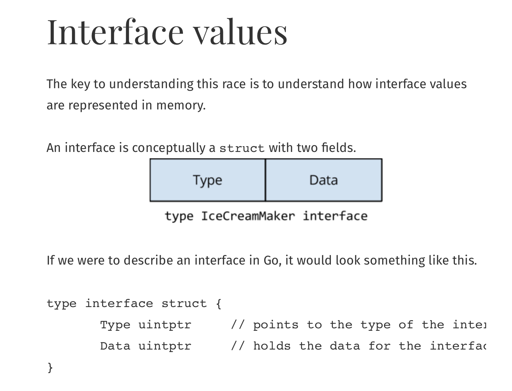
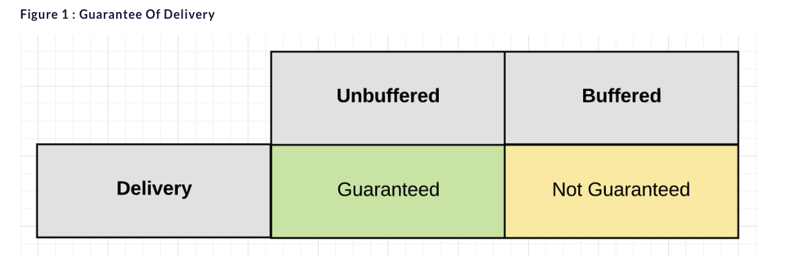
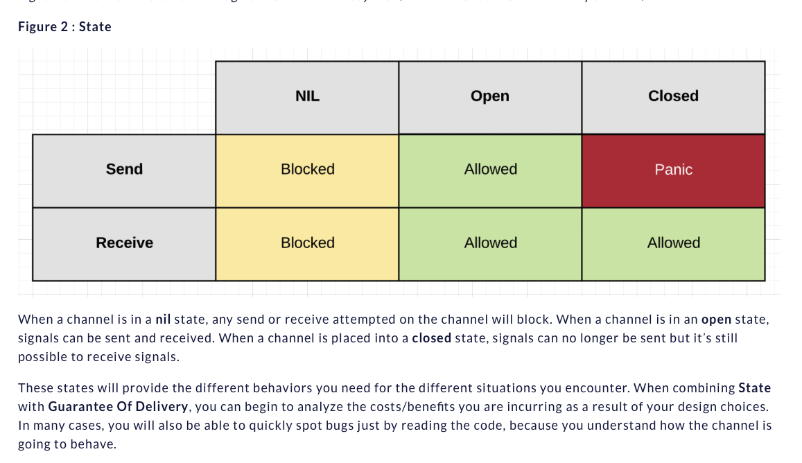
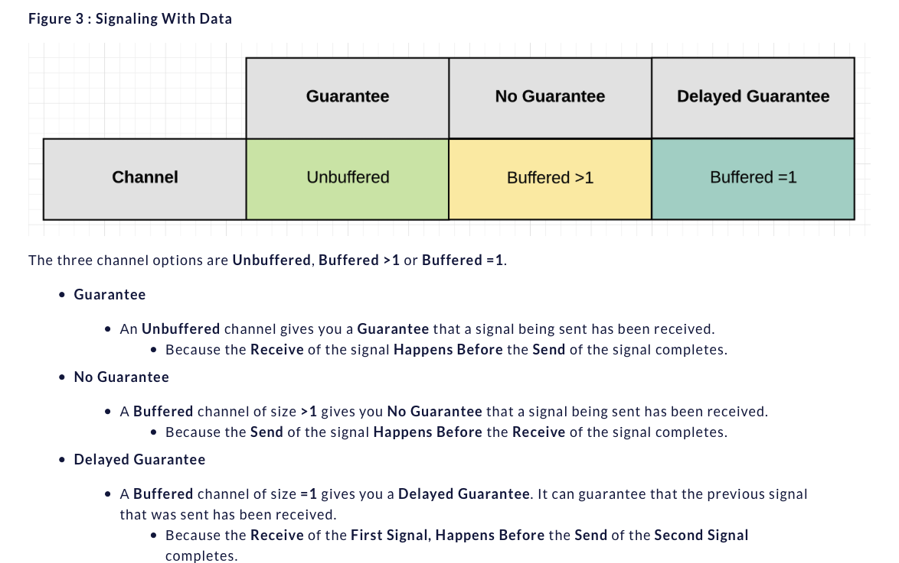
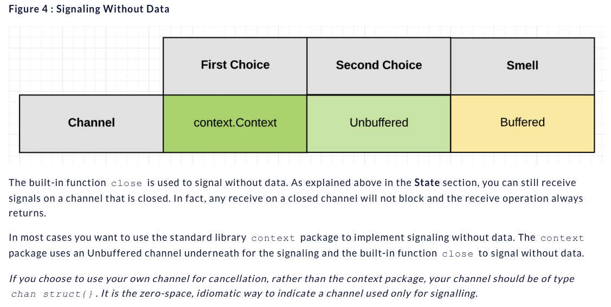

## 相关文章
- [X] [Goroutine Leaks - The Forgotten Sender](https://www.ardanlabs.com/blog/2018/11/goroutine-leaks-the-forgotten-sender.html)
  > goroutine 内存泄露， 可以利用缓冲channel解决。"**Never start a goroutine without knowing how it will stop**"
  - [ ] [相关阅读-context](https://blog.golang.org/context)
  - [ ] [the-behavior-of-channels](https://www.ardanlabs.com/blog/2017/10/the-behavior-of-channels.html)
- [X] [Concurrency Trap #2: Incomplete Work](https://www.ardanlabs.com/blog/2019/04/concurrency-trap-2-incomplete-work.html)
  > 协程泄露相关问题，使用tracker and context来配合解决
- [X] [concurrency-goroutines-and-gomaxprocs](https://www.ardanlabs.com/blog/2014/01/concurrency-goroutines-and-gomaxprocs.html)
  > 逻辑多核，并发并行不同。协程切换。不是增加核的参数就好，还是应该根据性能评价来决定 
  - [ ] [Profiling Go Programs](https://blog.golang.org/pprof)
  - [ ] [detecting-race-conditions-with-go](https://www.ardanlabs.com/blog/2013/09/detecting-race-conditions-with-go.html)
  - [video - Google IO concurrency youtube, 下面应该有重复](https://www.youtube.com/watch?v=f6kdp27TYZs)
- [X] [concurrency](https://dave.cheney.net/practical-go/presentations/qcon-china.html#_concurrency)
  - Keep yourself busy or do the work yourself, 不要过度使用goroutine
  - Leave concurrency to the caller, 解耦 调用者和 异步函数（goroutine）来控制goroutine的执行
  - Never start a goroutine without knowing how it will stop， 防止泄露，利用缓冲channel
- [X] [The Go Memory Model](https://golang.org/ref/mem)
  - A receive from an unbuffered channel happens before the send on that channel completes.
  - The kth receive on a channel with capacity C happens before the k+Cth send from that channel completes.
  - For any sync.Mutex or sync.RWMutex variable l and n < m, call n of l.Unlock() happens before call m of l.Lock() returns.
  - For any call to l.RLock on a sync.RWMutex variable l, there is an n such that the l.RLock happens (returns) after call n to l.Unlock and the matching l.RUnlock happens before call n+1 to l.Lock.
  - A single call of f() from once.Do(f) happens (returns) before any call of once.Do(f) returns.
    
  - go 内存模型
	- 1、w happens before r.
	- 2、Any other write to the shared variable v either happens before w or after r.
- [X] [理解Memory Barrier（内存屏障）](https://blog.csdn.net/caoshangpa/article/details/78853919)
  - [相关文章](https://blog.csdn.net/world_hello_100/article/details/50131497)
  - 编译时内存乱序访问
  ```
  // thread 1
  while (!ok);
  do(x);
  
  // thread 2
  x = 42;
  ok = 1;
  ```
  > 线程2两条写语句顺序不定，可能导致do的时候x不是希望的42
  - 运行时内存乱序访问
  - Memory Barrier 来保证顺序

- [X] [内存重排](https://blog.csdn.net/qcrao/article/details/92759907)
  > 再高速缓存还没有到内存，可能导致重排。
  A barrier instruction forces all memory operations before it to complete before any memory operation after it can begin.
  barrier 指令要求所有对内存的操作都必须要“扩散”到 memory 之后才能继续执行其他对 memory 的操作。
  正是 CPU 提供的 barrier 指令，我们才能实现应用层的各种同步原语，如 atomic，而 atomic 又是各种更上层的 lock 的基础。
  - [ ] [memory_barrier](https://github.com/cch123/golang-notes/blob/master/memory_barrier.md)
- [X] [从 Memory Reordering 说起](https://cch123.github.io/ooo/)
  > 似懂非懂（就是不懂！）
  - 你的系统在锁上出问题的最明显特征
    - 压测过不了几千级别的 QPS(丢人！
    - Goroutine 一开始很稳定，超过一定 QPS 之后暴涨
    - 可以通过压测方便地发现问题。
  >lock contention 的本质问题是需要进入互斥区的 g 需要等待独占 g 退出后才能进入互斥区，并行 → 串行
  
  > cache contention 那也是 contention，使用 atomic，或者 false sharing 就会导致 cache contention。
  atomic 操作可以理解成 “true sharing”。 症状：在核心数增多时，单次操作的成本上升，导致程序整体性能下降。
- [X] [Share Memory By Communicating](https://blog.golang.org/codelab-share)
  - 有些懵逼的
- [X] [If aligned memory writes are atomic, why do we need the sync/atomic package?](https://dave.cheney.net/2018/01/06/if-aligned-memory-writes-are-atomic-why-do-we-need-the-sync-atomic-package)
  > memory barrier 由来 以及 与 sync atomic 联系  
- [X] [race-detector](http://blog.golang.org/race-detector)
  > 略读了一下，使用 -race 来查看 data race 的情况
- [X] [ice-cream-makers-and-data-races](https://dave.cheney.net/2014/06/27/ice-cream-makers-and-data-races)
  > 变量竞争问题讨论， interface 结构：**todo: 还需深入理解下interface结构**, 变量引用
  
  > 
  ```
  type interface struct {
       Type uintptr     // points to the type of the interface implementation
       Data uintptr     // holds the data for the interface's receiver
  }
  ```
- [X] [ice-cream-makers-and-data-races-part-ii](https://www.ardanlabs.com/blog/2014/06/ice-cream-makers-and-data-races-part-ii.html)
  > 深入冰激凌制作问题的例子，替换结构体内部变量类型，进一步论证data race 问题
- [ ] [medium-Go: How to Reduce Lock Contention with the Atomic Package](https://medium.com/a-journey-with-go/go-how-to-reduce-lock-contention-with-the-atomic-package-ba3b2664b549)
- [ ] [medium-Go: Discovery of the Trace Package](https://medium.com/a-journey-with-go/go-discovery-of-the-trace-package-e5a821743c3c)
- [ ] [medium-Go: Mutex and Starvation](https://medium.com/a-journey-with-go/go-mutex-and-starvation-3f4f4e75ad50)
- [X] [The Behavior Of Channels](https://www.ardanlabs.com/blog/2017/10/the-behavior-of-channels.html)
  - Guarantee Of Delivery
    > 
    Having a strong understanding of whether or not you need a guarantee is crucial when writing concurrent software.
  - State
    > The behavior of a channel is directly influenced by its current State. The state of a channel can be **nil**, **open** or **closed**.
    ```
    // ** nil channel
    // A channel is in a nil state when it is declared to its zero value
    var ch chan string
    
    // A channel can be placed in a nil state by explicitly setting it to nil.
    ch = nil
    
    // ** open channel
    // A channel is in a open state when it’s made using the built-in function make.
    ch := make(chan string)
    
    // ** closed channel
    // A channel is in a closed state when it’s closed using the built-in function close.
    close(ch)
    ```
    >The state determines how the send and receive operations behave.
    Signals are sent and received through a channel. Don’t say read/write because channels don’t perform I/O.
    
    - With and Without Data
      - When you signal with data, it’s usually because:
        - A goroutine is being asked to start a new task.
        - A goroutine reports back a result.
      - When you signal without data, it’s usually because:
        - A goroutine is being told to stop what they are doing.
        - A goroutine reports back they are done with no result.
        - A goroutine reports that it has completed processing and shut down.
    - Signaling With Data
      > When you are going to signal with data, there are three channel configuration options you can choose depending on the type of guarantee you need.
      
      The size of the buffer must never be a random number, It must always be calculated for some well defined constraint. There is no infinity in computing, everything must have some well defined constraint whether that is time or space.
    - Signaling Without Data
      > Signaling without data is mainly reserved for cancellation. It allows one goroutine to signal another goroutine to cancel what they are doing and move on. Cancellation can be implemented using both Unbuffered and Buffered channels, but using a Buffered channel when no data will be sent is a code smell.
      
- [ ] [medium-Go: Buffered and Unbuffered Channels](https://medium.com/a-journey-with-go/go-buffered-and-unbuffered-channels-29a107c00268)
- [ ] [medium-Go: Ordering in Select Statements](https://medium.com/a-journey-with-go/go-ordering-in-select-statements-fd0ff80fd8d6)
- [ ] [The Nature Of Channels In Go](https://www.ardanlabs.com/blog/2014/02/the-nature-of-channels-in-go.html)
- [ ] [My Channel Select Bug](https://www.ardanlabs.com/blog/2013/10/my-channel-select-bug.html)
- [ ] [Advanced Go Concurrency Patterns](https://blog.golang.org/io2013-talk-concurrency)
- [ ] [Concurrency is not parallelism](https://blog.golang.org/waza-talk)
- [ ] [Go videos from Google I/O 2012](https://blog.golang.org/io2012-videos)
- [ ] [Go Concurrency Patterns: Timing out, moving on](https://blog.golang.org/concurrency-timeouts)
- [ ] [Go Concurrency Patterns: Pipelines and cancellation](https://blog.golang.org/pipelines)
- [ ] [Running MongoDB Queries Concurrently With Go](https://www.ardanlabs.com/blog/2014/02/running-queries-concurrently-against.html)

- [ ] [Thread Pooling in Go Programming](https://www.ardanlabs.com/blog/2013/05/thread-pooling-in-go-programming.html)
- [ ] [Pool Go Routines To Process Task Oriented Work](https://www.ardanlabs.com/blog/2013/09/pool-go-routines-to-process-task.html)
- [concurrency-rob-blog](https://blogtitle.github.io/categories/concurrency/)
  - [ ] [Go advanced concurrency patterns: part 1](https://blogtitle.github.io/go-advanced-concurrency-patterns-part-1/)
  - [ ] [Go advanced concurrency patterns: part 2](https://blogtitle.github.io/go-advanced-concurrency-patterns-part-2-timers/)
  - [ ] [Go advanced concurrency patterns: part 3](https://blogtitle.github.io/go-advanced-concurrency-patterns-part-3-channels/)
  - [ ] [Sneaky race conditions and granular locks](https://blogtitle.github.io/sneaky-race-conditions-and-granular-locks/)
  - [ ] [Using JavaScript SharedArrayBuffers and Atomics](https://blogtitle.github.io/using-javascript-sharedarraybuffers-and-atomics/)
- [ ] [Go: Context and Cancellation by Propagation](https://medium.com/a-journey-with-go/go-context-and-cancellation-by-propagation-7a808bbc889c)
https://blog.golang.org/context
https://www.ardanlabs.com/blog/2019/09/context-package-semantics-in-go.html
https://golang.org/ref/spec#Channel_types
空连接： https://drive.google.com/file/d/1nPdvhB0PutEJzdCq5ms6UI58dp50fcAN/view
https://medium.com/a-journey-with-go/go-context-and-cancellation-by-propagation-7a808bbc889c
https://www.ardanlabs.com/blog/2019/09/context-package-semantics-in-go.html
https://golang.org/doc/effective_go.html#concurrency
- [ ] [Go Context的踩坑经历](https://zhuanlan.zhihu.com/p/34417106?hmsr=toutiao.io)
- [ ] [Cancelation, Context, and Plumbing](https://talks.golang.org/2014/gotham-context.slide#1)
- [ ] [How to correctly use context.Context in Go 1.7](https://medium.com/@cep21/how-to-correctly-use-context-context-in-go-1-7-8f2c0fafdf39)


## 书籍
- [ ] 《Go语言并发之道》Katherine 著，中国电力出版社
  
## 其他
- [ ] 查看grpc 的metadata 的使用， 尝试抠出来作为自己的业务库使用
- [ ] [Some useful patterns](https://blogtitle.github.io/some-useful-patterns/)
- [ ] [Go Generics](https://blogtitle.github.io/go-generics/)
- [ ] [7 common mistakes in Go and when to avoid them by Steve Francia (Docker)](https://www.youtube.com/watch?v=29LLRKIL_TI)