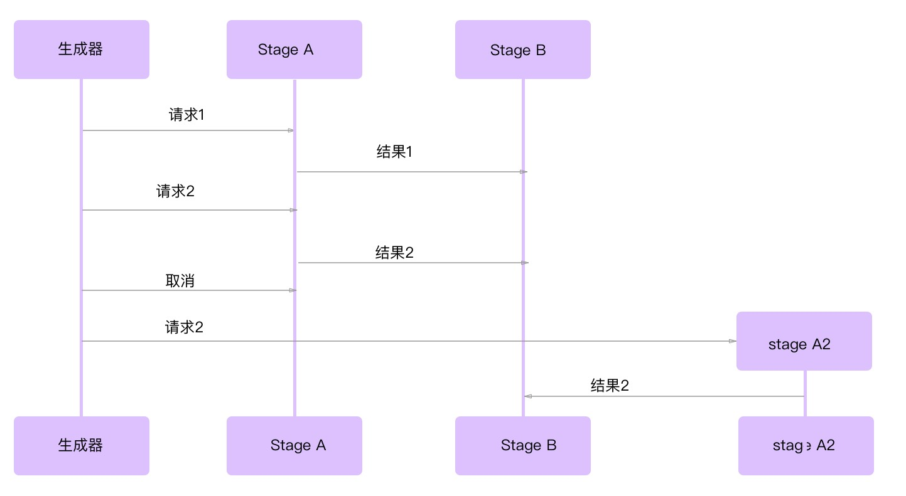
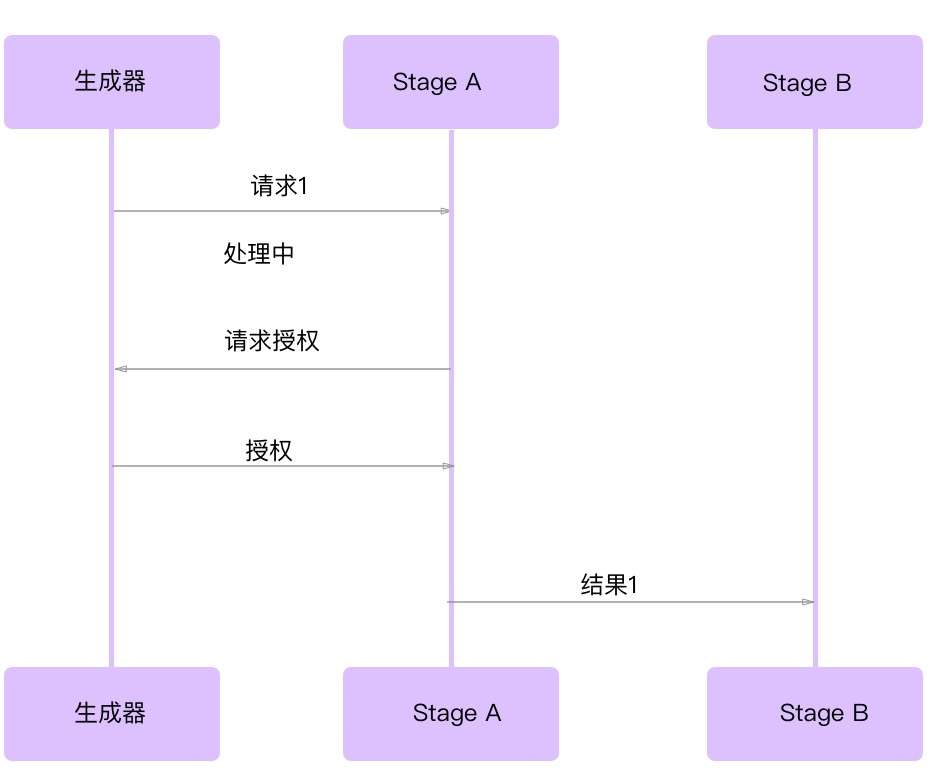

# 超时和取消 
在并发代码运行时，超时（Timeouts） 和 取消 （Cancellation）会频繁出现。
在本节中我们将会看到，超时的处理对于创建一个易于理解的系统是至关重要的，
进程被取消是其发生超时的自然反映。我们还将讨论一个并发进程可能被取消的原因。

那么我们为什么希望我们的并发程序支持超时呢？这里有几个原因：
- ***系统饱和度***
  > 正如我们在第4章 "队列" 中所讨论的，如果我们的系统已经饱和（即它的处理请求的能力刚好足够处理），
  > 我们可能希望超出的请求返回超时，而不是花很长时间等待响应。你采取的应对方式取决于你的问题空间，
  > 下面是一些关于何时应当超时的一般性指导：
  - 请求在超时时不太可能重复。
  - 没有资源来存储请求（例如，内存队列的内存，持久队列的磁盘空间）。
  - 如果对系统的响应 或 请求发送数据有时效性的要求（接下来会讨论）。如果一个请求可能会重复，
    超时会额外增加一个请求和超时的消耗。如果开销超过我们系统的容量，这可能会导致系统宕机。
    不管怎样，如果我们缺少将请求存储在队列中所需的系统资源，那也是没有意义的。
    即便我们符合这两个指导方针，只要我们能即使处理，让请求进入排队中意义也不大。
    这给我们带来了下一个支持超时的理由。
- ***陈旧的数据***
  > 数据通常有一个窗口期，一般是在这个窗口必须先处理更多的相关数据，或者处理数据的需求已经过期。
  > 如果一个并发进程处理数据需要的时间比这个窗口期更长，我们会想返回超时并取消并发进程。例如，
  > 如果我们的并发进程在长时间的等待之后响应请求，则在队列中的请求或其数据可能已经过时。
  
  > 如果事先知道这个窗口时间，那么将context.WithDeadline 或 context.WithTimeout 创建的 
  > context.Context 传递给我们的并发进程是有意义的。
  
  > 如果事先不知道窗口时间，我们希望并发进程的父节点能够在请求不再需要时取消并发进程。 
  > context.WithCancel 是达到这个目的的最佳选择。
- ***防止防止死锁***
  > 在大型系统中，尤其是分布式系统中，有时难以理解数据流动的方式，或者可能出现的异常。
  > 为了保证系统不会发生死锁，建议在所有并发操作中增加超时处理。
  > 超时时间不一定要接近执行并发操作所需的实际时间。不过超时的目的只是为了防止死锁，所以
  > 需要它足够短，使死锁的系统在合理的时间内解除阻塞即可。
  
  > 以上内容使我们知道了，尝试通过设置超时可以将一个死锁系统转变为一个活锁系统。
  > 不过，在大型系统中，由于存在更多灵活的组件，在系统死锁后，你的系统更可能会遇到时序配置不同步的情况。
  > 因此，最好是在允许的时间内尽可能修复活锁，好过发生死锁后只有通过重新启动才能恢复系统。
  
  > 这不是如何正确构建系统的建议，而是关于如何建立一个对时间问题有容错能力的系统，这些错误在开发和
  > 测试过程中可能不容易遇到。我建议你将超时设置在适当的位置，但是目标应该是在没有触发超时的情况下
  > 处理完所有的请求。

现在我们已经掌握应当何时使用超时了，让我们把注意力转向取消，以及如何建立一个并发处理来优雅地处理取消。
并发进程可能被取消的原因有很多：
- ***超时***
  > 超时是隐式取消
- ***用户干预***
  > 为了获得良好的用户体验，通常建议维持一个长链接，然后以轮询间隔将状态报告给用户，或允许用户查看他们
  > 认为合适的状态。当用户使用并发程序时，有时需要允许用户取消他们已经开始的操作。
- ***父进程取消***
  > 对于这个问题，如果任何一种并发操作的父进程停止，那子进程也将被取消。
- ***复制请求***
  > 我们可能希望将数据发送到多个并发进程，以尝试从其中一个进程获得更快的响应。当第一个回来的时候，
  > 我们就会取消其余的进程。我们将在第 5 章 "复制请求" 中详细讨论。

也可能有其他的原因。然而，"为何"这个问题并不像"如何"这样的问题那么困难或有趣。
在第4章中，我们讨论了两种取消并发进程的方法：`channel done` 和 `context.Context` 类型。
这是相对容易的一部分，在这里我们想要探索更复杂的问题：
- **当一个并发进程被取消时，对于正在执行的算法及其下游消费者意味着什么？**
- **在编写可随时终止的并发代码时，需要考虑哪些事项？**

为了回答这些问题，我们需要探索的第一件事是并发进程的可抢占性。观察下面的代码，并假设它在自己的 goroutine 中运行：
```go
    var value interface{}
	select {
	case <-done:
		return
	case value = <- valueStream:
	}

	result := reallyLongCalculation(value)

	select {
	case <-done:
		return
	case resultStream <-result:
	}
```
我们已经可以从 valueStream 的读取数据然后写入 resultStream，并监听 channel done，检查
goroutine 是否被取消了，但是仍然有一些问题。reallyLongCalculation 似乎不能抢占，而且根据
名字来看，可能需要很长时间！这意味着，如果在长时间计算正在执行的时候，如果有东西试图取消这个 goroutine，
那么在我们确认取消和停止之前可能需要很长时间。让我们试着让 reallyLongCalculation 支持抢占，看看会发生什么：
```go
func reallyLongCalculation(done <-chan interface{}, value interface{}) interface{} {
	intermediateResult := longCalculation(value)
	select {
	case <-done:
		return nil
	default:
	}
	return longCalculattion(intermediateResult)
}
```
我们已经取得了一些进展：reallyLongCalculation 现在可以被抢占了，不过我们只解决了一半的问题：
我们只能在reallyLongCalculation 调用其他函数实现抢占。
为了解决这个问题，我们需要编写 longCalculation， 就像下面这样
```go
func reallyLongCalculation2(done <-chan interface{}, value interface{}) interface{} {
	intermediateResult := longCalculation(done, value)
	return longCalculattion(done, intermediateResult)
}
```
如果认为这个推理的结论是合乎逻辑的，那就能得出以下两个必要的任务：
- 定义我们的并发进程可抢占的周期。
- 确保运行周期比抢占周期长的功能本身都是可抢占的。

一个简单的方法是将你的goroutine 代码段分解成小段。你应该注意那些不可抢占的原子操作，
确保它们的运行时间小于你认为可以接受的时间。

这里还有另外一个潜在的问题：如果我们的goroutine 恰好修改了共享状态（例如数据库，文件，内存数据结构），
那当 goroutine 被取消时会发生什么？你的 goroutine 会试图将这个中间状态回滚吗？回滚过程需要多长时间？
goroutine 已经接收到了停止的信号，所以它不应该花太长的时间来回滚它之前的工作，对吧？

就如何处理这个问题很难给出通用的建议，因为你的算法的性质很大程度上决定了你应该如何解决这个问题。
然而，如果你将对共享状态的修改保持在一个很小的范围内，并且确保这些修改很容易回滚，那么你可以很好地处理取消。
如果可能的话，将中间结果存储在内存，然后尽可能快的修改状态。下面是一个错误的示范：
```go
result := add(1, 2, 3)
writeTallyToState(result)
result = add(result, 4, 5, 6)
writeTallyToState(result)
result = add(result, 7, 8, 9)
writeTallyToState(result)
```
这里我们改了三次状态。如果运行这个代码的goroutine 在最后写入之前被取消，
【我们需要以某种方式回滚前两个调用来修改TallyToState】。对比这个方法：
```go
result := add(1 ,2 ,3 ,4 ,5 , 6, 7, 8, 9)
writeTallyToState(result)
```
这次我们必须回滚范围要小的多。如果在调用writeToState 之后取消，我们
仍然需要一种方法来撤回我们的修改，但是由于我们只修改了一次状态，发生这种
情况的可能性要小得多。

你需要关心的另一个问题是重复的消息。假设你有一个 pipeline，它有三个阶段：
生成阶段，阶段A和阶段B。生成阶段通过记录上一次channel 被读取的时间，来监控A阶段持续的时间。
如果当前实例变得不正常，则产生新的实例A2。如果发生这种情况，阶段B可能会受到重复的消息。（见下图）



你可以从图中看到，如果在阶段A已经将阶段B 的结果发送到阶段B之后，接收取消的信号，那么阶段B可能会收到重复的消息。

有很多种方法可以避免发送重复的消息。最简单的方法（也是作者最推荐的方法）是让一个父goroutine 在 子goroutine
已经发送完结果之后发送一个取消信号。这需要各阶段之间的双向通信，我们将在本章后面 "心跳" 中详细介绍。
其他方法是：

- ***接收到的第一个或最后一个消息***
  > 如果你的算法允许，或者你的并发进程是幂等的，那么你可以简单地在下游进程中允许可能存在的重复消息，并从
  > 接收到的第一个消息或最后一个消息中挑选一个处理。
- ***向父goroutine确认权限***
  > 你可以与你的父 goroutine 使用双向通信来确认你发送消息的权限。这种方法与心跳类似，如下面的图所示。
  
  > 因为我们明确请求允许在B的channel 上执行写入操作，这比心跳更安全；然而，在实践中很少这样做，
  > 因为它比心跳更加复杂，而心跳更普遍且有效，所以我建议你只使用心跳。



